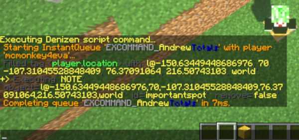
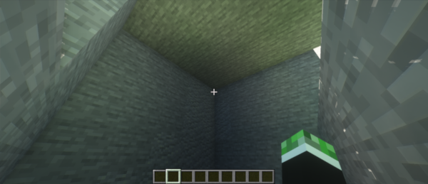
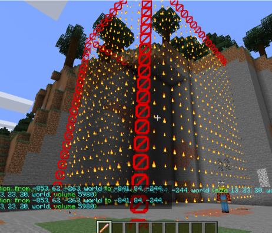
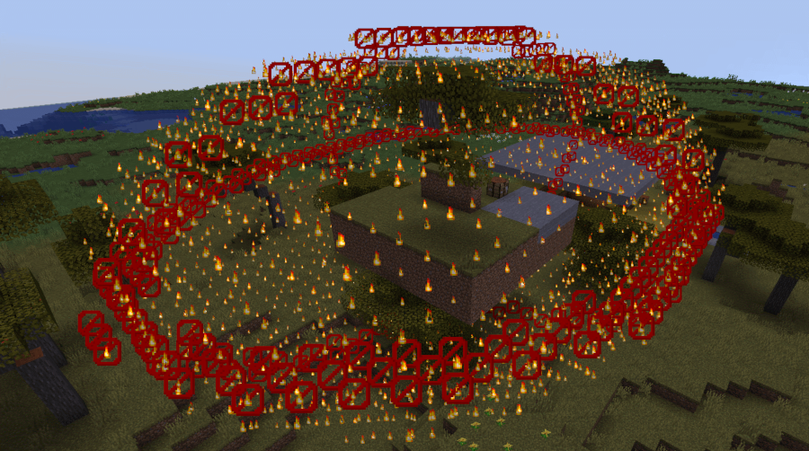
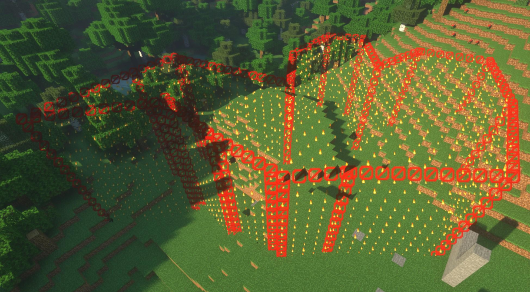
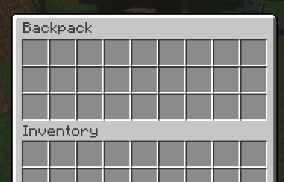

Special Memory: Notable Objects
-------------------------------

```eval_rst
.. contents:: Table of Contents
    :local:
```

### Some Objects Are Noteworthy

Some of your objects, on your server, are pretty noteworthy! That spawn location is pretty important! That town region is the center of player activity!

You probably need to reference some of these objects very very often. For that matter, you probably need to reference them in key places like event lines - you might want, for example, an event that fires when a player enters or exits your town region, that shows them a welcome/farewell message. There's a lot of use cases like this.

The best tool for handling these cases is the **Notable Objects** system in Denizen.

#### Some Object Types Are Notable

Just a few key object types in Denizen are part of the notable system. This includes locations, areas, and inventories.

When an object type is "notable", this means that you can make a "note" of any object of that type. A "note" is essentially a globally unique reference name for that object. Think of it like a variant of a server flag, where the note name is the flag name and the object itself is the flag value.

#### Why Not Just Use Server Flags Then?

Noted objects have a few key advantages over simple server flags:

- When an object is noted, *that object* is noted, not a copy of it. This means that if you adjust the object, you're actually changing the object in the note, and do not have to re-use the `note` command <span class="parens">(vs with a flag, you have to re-use the flag command after making any changes to put the result back in the flag)</span>.
- Objects know their own note name. For example, a normal `LocationTag` identifies like `l@0,64,0,world`, but if you note that location with the name `spawn`, it will identify from there on as `l@spawn`. You can also check the note name of any location with `<[some_location].note_name>`.
- Notes can be referenced by name alone. If you have that `LocationTag` noted with name `spawn`, you can do commands like `- teleport <player> spawn` to send a player to spawn - the name `spawn` alone is enough for Denizen to know what you mean. <span class="parens">(vs with a flag, you would have to do `- teleport <player> <server.flag[spawn]>`, with that whole tag to clarify what you're referring to)</span>.
- Notes can be referenced in event lines. If you have a `CuboidTag` noted as `main_town`, you can write events like `on player breaks block in:main_town:`, which automatically limits the `breaks block` event to only fire when the block is inside the town as defined by your noted area. This is the most important use case for notes, and will be explored more farther down in this guide page.
- Notes have a reliable persistent unique state. This is just an overcomplicated way of saying, if you note an `InventoryTag`, that inventory can be opened by multiple players, who can then move items around in it, and every player will see everyone else's changes, and after the server restarts everything in the inventory will still be however the players left it, completely automatically.

### So How Do I Make A Note?

Well, as with most such non-beginner-level questions in Denizen, the answer is take the word you used to ask the question, and put it in [the documentation search](https://meta.denizenscript.com/). In this case, you will sure enough find the `note` command, which does exactly what it says on the tin.

The basic syntax of the `note` command is `- note [<object>/remove] [as:<name>]`

The `object` input of course takes any object that is of any notable object type. The `as:<name>` input of course takes the name you want the note to have.

Let's try an example.

### Noting A Location

Location notes aren't the most useful type of note, but they're quick and easy to make, and can make many scripts cleaner and simpler.

Go ahead and stand at an important spot in your world <span class="parens">(or just slap a gold block on the ground in the middle of nowhere and declare that's important for the sake of trying the command out)</span>, and type `/ex note <player.location> as:importantspot`



Generally `/ex` is used for testing, but in this case it's actually all you need. After having done the `/ex note`, that note exists forever on your server <span class="parens">(until you remove it)</span>, and has all the correct data it needs already.

Now, let's go ahead and use `/ex` again, this time to test the note. Step away from the location, and then type `/ex teleport <player> importantspot`. If everything went as expected, you'll be teleported back to the exact same spot.

You can from now on use the same `/ex note` for any important location with any name you want, and use the simple syntax of typing the name into a `teleport` command <span class="parens">(or a `modifyblock` command or any other command that takes a location)</span> in a script or testing in an `/ex`. Bear in mind, you can also use `- note` in a script if you want to dynamically create notes.

#### Common Questions With Noted Locations

When you got teleported to the exact same spot in the example above, you might have noticed it's the **exact** same spot. If you were on the edge of a block, you're teleported to that edge, if you were facing downward at the time, you're now facing downward. If you want to change this result, the first obvious solution is just change where you're standing and re-make the note. If you want to be a bit more perfectionist about it, you can also of course just change the tag you used when creating the note. For example, to center the location, just use `/ex note <player.location.center> as:importantspot`. If you want to flatten out the angles, you can use for example `/ex note <player.location.with_pitch[0].with_yaw[90]> as:importantspot`.

You might be interested in noting the location of a lever, button, door, or etc. for use in the `switch` command, to have a script automatically activate something, and find it's hard to accurately note the location just by standing in it. What do you do? Simple! Just point your cursor at the block and type `/ex note <player.cursor_on> as:lever`. The `cursor_on` tag will return the location of the block you're pointing at, rather than where you're standing.

### Noting An Area

The perhaps most important, or at least most common, type of object to note is an area object. This is a category of object types that includes `CuboidTag`, `EllipsoidTag`, and `PolygonTag` - different ways of confining a section in the world - inside a box, inside a round area, or inside a many-cornered polygon.

The command and syntax for noting areas is the same as with locations, the only difference is how you make the object.

#### Noting Cuboids

Cuboids are an extremely common way to define areas. If you've ever used WorldGuard, you're probably familiar with the basic idea of a cuboid. A cuboid has two corners, and contains every block in the box-shape space between those two corners. Note that cuboid boundaries are defined in terms of blocks, and cannot have decimal values.

For a very quick and simple example of creating a cuboid, you could simply stand in one corner of a room, stare at the opposite corner, and type `/ex note <player.location.to_cuboid[<player.cursor_on>]> as:myroom`.



To test that it worked, you can walk around the room and type `/ex narrate <player.location.is_within[myroom]>` ... for as long as you're in the room, it should output `true`, and once you leave the room, it should output `false`.

### Convenience Script

You're probably thinking: "**that's such an awkward way of doing it, I want a magic wand to just click and be done**" and you're in luck! This is Denizen after all, noting areas involves tags and commands, this is a problem easily solved by a script. In fact, being such a common request, there's a high quality premade script to do exactly this - give you a magic wand to click and note areas with. You can download it [here from the Denizen forum resources section](https://forum.denizenscript.com/resources/area-selector-tool.1/).



To use it, simply download the `.dsc` file and put it in your scripts folder. Give the file a look-through in your script editor if you'd like, to see what's it doing, how it does it, etc. When you're ready, go into your server and type `/ex reload` to load the script, then `/seltool` to get the magic wand. You can then left click any block to start a selection, and right click to expand it. It will automatically create particle highlights to show you the selected region thus far. When you have an area selected, type `/selnote myareaname`. You now have a noted cuboid named `myareaname`.

#### Using An Area Note

So, how can we make use of this area note? First, of course, you can use it in tags like the `is_within` tag demonstrated earlier. You can also use them in commands - a common example for cuboids is the `schematic` command takes a cuboid as input. But the most common usage is in events.

One common event usage of area notes is the *area enter/exit event*. This is used with the syntax `[on/after] player [enters/exits] <note-name>:`. Let's try a script using this:

```dscript_green
cuboid_note_sample:
    type: world
    events:
        after player enters myroom:
        - narrate "hi <player.name> welcome to my room!!!"
        after player exits myroom:
        - ratelimit <player> 10s
        - narrate "oh bye <player.name>"
```

With this script loaded, you can walk into the area noted as `myroom` and receive a greeting every time. When you walk out, you receive a `bye` message, but no more often than 10 seconds apart from the last `bye`, using the `ratelimit` command to reduce spam.

Another extremely common usage of area notes is the `in:<area>` switch. When looking through event documentation, you'll see many of the events have a line that says `Has Location: True - This adds the switches 'in:<area>', 'location_flagged:<flag>', ...`. For any such event, you can create something like the following example:

```dscript_green
in_area_sample:
    type: world
    events:
        after player places block in:myroom:
        - narrate "hey <player.name>! get that block outta here!"
```

With this script, any time you place a block in my room, a mystical voice will yell at you to knock it off. If you place a block anywhere else, nothing happens.

Limiting events in this way is useful for countless scenarios. You can use it to implement protected regions - some areas stop you from placing/breaking blocks with a `determine cancelled`, or stop PvP, or something like that. You can have some areas just work a little different - maybe fishing in the special lake brings twice as much loot, using a `player fishes in:special_lake` event. Maybe players that die in your arena region respawn instantly at the arena entrance rather than the global spawn. The only limits are your imagination!

#### Noting Ellipsoids

Ellipsoid notes work larger the same as cuboids, they're just rounder. Also unlike cuboids, ellipsoids values can have decimal points on them.

I'll cut to the chase here, you can basically do all the same things, just use the word `ellipsoid` instead of `cuboid`. If you use the premade script linked above, just use `/seltool ellipsoid` or `/etool` to get the wand, left click to start, right click to expand, and `/selnote` to make a note of it.



You can use ellipsoids in events and commands in just the same was as cuboids.

#### Noting Polygons

Polygons are a little bit more complicated. Polygons are defined by a minimum and maximum Y (height) value, and a list of corners. Corners should mark the outer boundaries of the polygon. If edges of the polygon overlap each other, the polygon will have holes in it. Polygon locations are allowed to have decimal point values.

Outside of their complicated formation, they're otherwise used the same as cuboids and ellipsoids - there are commands and tags that operate with polygons, and any event input that takes an "area" accepts a polygon just the same as an ellipsoid or a cuboid.

If you use the premade selector tool script, you can use `/seltool polygon` or `/ptool` to get the wand, then left click the first corner of a region, and right click each additional corner. Be careful which blocks you select, make sure you keep moving in a single rotational direction (clockwise or counter-clockwise) around the area, make sure you don't turn backwards or bend in on yourself, don't keep going past the start point. Once you've placed at least 3 corners, particles will start appearing. If you want to expand the polygon up or down, simply fly to the height you need and use `/selheight`. If this is all confusing... well just give it a try and experiment a little, you'll probably understand after you've tried it and see the particle boundaries of your region. If you get lost, don't be afraid to join the [Discord](https://discord.gg/Q6pZGSR) and ask for help.



### Noting An Inventory

To note an inventory, you need an inventory constructor. This can be either an inventory script or a generic constructor.

Here's an example of an inventory script:

```dscript_green
my_inventory_script:
    type: inventory
    inventory: chest
    size: 27
    title: Backpack
```

To use a generic constructor, you would type something like `<inventory[generic[size=27;title=MyInv]]>`. This is a bit messy, so inventory scripts are better, but can be handy for quick test inventories.

To create a note from an inventory, the command looks like `/ex note <inventory[my_inventory_script]> as:my_inv_note`. This uses the `inventory` constructor tag to clarify to the `note` command what type of object we're trying to create a note of.

An inventory script represents a way to construct an inventory - each time you open `my_inventory_script` it *generates* a new inventory. An inventory note, however, is a single actual inventory.

What that means in practice, is if multiple players run `- inventory open d:my_inventory_script`, they will each see their own separate inventory. If, however, multiple players run `- inventory open d:my_inv_note`, they will all have the same inventory open. That means if one player moves an item, every other player also sees that item move.

A noted inventory's contents are persistent. This means that if you move items by hand in the inventory note, then close and re-open the inventory note, the contents will be the same. Even if you restart the server, you will still see the contents as they were when you last changed them. A common use case for this is a backpack script - a pairing of a simple inventory script like the example above, and a command script like `/backpack` that opens an inventory note unique to the player - usually generated with a name like `- note my_backpack_script as:backpack_<player.uuid>` and opened like `- inventory open d:backpack_<player.uuid>`. This means each player gets their own persistent backpack - like having a second enderchest.

Inventory note names can be used in events as well, in all the same places that inventory script names can be used. For example, `after player opens my_inventory_script:` and `after player opens my_inv_note:` would both run whenever the note is opened (because the note was generated from the script, so both example event lines are applicable).



### Editing A Note

There are two ways to edit a note:

The first way is to simply overwrite the note with a new note command. Don't like the placement of your `LocationTag` note named `spawn`? Just go `/ex note <player.location> as:spawn` again in a better position.

The second way can be handy for some advanced usages, especially with inventory notes: the `adjust` command. Any mechanism used on a noted object will apply to the actual original object in the note directly. With the `adjust` command you will need to clarify the object type of your input with a constructor tag. For example, to change the title of a noted inventory, `/ex adjust <inventory[my_inv_note]> title:NewTitle`. You can also use other commands on the object freely. For example, `/ex give stick to:my_inv_note` will add a stick into that noted inventory.

### Removing A Note

If you no longer need a note, removing it is simple: `/ex note remove as:<name>`. Instead of having an object, type the literal word `remove`. That's all there is to it, the note for the name you gave is no longer noted.

Be aware that this doesn't inherently destroy an underlying object. For example, if you remove an inventory note, but some player has that inventory open, it will remain open and valid until they close it, just the note name no longer refers to it.

### Common Questions

- **Will anything bad happen if I use the `note` command with a name that already exists?** That will remove the existing note and save your new one. Nothing will break, unless you needed that original note.
- **How should I name my notes?** Generally, well, however you want. The key thing to remember is that every script on your server has the same list of notes, so you'll want to name things in a way that avoids the risk of two different scripts trying to use the same note name. So the example names of `importantspot` and `lever` probably aren't very good names for actual use. You might go for names more like `quest_savethecows_lever` <span class="parens">(this example imagines your server has a scripted quest named 'save the cows', and the lever is specifically related to that quest)</span>. However, often with notes, simple names do work out - for example, a noted location named `spawn` is pretty reasonable to have - how many spawn points could one server have? Also do of course as always observe general clean name rules - use simple words, no spaces, no weird capitalization, no symbols other than an underscore `_`. That part's not *required*, it's just a suggestion to keep things clean.

### Related Technical Docs

If you want to read some more about notable objects, here are a few technical guides you might consider...

- [Note command doc](https://meta.denizenscript.com/Docs/Commands/note)
- [Inventory script containers doc](https://meta.denizenscript.com/Docs/Languages/inventory%20script%20containers)
- [Cuboid selector wand script](https://forum.denizenscript.com/resources/cuboid-selector-tool.1/)
- [Ellipsoid selector wand script](https://forum.denizenscript.com/resources/ellipsoid-selector-tool.3/)
- [Polygon selector wand script](https://forum.denizenscript.com/resources/polygon-selector-tool.2/)
