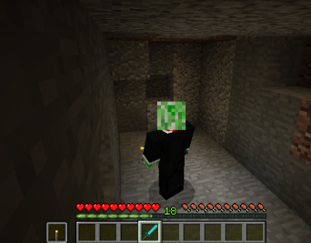
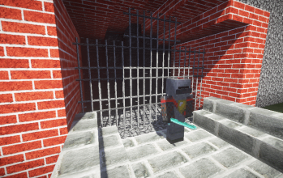
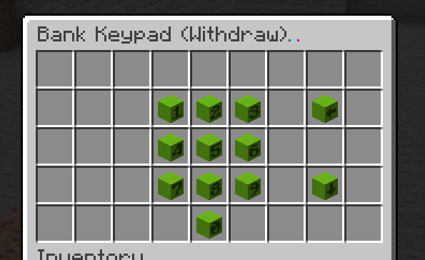

What Is Denizen Capable Of?
---------------------------

```eval_rst
.. contents:: Table of Contents
    :local:
```

### Let Me Put It Simply


### What Can An Advanced User Do With Denizen?

**What can you do with Denizen... if you're dedicated? Anything you can set your mind to!**
- Here's a region manager that competes with WorldGuard, written as a Denizen script: [Spigot - dRegions](https://www.spigotmc.org/resources/denizen-dregions.26864/)
- Here's a script only about 20 lines long that makes it so a torch glows when held in your hand: [Spigot - Denizen Torch Light](https://www.spigotmc.org/resources/denizen-torch-light.26855/)



- In the past before I (mcmonkey) created Sentinel, I had written the same basic concept as a fully functional Denizen script: [Old Repo Archive - dSentry](https://one.denizenscript.com/denizen/repo/entry/0)



- Or whatever other crazy thing you might imagine. Here's a chest GUI of a keypad to type on:



### What Can A Normal User Do With Denizen?

**What can you do with Denizen... if you're a more average user? Still quite a lot!**
- It's very common to write a variety of basic server utilities in a Denizen script, such as a daily auto-restart which amounts to just a few lines of script. In fact, here's exactly such a script:
```dscript_green
daily_autorestart:
    type: world
    debug: false
    events:
        on system time 01:00:
        - announce "<gold>Server restart in ten minutes!"
        - wait 5m
        - announce "<gold>Server restart in five minutes!"
        - wait 2m
        - announce "<gold>Server restart in three minutes!"
        - wait 1m
        - announce "<gold>Server restart in two minutes!"
        - wait 1m
        - announce "<gold>Server restart in one minute!"
        - wait 30s
        - announce "<gold>Server restart in thirty seconds!"
        - wait 30s
        - adjust server restart
```
It's that simple! Most of the space usage is simple copy/pasted messages.
- Writing quests within Denizen is very popular as well (usually NPC-driven, refer to the [What Can Denizen Do With Citizens?](/guides/background/denizen-citizens) page for more info).
- Custom item systems are pretty popular as well. You can write item scripts as simply as this example:
```dscript_green
hero_sword:
    type: item
    debug: false
    material: diamond_sword
    display name: <gold>Hero's Sword!
    lore:
    - Sword granted only to the greatest of heroes.
    enchantments:
    - sharpness:5
```
You can easily just `- give hero_sword` at any time, and use simple world events to give special properties to your items.
