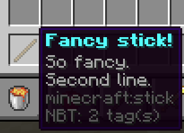
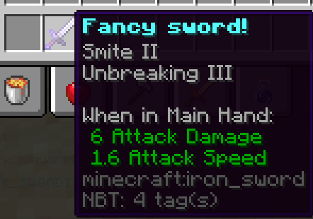
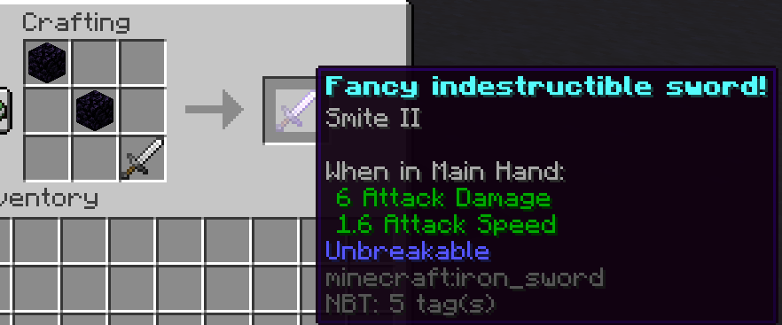

Fancier Sticks: Making Custom Items (PLACEHOLDER ONLY)
-----------------------------------

```eval_rst
.. contents:: Table of Contents
    :local:
```

### What Are Custom Items

Custom items are a way to store a various set of properties onto an item to create a new unique item in the game. Denizen provides the capabilities to save these unique items in item scripts so that they can be reused or uniquely referenced to in other scripts. These were briefly mentioned in [the mechanisms guide](/guides/basics/mechanisms) but this page will go into more detail.

### The Basic Structure

To start off with, this is the basic structure of an item script:
```dscript_green
fancy_stick:
    type: item
    material: stick
    display name: <&b><bold>Fancy stick!
    lore:
    - <&7>So fancy.
    - <&7>Second line.
```
In [the script editor](/guides/first-steps/script-editor), you can simply type `item` and use tab completion to generate the basic template of an item script at any time.

An item script container has the type set to `item`. You also need to give it a valid existing Minecraft material for your item to be based off of, for example here we are using a stick.

While not strictly required, most item script will also have a custom display name and custom lore. The display name works similarly to other container keys, the lore takes in a list as opposed to a single argument. Each line of lore is given on a new line prepended by a `-` <span class="parens">(this is similar, but should not be confused with, how commands look)</span>.

You can get this item in-game by typing `/ex give fancy_stick`



### Adding More Properties

There are several other properties that can be added to item scripts.

As an example this would be how you would and enchantments:
```dscript_green
fancy_sword:
    type: item
    material: iron_sword
    display name: <&b><bold>Fancy indestructible sword!
    enchantments:
    - DAMAGE_UNDEAD:2
    - DURABILITY:3
```
Note that the enchantment names do differ than the ones that display in game, the names to use can be found on [spigots page](https://hub.spigotmc.org/javadocs/bukkit/org/bukkit/enchantments/Enchantment.html)

You can get this item in-game by typing `/ex give fancy_sword`



You can also add in custom data onto an item in the form of flags such as:
```dscript_green
special_hat_1:
    type: item
    material: iron_helmet
    display name: <&b><bold>A Special Hat
    flags:
        hat_type: 1
special_hat_2:
    type: item
    material: iron_helmet
    display name: <&b><bold>A Special Hat 2.0
    flags:
        hat_type: 2
```

You can test this out by giving yourself the 2 items `/ex give special_hat_1` and `/ex give special_hat_2` and using `/ex narrate <player.item_in_hand.flag[hat_type]>` while holding the item to see the flag value.


As mentioned above [the mechanisms guide](/guides/basics/mechanisms) covers more on how properties work, but to reiterate you can apply mechanisms to items directly in the item script to add more unique properties that are not covered by other keys. For instance if you wanted the `fancy_sword` to be truly unbreakable you would do:
```dscript_green
fancy_sword:
    type: item
    material: iron_sword
    display name: <&b><bold>Fancy indestructible sword!
    enchantments:
    - DAMAGE_UNDEAD:2
    mechanisms:
        unbreakable: true
```

As a warning, changes to an item script do not get automatically applied to instances of the item that have been created. For instance, if you are now updating this sword, the old sword would still have the same original properties.

### Using Items Elsewhere

As demonstrated previously, you can simply just provide the name of the item script into the give command and denizen will give you a copy of that item. This applies also to anywhere that specific items can be referenced. For instance, lets say we want an event to listen for when someone specifically uses the `fancy_sword` to hit something else, we can simply just do the following:
```dscript_green
fancy_sword_events:
    type: world
    events:
        on player damages entity with:fancy_sword:
        - narrate "You hit an <context.entity.name> with the fancy sword"
```
You can test this out by hitting an entity with the fancy_sword and again with a normal one and see that nothing happens when using the normal one and only when using the fancy_sword.

### Adding Crafting Recipes

Custom items can also come with their own crafting recipes so that players can craft it in game. Let's add a crafting recipe to the fancy_sword:
```dscript_green
fancy_sword:
    type: item
    material: iron_sword
    display name: <&b><bold>Fancy indestructible sword!
    enchantments:
    - DAMAGE_UNDEAD:2
    mechanisms:
        unbreakable: true
    recipes:
        1:
            type: shaped
            input:
            - obsidian|air|air
            - air|obsidian|air
            - air|air|iron_sword
```
A few things to note:
- Each recipe needs a number, as an item can have multiple recipes. This should be increasing in numeric order
- The recipe needs a type, there are many ways to craft items, shaped is the most basic/common of using the crafting table
- The shaped recipe goes in this 3*3 grid with air taking up where you would want a specific empty spot
- The recipe will not show up in the recipe book after crafting until you either reconnect or use the `resend_recipes` mechanism <span class="parens">(`/ex adjust <player> resend_recipes`)</span>

You can try it out and see that you can now craft it


As mentioned above, there are more kinds of crafting. To cover them briefly an example would be given of how the input would look.

shapeless - taking a list of items as input but doesnt care about shape:
```
type: shapeless
input: obsidian|obsidian|iron_sword
```

stonecutting - takes in only a single item on the stonecutter
```
type: stonecutting
input: iron_sword
```

furnace/blast/smoker/campfire - smelting an item in the relevant block
```
type: furnace
input: iron_sword
```

smithing - crafting an item on the smithing table, using 2 inputs (a base and an upgrade) as well as allowing to  keep enchantments and display names
```
type: smithing
base: iron_sword
retains: enchantments|display
upgrade: obsidian
```

### Related Technical Docs

If you want to read a lot more about the custom items, here are a few technical guides you might consider...

Note: most users, especially those learning from the Denizen for the first time, should just continue on to the next guides page. These references might be of interest to later come back to after you've learned Denizen as far as this guide teaches.

- [Item script containers doc](https://meta.denizenscript.com/Docs/Languages/item%20script%20containers)
- [Book script containers doc](https://meta.denizenscript.com/Docs/Languages/book%20script%20containers)
