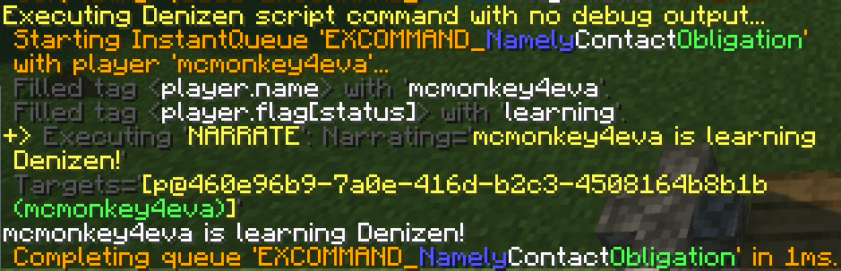
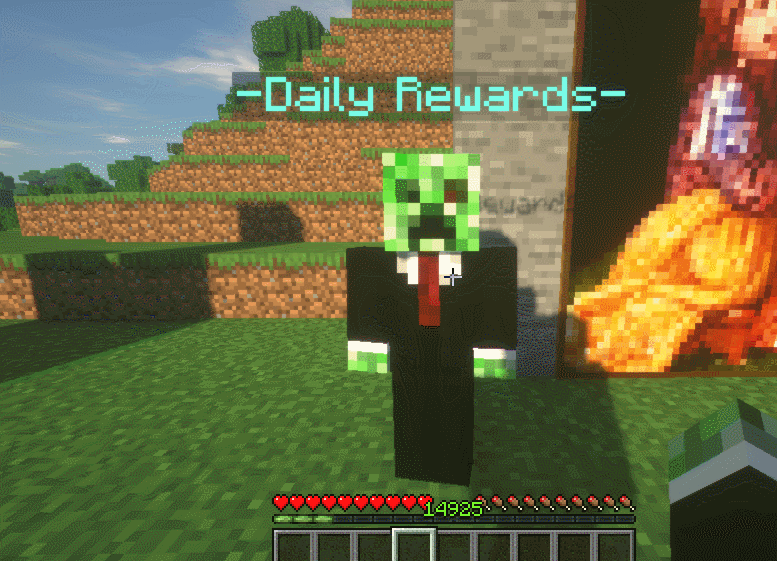

Long Term Memory: Flags
-----------------------

```eval_rst
.. contents:: Table of Contents
    :local:
```

On the [previous page](/guides/basics/definitions) you learned about definitions and their usage as short-term memory. On this page, you will learn about **flags**.

### What Are Flags?

Flags, like definitions, are a form of memory. They are data-points that you can freely control and change within a script, without affecting anything other than your own scripts.

Flags have two key distinctions from definitions:
- First, flags are *long term* memory, while definitions are *short term*. As you learned on the previous page, a definition only lasts as long the queue does. Flags, however, last much longer - flags can even stay forever if needed.
- Second, you can choose what object a flag is linked to. As you'll come to understand after learning about the flag system, definitions are basically a special case of flags that are linked exclusively to queues.

Flags also use the Data Actions system, just like definitions do.

Unlike the `define` command, the `flag` command *always* uses data action syntax. Meaning, the most basic set command uses a `:` rather than a space, like: `- flag <object> my_flag:my_value`.

### Basic Usage of Flags

Before we bother with much of the theory behind flags, let's get some practice trying them out, using [the /ex command](/guides/first-steps/ex-command)!

Open up your Minecraft window, and type in this command: `/ex flag server greetable:World`

With that command, you have now set a flag named "`greetable`" to the value "`World`" on the `server` object.

Now, let's make use of that flag... type in: `/ex narrate "Hello, <server.flag[greetable]>!"`

If everything went well, you should see output like the following:


### Flags Are Attached To Objects

Flags are always *attached to an object*. In the example above, we used the `server` object. The `server` object is a special helper object that exists for things like flags to have a global static target. Flags attached to the server stick around forever, and can be accessed from anywhere at any time.

The most common object that flags get attached to is a player. When a flag is attached to a player, that means only that one single player has that flag - any other players would only have it if the flag command is used again to set it on each other player.

Setting a flag on a player is easy - it's just like setting a global flag on the server, you just have to feed the command a specific player instead of `server`.

Try typing this command: `/ex flag <player> status:learning`

And then type: `/ex narrate "<player.name> is <player.flag[status]> Denizen!"`

You should see roughly the following:



If any other players try that `/ex narrate` command without doing the `/ex flag` first, it will show an error message - because only *you* have the `status` flag, no other players.

### What Would I Ever Use This For?

The examples above are pretty abstract, so let's use the parts of the flag system we've already learned to create a simple script that looks a little more like something you might actually use.

```dscript_green
ore_counter:
    type: world
    events:
        after player breaks iron_ore:
        - flag player ores_broken:++
        - narrate "You have broken <player.flag[ores_broken]> iron ore so far! Keep it up!"
```

This script will keep a running count of how many iron ore blocks the player has mined. Each player will have their own separate count <span class="parens">(this uses the 'increment' data action, which is explained on the [definitions page](/guides/basics/definitions))</span>.


You can use the 'clear' data action, marked with a `!` symbol, to remove a flag at any time. After using the script example above, try doing `/ex flag player ores_broken:!` to remove your own iron ore counter flag, then break another iron ore block. If all went went, you will see the flag tag fills with a value of `1` <span class="parens">(indicating that as far as the script knows, this is the first iron ore you've ever mined)</span>.

### Do You Have This Flag?

If you want to know whether an object already has a flag or not, the solution is simple: `has_flag`! This looks just like the `flag` tag, but instead of returning the flag value, will instead return a simple boolean: `true` or `false`.

You can use this inside an if command like `- if <player.has_flag[ores_broken]>:`, to only run the `if`'s commands when the player already has broken at least one iron ore in the script above.

This is also the basic way to implement values that either are there, or aren't <span class="parens">(as opposed to having some additional data, like how `ores_broken` has a number associated with it)</span>.

```dscript_blue
toggler_task:
    type: task
    script:
    - if <player.has_flag[my_first_toggle]>:
        - flag player my_first_toggle:!
        - narrate "Disabled your toggle."
    - else:
        - flag player my_first_toggle
        - narrate "Enabled your toggle."
```

The above example script, when ran via `/ex run toggler_task`, will toggle the flag `my_first_toggle` on or off, by removing it or setting it <span class="parens">(if you have no value to give, you can just leave the value off from the flag command)</span>, using the `has_flag` tag to determine whether to add or remove it.

As you learn about more features like [player commands](/guides/basics/player-commands), you can use these for simple yet powerful options, like a command that toggles some flag on or off when used, that then ties into some world event that checks if the player has the flag to determine whether to apply some special effect.

### Flags Are Core To Denizen

Flags are a core feature of Denizen... this means that they are integrated in a variety of places within Denizen to make things easier when using them.

For example, if you want an event to only fire if the player involved has a specific flag, you can use the `flagged:` event switch, like so:

```dscript_green
optional_ore_counter:
    type: world
    events:
        after player breaks iron_ore flagged:ore_quest:
        - flag player ores_broken:++
        - narrate "You have broken <player.flag[ores_broken]> iron ore so far! Keep it up!"
```

This is the ore_counter script from earlier, but it now only runs for players that have the toggleable flag named `ore_quest`. Now, rather than just being a generic counter of ores broken, this script has become a part of a quest that requires a player go out and break some number of iron ore blocks to complete it.

There are many features like this throughout Denizen, including the player `flagged:` event switch, the `server_flagged:` and `location_flagged:` and etc. similar event switches, `(x)_flagged` matchables, various command arguments like the `announce` command's `to_flagged` argument, a variety of convenience tags like `<server.online_players_flagged[flag_name]>`, and so much more. As you learn more about Denizen and eventually start looking through the meta-documentation, you'll encounter many of these.

### Lifetime

Flags are *persistent*. This means that things which normally cause data to go away, like restarting the server, will not get rid of flag data.

There are only four cases in which a flag will go away:
- Explicit intentional removal within a script, using the 'clear' data action.
- Timed expiration <span class="parens">(explained in the next section)</span>.
- Attached object is gone <span class="parens">(for example, the flag is on a mob entity, and that mob dies)</span>.
- And of course: hard server crash or deletion of server files.

### Flag Expirations

One common usage of flags is as long-term cooldown timers, like a quest or special effect that only works once per day. Here's an example of how that might look:

```dscript_blue
once_a_day:
    type: task
    script:
    - if <player.has_flag[my_script_cooldown]>:
        - narrate "You can only get this reward once per day. You must wait <player.flag_expiration[my_script_cooldown].from_now.formatted>."
        - stop
    - flag player my_script_cooldown expire:1d
    - narrate "Here's your daily reward!"
    - give diamond
```

This script example will give the player a diamond, but no more often than once per day, using a flag as the cooldown method.

While this might seem a bit pointless in a `task` script, after you've gone farther into the guide, you could [attach it to an NPC's click handler](/guides/npcs/assignment-scripts) to make an NPC that can be clicked for a daily reward, it becomes basically a complete feature of your server!



You'll notice two new parts of the flag system being used here:

First, in the `flag` command, there is now a `expire:1d` argument. This does exactly what you think it does: it makes the flag only stick around for one day... after that, the flag is considered the same as if it didn't exist. The input is a `DurationTag` object, which can be written like `1d` to mean "one day", or `5h` to mean "five hours", or anything like that. The duration value input is then used to calculate the date/time when the flag should expire <span class="parens">(by adding the duration onto the current date/time)</span>, and stored alongside the flag.

Second, in the `narrate` command, we used the `flag_expiration` tag. This tag, as the name implies, returns the time at which the flag is scheduled to expire. It does this in the form of a `TimeTag` object. We then use the tag `TimeTag.from_now`, which gets the `DurationTag` representing the distance in time between right now and some previously stored `TimeTag` <span class="parens">(so at the moment the flag is set, it will be `1d`... if you wait an hour, it will be `23h`, etc.)</span>, followed by the tag `DurationTag.formatted`, which converts the raw duration object to something relatively clean for human reading.

Note that flags expirations are something you can check for, but you cannot wait for them - there is no "flag expires" event or similar. If you would like to know why this is, refer to the [Flag System technical doc](https://one.denizenscript.com/denizen/lngs/flag%20system).

Note that very short/simple cooldowns (anything less than a few hours, usually) should often use the `ratelimit` command instead of flags, like `- ratelimit <player> 1h`. Ratelimits are very simple and easy, but notably do not persist across restarts and do not have the ability to show cooldown messages like the one the script above uses.

### What Else Can I Attach Flags To?

You can actually flag a lot of objects! Here are the main ones:

- The server itself, as a global flag, using the keyword `server`.
- Any player, using a `PlayerTag` object.
- Any Citizens NPC, using an `NPCTag` object.
- Any minecraft entity, using an `EntityTag` object.
- Any block in the world, using a `LocationTag` object.
- Any chunk in the world, using a `ChunkTag` object.
- Any item - however, items work a little different, so this will be covered in the [custom items page](/guides/basics/custom-items).
- Any world using a `WorldTag` object.
- Any *noted* area <span class="parens">(notes will be covered in the [advanced section](/guides/advanced/notables))</span> using a `CuboidTag`, `EllipsoidTag`, or `PolygonTag` object.
- Any *noted* inventory <span class="parens">(notes will be covered in the [advanced section](/guides/advanced/notables))</span> using an `InventoryTag` object.
- Most other object types too. Any type that's in some way uniquely identified will usually be flaggable.

Note that flags are generally loaded when the object is loaded - so server flags are loaded when the server starts, player flags are loaded when the players joins, etc.

With players, if the player is offline when you use flag commands or tags, the player's data will automatically be loaded at that time.

For entities however, if an entity is despawned <span class="parens">(meaning it's in a chunk that isn't loaded)</span>, there is no way to reliably load that entity, and it will therefore not work.

For blocks, if the chunk that contains the block is not loaded, you will have to load the chunk before working with its flags. For the `flag` command, this will be automatic, however for flag *tags*, there is no automatic chunkload, and you can instead use the `chunkload` command beforehand to ensure the chunk is available.

For more information on exactly how different object types handle flags, refer to the [Flag System technical doc](https://one.denizenscript.com/denizen/lngs/flag%20system).

### Advanced Note: Maps And Sub-maps

Advanced/experienced users might recognize that flags are a form of data-map - that is, a system of data consisting of named keys paired with values. Those users might be interested in `MapTag` objects, or in using flags to produce dynamic submapping structures (maps within maps). The Denizen flag systems supports submapping automatically by using the `.` symbol as the submap separator, like `- flag server myroot.mysubmap.mykey:myvalue`. If this seems arcane or complex to you, don't worry, you don't need to use or understand this right now. There will be further explanation of this system / how to use it / what it can be used for in a later part of [the advanced section](/guides/advanced/index).

### Special Note: Restricted Flag Names

It should be noted that it is considered restricted to have flag names prefixed with two underscores, like `__name`. This is because some internal features of Denizen will generate flags, and use this naming convention to avoid conflicts with scripts. This includes for example the `zap` command using `__interact_step` and the `cooldown` command using `__interact_cooldown`.

### Even More Memory

Advanced users may decide they need even more custom memory options. While flags and definitions should cover the overwhelming majority of cases, Denizen does provide additional options <span class="parens">(primarily intended for intercompatibility with pre-existing data systems)</span> such as [the YAML command](https://one.denizenscript.com/denizen/cmds/yaml) and  [the SQL command](https://one.denizenscript.com/denizen/cmds/sql).

### Related Technical Docs

If you want to read a lot more about flags, here are a few technical guides you might consider...

Note: most users, especially those learning from the Denizen for the first time, should just continue on to the next guides page. These references might be of interest to later come back to after you've learned Denizen as far as this guide teaches.

- [Flag System lang doc](https://one.denizenscript.com/denizen/lngs/flag%20system)
- [Flag command doc](https://one.denizenscript.com/denizen/cmds/flag)
- [FlaggableObject.flag tag](https://one.denizenscript.com/denizen/tags/flaggableobject.flag)
- [FlaggableObject.has_flag tag](https://one.denizenscript.com/denizen/tags/flaggableobject.has_flag)
- [FlaggableObject.list_flags tag](https://one.denizenscript.com/denizen/tags/flaggableobject.list_flags)
- [FlaggableObject.flag_expiration tag](https://one.denizenscript.com/denizen/tags/flaggableobject.flag_expiration)
- [FlaggableObject.flag_map tag](https://one.denizenscript.com/denizen/tags/flaggableobject.flag_map)
- [ChunkLoad command doc](https://one.denizenscript.com/denizen/cmds/chunkload)
- [Ratelimit command doc](https://one.denizenscript.com/denizen/cmds/ratelimit)
- [DurationTag objects lang doc](https://one.denizenscript.com/denizen/lngs/durationtag%20objects)
