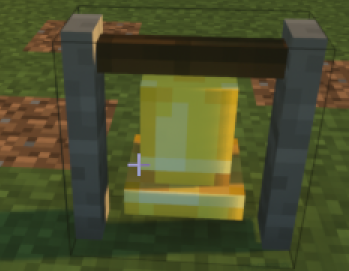
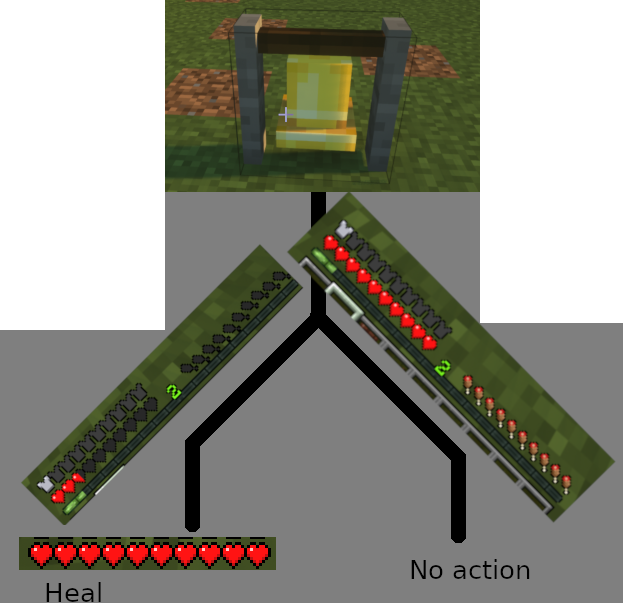
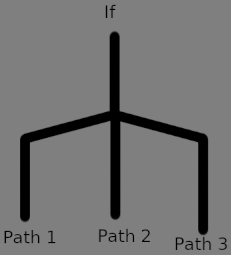
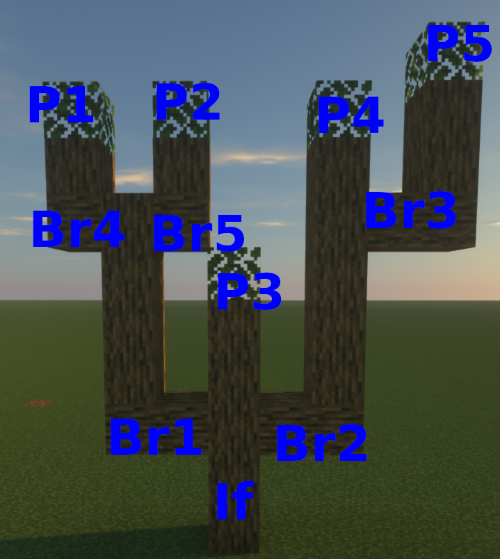

Changing The Path: The If Command
---------------------------------

```eval_rst
.. contents:: Table of Contents
    :local:
```

### What Is The 'If' Command?

You learned how to use events to run a set of commands whenever a situation occurs on your server. You learned how to use tags to change what any command does based on the details of the situation.
Now it's time to use the `if` command to combine the two concepts: choosing a set of commands to run based on the details of the situation.

The `if` command does exactly what it says on the tin: it says "*if* something is true, then run these commands. Otherwise, don't run them."

### So What Does An If Command Look Like?

Don't worry, `if` commands are pretty easy to write, and look just like anything else in a Denizen script does.

Here's the basic format:
```dscript_blue
- if (some condition here):
    - (some commands)
    - (go here)
```

As you can see, `if` is a command <span class="parens">(written just like any other at the start, with some condition(s) as its input arguments)</span>
but with a `:` on the end <span class="parens">(just like you would have on an event line)</span>,
and some commands spaced out and placed within. The thing to be extra careful about here is the spacing on the commands within.
If the commands within don't get spaced out a step, Denizen won't know that they were meant to be in the `if`, and just run them regardless of the condition you give.

Let's see how this might look in a real script...
```dscript_green
magic_healing_bell:
    type: world
    events:
        on player right clicks bell:
        - if <player.health_percentage> < 25:
            - heal
            - actionbar "<green>The bell has healed you!"
```



This handy sample script will instantly heal a player that clicks on a bell block, but *only if* their health is dangerously low.
<span class="parens">(We'll expand on this sample script throughout this section, and when we get to the [Flags](flags) section we'll revisit this sample script to add a rate limit, so players can only heal once every few minutes).</span>

### Conditions

There's a few different ways to make a condition in an `if` command.
At its simplest, the condition could be a boolean tag <span class="parens">(one that returns 'true' or 'false')</span>, and that's enough right there. <span class="parens">(For example, `- if <player.on_fire>:`)</span>.
The `if` sub-commands will run when the tag returns `true`, and won't when it returns `false`.
You can also invert <span class="parens">(run when the tag is 'false', and don't run when it's 'true')</span> these simple boolean `if` commands using the `!` symbol <span class="parens">(which is read as "not")</span>.
For example, `- if !<player.on_fire>:` will run only if the player is **not** on fire.

It could also be some value tag <span class="parens">(a tag that returns anything more complicated than a boolean)</span>, in which case it will be compared to some other value.
The basic format of an `if` command that compares two values is `- if (first value) (comparison) (second value):` <span class="parens">(for example, `- if <player.name> == mcmonkey4eva:`)</span>.
One or both values can be a tag. <span class="parens">(Technically, both values can also be static text, but that would mean the `if` command either always runs its sub-commands, or never does... that's not a very useful `if` command)</span>.

There are a few different comparison types available:
- `==` to test equality <span class="parens">(`- if 3 == 3:` will run its commands, but `- if 3 == 4:` will not)</span> - you can read this as "if three is equal to three, then run some commands".

<hr>

- `!=` to test equality but expect the opposite result <span class="parens">(so, `- if 3 != 3:` will **not** run its commands, and `- if 3 != 4:` **will** run its commands)</span> - the `!` is read as "not",
so you can read this like "if three **is not** equal to three, then run some commands." Of course in real usage, one or both of the values would be from a tag.

<hr>

- `>` (is greater than), `>=` (is greater than or equal to), `<` (is less than), and `<=` (is less than or equal to) to test numeric comparisons. Note that `>` and `<=` are opposites, and that `<` and `>=` are opposites.
As a special additional note here: you might notice that `<` and `>` are the symbols used to indicate a tag normally, but are used for a different meaning here -
this is fine, as you will never have both `<` and `>` in a single argument of a comparison, and thus the symbols will never be misinterpreted as a tag.

### Combining Conditions: The Venti Mocha Frap With Extra Sugar and No Cream

When a simple comparison just won't do, and you gotta get a few extra things included, don't worry: the `if` command will let you do that!

There are two combination types available:
- If you want a set of commands to run if multiple comparisons **are all** true, use `&&` <span class="parens">(read as "and" - the symbol itself is a double-ampersand)</span>.
For example, `- if <player.on_fire> && <player.health_percentage> < 25:` will run its commands if a player is on fire *and* almost dead.

<hr>

- If you want a set of commands to run if **any one (or more)** of multiple comparisons is true, use `||` <span class="parens">(read as "or" - the symbol itself is a double-pipe)</span>.
For example, `- if <player.on_fire> || <player.health_percentage> < 25:` will run its commands if a player is on fire <span class="parens">(regardless of their health)</span>,
or will run its commands if the player's health is low <span class="parens">(regardless of whether they're on fire)</span>.

If you have a lot of things you want to specify at once, you can simply chain these together in a row: `- if (condition one) && (condition two) && (condition three) && (condition four):`.
There's only one complication: chaining together only ones if you have `&&` all the way down the chain, or you have `||` all the way down the chain.
You can't have both in one chain... think about it, `- if (one) && (two) || (three) && (four):` ... what does that mean?
Does that mean we must either have one and two, OR have three and four? It could also mean we must have one, two or three, and four.
We as humans might be able to make a good guess as to which was intended, but Denizen is just software, it can't read minds.

The solution to this problem was hidden in the way I asked the question: if you look at the way I specified the two possible interpretations, you'll notice I carefully grouped parts together, and separated the other parts into a list.
Denizen contains a syntax to do the very same: parentheses `()` with extra spaces can be used to mark groupings.
So how do we use that?

Here's a long but relatively simple example:
```dscript_blue
- if ( <player.name> == mcmonkey4eva && <player.health_percentage> > 90 ) || ( <player.on_fire> && <player.health_percentage> < 25 ):
    - narrate "wow mcmonkey specifically is doing pretty well! That or somebody is dying from a fire..."
```

Using grouping as shown above, you can make any combination of conditions you might ever need.
You can even put groups inside of other groups if you really want to, but be aware that going too crazy can make your script hard to read,
and a better organization might be preferable <span class="parens">(see next sub-section below for one good alternative)</span>.

### The Most Common Usage of 'If'

The benefit of the `if` command in the 'magic healing bell' example earlier is pretty straight forward: it allowed us to narrow down exactly when a set of commands should run.
Rather than just "whenever a player clicks a bell", it's now "whenever a player clicks a bell, *and* that player has low health".
Narrowing down the requirements for commands to run is, generally speaking, the most common usage of an `if` command.

You will very often see this in real scripts in a slightly different form, but accomplishing the same goal:
```dscript_green
magic_healing_bell:
    type: world
    events:
        on player right clicks bell:
        - if <player.health_percentage> > 25:
            - stop
        - heal
        - actionbar "<green>The bell has healed you!"
```

By using the `stop` command inside an `if`, we are able to stop the script from running the heal command if a player's health is greater than 25%.
This is functionally the same as the original script, but expressed 'backwards'
<span class="parens">(instead of "if the player has below 25% health, heal them" we instead say "if the player has above 25% health, they don't get healed").</span>
This is very useful when you have multiple things you want to require before you want the actual script commands to be ran, as they can expressed neatly in order
<span class="parens">(rather than getting stuck with a very long line listing all your conditions)</span>.

### A Fork In The Road

So far, we've explained the basics of the `if` command in terms of how to run a set of commands or not run them, based on some condition.
This is great for adding extra requirements to an event before a set of commands runs, but that's not all that `if` can do!
The if command, as we currently understand it, says "if this condition is true, then run these commands, otherwise don't."
Let's expand that to instead say "if this condition is true, then run these commands, otherwise *run these different commands*."
Now, our script can go down one of two paths depending on some tag-based condition.
We'll do this using the `else` command.



### What Does An Else Command Look Like?

The `else` command looks almost the same as an `if`.

Here's the basic format:
```dscript_blue
- if (some condition here):
    - (commands for when the condition is 'true')
- else:
    - (commands for 'false')
```

That's pretty simple! It's just an `else` with no input parameters, formatted just like an `if`, and with the special requirement that it must be right after an `if`.
Whenever the `if` command's condition is 'false', the commands in `else` will run.

Let's make use of an else in our magic bell script...
```dscript_green
magic_healing_bell:
    type: world
    events:
        on player right clicks bell:
        - if <player.health_percentage> < 25:
            - heal
            - actionbar "<green>The bell has healed you!"
        - else:
            - actionbar "<red>The bell does nothing: you're healthy enough already."
```

The existing script healed players with less than 25% health. Now it will also give a message to players that are healthy enough, so they don't get confused when the bell doesn't do anything.

You might ask "well, why don't I just use the `stop` command the way you showed earlier, and put the rejection message right before the `stop` command?" - And you can do that!
That's a great way to do that. So what good is the else command? It's much more useful when you have things that go after the `if`/`else` commands, that need to run regardless of what happens with the `if`/`else`.
Consider this script:

```dscript_green
magic_healing_bell:
    type: world
    events:
        on player right clicks bell:
        - if <player.health_percentage> > 90:
            - actionbar "<red>The bell does nothing: you're healthy enough already."
            - stop
        - if <player.health_percentage> < 25:
            - actionbar "<green>The bell has saved you!"
        - else:
            - actionbar "<green>The bell has healed you!"
        - heal
```

This script will reject the player if they have at least 90% health, and heal for anything below that.
It gives a unique message depending on whether the player is almost dead, or just a bit low.
If we didn't use an `else` command here, we would have had to do this:

```dscript_red
magic_healing_bell:
    type: world
    events:
        on player right clicks bell:
        - if <player.health_percentage> > 90:
            - actionbar "<red>The bell does nothing: you're healthy enough already."
            - stop
        - if <player.health_percentage> < 25:
            - actionbar "<green>The bell has saved you!"
            - heal
            - stop
        - actionbar "<green>The bell has healed you!"
        - heal
```

That's a lot worse! We had to write the `heal` command twice <span class="parens">(not to mention the extra `stop` command)</span>.
If you're thinking "that's not too bad", just think about how much worse that might get in a real script where there's a lot more than just a single `heal` command that runs regardless of the condition.
You'd be duplicating an entire list of commands - luckily, the `else` command lets us avoid that!

### Don't Forks Normally Have 3 or 4 Prongs?



The `else` command is pretty handy as we've seen, but it actually has even more power to it!
We started out with just an `if` command that lets you make one subset of code run or not run.
We then expanded to the `else` command to let you run one of two possible subsets of code.
You can probably guess what we're expanding to next: a way to choose one of many possible subsets of code.
This is the `else if`!

### How Do You Write An 'Else If'?

Here's the basic format:
```dscript_blue
- if (first condition here):
    - (commands for when the first condition is 'true')
- else if (second condition):
    - (second condition 'true' commands)
- else:
    - (commands for when all conditions were 'false')
```

As you can see, it's pretty much just slapping an `if` inside of an `else`.
You can chain `else if`s in a row as many times as like, the only limit is you must always start with a regular `if`.
You do not have to have an `else` <span class="parens">(without the `if`)</span> but you can if you want, it just has to be kept at the very end if so.

How might that go in real usage?

```dscript_green
magic_healing_bell:
    type: world
    events:
        on player right clicks bell:
        - if <player.health_percentage> > 90:
            - actionbar "<red>The bell does nothing: you're healthy enough already."
        - else if <player.health_percentage> < 25:
            - actionbar "<red>The bell can't save you: you're too far gone."
        - else:
            - actionbar "<green>The bell has healed you!"
            - heal
```

This version of the magic bell script won't heal you if you're healthy already, and also won't save you from death - it will only heal you if you're moderately injured.
Thanks to this new design, we don't need the `stop` command at all anymore, as the `heal` command only runs on one of the possible "branches".

### Wait Who Was Talking About Trees?



If you have experience in advanced computer processing design - well, first of all, why are you bothering to read this guide? but more relevantly - you might recognize the term "branch" being used here.
If not, you might still recognize the idea of visualizing paths as trees with many branches. If you don't have any idea what I'm on about, don't worry, I'll explain.

The different ways an if command might go are sometimes called "branches", usually when using this terminology the overall structure of a script is called a "tree".
When a script is being ran, it starts at the "root" <span class="parens">(whatever the first command is)</span>,
and it "branches out" any time you have an `if` command or similar <span class="parens">(any subset of commands that only sometimes runs)</span>.

You don't have to know or use any of these terms or any others like it we introduce, but if you see someone using them and don't know what they're talking about, hopefully you'll remember that this subsection exists to come look back at!

Another common phrasing you might want to be aware of is "pass" and "fail" - an `if` command "passes" when its conditions are true <span class="parens">(and its sub-commands run)</span>.
The `if` has "failed" when its conditions are false <span class="parens">(and its sub-commands don't run)</span>.

### Going Beyond

If you're sitting here thinking "well this is all well and good, but there's so many more complicated ways I want to branch my scripts",
well... you've reached the end of the general overview of the `if` command here. Depending on what you want to do,
you might just go ahead and stick an `if` command inside of another `if` command <span class="parens">(nothing's going to stop you, other than than your script starting to look big and scary)</span>,
or if that's not good enough... well keep reading through the guide, one of the upcoming sections will probably have what you're looking for <span class="parens">(like the [Loops section](/guides/basics/loops))</span>.

### Related Technical Docs

If you want to read a lot more about the if command, here are a few technical guides you might consider...

Note: most users, especially those learning from the Denizen for the first time, should just continue on to the next guides page. These references might be of interest to later come back to after you've learned Denizen as far as this guide teaches.

- [If command doc](https://one.denizenscript.com/denizen/cmds/if)
- [Else command doc](https://one.denizenscript.com/denizen/cmds/else)
- [Comparable language doc](https://one.denizenscript.com/denizen/lngs/comparable)
- [Operator language doc](https://one.denizenscript.com/denizen/lngs/operator)
