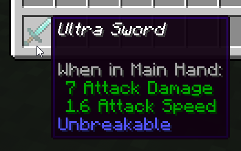
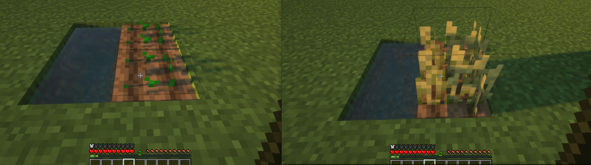
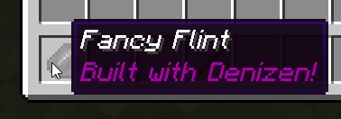
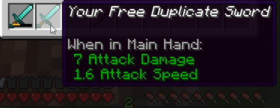
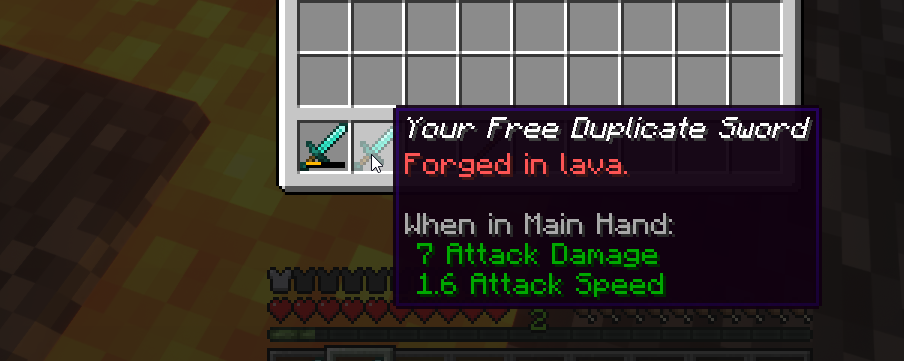

Mechanisms And Properties
-------------------------

```eval_rst
.. contents:: Table of Contents
    :local:
```

### What's a Mechanism?

**Mechanisms** are a way to directly change a single value on an object. They're kind of like mini-commands, designed to work as part of the property system.

Here are a few examples of simple mechanisms, used in script containers:

```dscript_green
ultra_sword:
    type: item
    display name: Ultra Sword
    material: diamond_sword
    mechanisms:
        unbreakable: true
```



This script, using the `mechanisms` key of `item` script containers, has the mechanism named `unbreakable` set to the value `true`, which makes the item never take durability damage.

```dscript_green
undead_golden_swordsman:
    type: entity
    entity_type: zombie
    item_in_hand: golden_sword
    item_in_offhand: golden_sword
    health_data: 80/80
```


This `entity` script creates a zombie and uses the `item_in_hand` and `item_in_offhand` mechanisms to put golden swords in both hands. It also spawns with 80 health, and has 80 health at maximum, using the `health_data` mechanism.

### The Adjust Command

Mechanisms can be used in more than just script containers! If you need to alter the value of a mechanism, the `adjust` command is the way to go.

For example, if we want to write a script that changes the color of a sheep when right-clicked:

```dscript_green
random_sheep_colors:
    type: world
    events:
        after player right clicks sheep with:stick:
        - adjust <context.entity> color:<context.entity.allowed_colors.random>
```


Using this script, when a player right-clicks any sheep mob with a stick in hand, the sheep mob will change to a random color.

The `adjust` command can be used to adjust mechanisms on most object types <span class="parens">(players, entities, the server, ...)</span> but some situations call for different ways of applying mechanisms.

### The AdjustBlock command

The `adjustblock` command is a variant of the normal `adjust` command. It's built specifically to adjust `material` mechanisms on blocks <span class="parens">([a list of which can be found here](https://one.denizenscript.com/denizen/mecs/materialtag))</span>.

While the applicability of `adjustblock` is more niche, it can still be quite useful. For a quick usage example, you can use this script to force a plant block to immediately change to its maximum age <span class="parens">(eg. to cause newly-planted wheat to fully grow)</span>:

```dscript_green
plant_grower:
    type: world
    events:
        after player right clicks block with:stick:
        - if <player.cursor_on.material.is_ageable>:
            - adjustblock <player.cursor_on> age:<player.cursor_on.material.maximum_age>
```



### How To Adjust Items

You can also adjust the properties of items in inventories. Doing so uses the `inventory` command with the `adjust` argument.

You might assume that the way to modify an item held by a player is by adjusting the item itself:

```dscript_red
flint_fancifier_bad:
    type: world
    events:
        after player right clicks block with:flint:
        - adjust <player.item_in_hand> "display:Fancy Flint"
        - adjust <player.item_in_Hand> "lore:Built with Denizen!"
```

However, the tag `<player.item_in_hand>` will just return "flint", with no indication of *which* flint item. In effect, the above script is attempting to modify the abstract concept of flint items, rather than the specific flint in the player's hand. If you're not adjusting a specific item that exists in the world somehow, nothing is going to change in the world!

So instead, the usual way to adjust an item is to use the `inventory` command's `adjust` argument to adjust the specific item that you want to change.

The below example will *correctly* transform a player's flint into a diamond when they right click with it:

```dscript_green
flint_fancifier:
    type: world
    events:
        after player right clicks block with:flint:
        - inventory adjust slot:<player.held_item_slot> "display:Fancy Flint"
        - inventory adjust slot:<player.held_item_slot> "lore:Built with Denizen!"
```



The `inventory adjust` command will specifically change the item at issue, because that's what it is designed to do! Because you identify the unique object of the item as it exists in the player's inventory <span class="parens">(as a reference a specific slot within an inventory)</span>, the `inventory adjust` command is therefore able to modify it as desired.

#### The With Tag

In some cases, the `.with` tag is convenient for adjusting mechanisms on an item. Unlike the `inventory adjust` command, which has to operate on a real pre-existing item, the `with` tag takes any conceptual item, and returns a copy of that conceptual item with the mechanisms applied, which can then be put into any command that accepts items as normal.

Say for example that rather than changing the name of the player's held item, you instead want to give them a new copy of that item with a different name or with repairs.

```dscript_green
sword_duplicator:
    type: world
    events:
        after player right clicks bedrock with:diamond_sword:
        - ratelimit <player> 1h
        - give "<player.item_in_hand.with[display=Your Free Duplicate Sword].with[durability=0]>"
        - narrate "<&b>Sword duplicated!"
```



The above script example allows players to take a diamond sword down to bedrock level to get a repaired duplicate made, no more than once per hour.

As you can see in the example above, like any tag, the `with` tag can simply be placed on the end of any `ItemTag`, and because it returns an `ItemTag`, you can also chain multiple `with` tags in a row.

Note also that there is also a `with` tag available for `MaterialTag` objects, to achieve similar logic with blocks.

### Adjusting Definitions

The `adjust` command can also be used to modify an object stored in a definition and automatically apply the resultant object back into the definition.

This is a relatively niche use case, but it can come in handy at times. In particular, this allows for `if` commands to be used to choose which mechanisms need to be applied to an object prior to actually performing changes.

For example:

```dscript_green
sword_duplicator:
    type: world
    events:
        after player right clicks bedrock with:diamond_sword:
        - ratelimit <player> 1h
        - define sword <player.item_in_hand>
        - adjust def:sword "display:Your Free Duplicate Sword"
        - if <player.location.material.name> == lava:
            - adjust def:sword "lore:<&c>Forged in lava."
            - adjust def:sword durability:0
        - give <[sword]>
        - narrate "<&b>Sword duplicated!"
```



This script is similar to the sword duplicator in the `with` tag example, but now only repairs the duplicate sword if the player is daring enough to jump into lava before clicking bedrock. <span class="parens">(You can comment out the `ratelimit` by putting a `#` symbol before the `-`, to be able to test the script without having to wait.)</span>

This way of adjusting items also has the advantage of being slightly cleaner when changing many mechanisms at once, thanks to the more linear format.

### Properties

"Properties" are a system to track the details of an object that doesn't have a unique identity of its own.

Generally, every properties consist of one tag and one mechanism. The tag reads the current value, and the mechanism applies a new value. In many cases, they will also be associated with additional helpful tags and/or mechanisms to make things easier when trying to interact with a property through a script. Note that while every property has a tag and mechanism, not every tag or mechanism is related to a property.

Properties are most noticeable from their usage in Denizen internal object descriptions. Object descriptions are the full reusable description of any object, generally marked with object notation <span class="parens">(like `i@`)</span> in front of it. This is primarily for internal data tracking, and you will most often only see it in your debug console.

#### Item Properties

The most common place that properties are seen in use is with items. In Denizen, an item is a material and a series of properties. For example, if you hit an entity with a freshly-crafted diamond sword in survival mode and then run `/ex narrate <player.item_in_hand>` to view the Denizen internal description of that item, you'll see it return `i@diamond_sword[durability=1]`. In this case, `durability` is the only property of the item, and its value is `1`, the amount of durability the item has lost thus far. Multiple properties are separated by semicolons. For example, `i@diamond_sword[durability=1;display_name=Skullbuster]`. <span class="parens">(Remember, [don't type raw object notation](/guides/troubleshooting/common-mistakes#don-t-type-raw-object-notation) into a script - these are examples of internal data formats, not anything that can be put in a script directly)</span>

Items are, fundamentally, their material and their properties. Any item a player has in their inventory can be parsed in this manner, and any item's properties can be read or modified as desired.

#### Material Properties

Materials, like items, lack unique identities. A stone block is just a material at a location. A wheat block is only slightly more complicated - it's a material at a location with an `age` property. As you saw above in the `adjustblock` example, using the `age` mechanism allows you to modify that property for a block in the world. When you read block materials from locations, they will return any associated properties. This could be used, for example, to check whether a campfire is sending up smoke signals, or various redstone properties, or even the faces of a mushroom block.

Materials with properties, when parsed by a tag like `<player.cursor_on.material>`, will return an output like `m@wheat[age=7]` for a fully-grown wheat block. In this case, the `age` of the wheat is `7`.

#### Entity Properties

Entities have properties too! Entity properties can be read and modified just like material properties, and you can see a list of all of an entity's properties with the `<EntityTag.describe>` tag. For example, here's a sample output of `/ex narrate <player.target.describe>` when targeting a sheep modified by our color script:

```
e@sheep[age=0;has_ai=true;is_aware=true;color=orange;equipment=li@i@air|i@air|i@air|i@air|;health_data=8/8;speed=0.23]
```

As you can see above, all of the data about the sheep is captured by Denizen and output in the format of an EntityTag with various properties. Each property is separated by a semicolon, and the data stored in each property varies based on the nature of the property. 

These properties can be adjusted using the `adjust` command or read by using their corresponding tags. As the property is named `color`, we can assume that there is both a mechanism and a tag named `color` for EntityTag objects. `/ex narrate "The <player.target.entity_type> you're looking at is colored <player.target.color>"` will narrate, for example, `The SHEEP you're looking at is colored orange` based on the data above.

### Related Technical Docs

If you want to read a lot more about mechanisms and properties, here are a few technical guides you might consider...

Note: most users, especially those learning from the Denizen for the first time, should just continue on to the next guides page. These references might be of interest to later come back to after you've learned Denizen as far as this guide teaches.

- [Adjust command meta docs](https://one.denizenscript.com/denizen/cmds/adjust)
- [AdjustBlock command meta docs](https://one.denizenscript.com/denizen/cmds/adjustblock)
- [Inventory command meta docs](https://one.denizenscript.com/denizen/cmds/inventory)
- [ItemTag.with meta docs](https://one.denizenscript.com/denizen/tags/itemtag.with)
- [MaterialTag.with meta docs](https://one.denizenscript.com/denizen/tags/materialtag.with)
- [EntityTag.describe meta docs](https://one.denizenscript.com/denizen/tags/entitytag.describe)
- [List of all mechanisms](https://one.denizenscript.com/denizen/mecs/)
