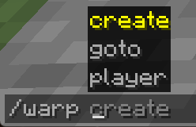

Handling Player Commands
------------------------

```eval_rst
.. contents:: Table of Contents
    :local:
```

### What Are Player Commands?

A player command is a command that a player types in chat to perform some unique task. These can range from fun user interactions to moderating tools, and are found all over Minecraft. Denizen allows you to create custom player commands of your own to further enhance your server. This page will walk through making a basic 'warp' command, a command that allows a user to set up points for others to teleport to. This is to illustrate how to make custom player commands as well as point out various features one should think about when making player commands.

### The Basic Structure

To start off, all custom commands in Denizen require the same basic structure. This is similar to the `task` scripts you have been seeing up until now, however with a few more required details:

```dscript_blue
ScriptContainerName:
    type: command
    name: [commandName]
    description: [a short description of your command]
    usage: [a description of the usage]
    permission: [permission key]
    script:
    - (commands here)
```

In [the script editor](/guides/first-steps/script-editor), you can simply type `command` and use tab completion to generate the template of a command script at any time.

In addition to specifying the type of this script is `command`, you also need to provide the name of the command. This is what the user will be typing in chat to run the command <span class="parens">(without the `/` slash prefix)</span>.

You also need to provide a description and a usage text. These are primarily for the default `/help` command.

You also generally should specify a permission node - this can be be any made up key for now. You're probably an op on your test server, so you'll bypass the permission requirement anyway.

So let's start our command script by filling out the required fields:
```dscript_green
warp_command:
    type: command
    name: warp
    description: Warps you to magical places.
    usage: /warp
    permission: dscript.warp
    script:
    - narrate "<&[base]>This is where my command will go!"
```
Try it out in game by running `/warp`. This should just narrate out `This is where my command will go!`. Far from what we have set out to do, but our custom command does work in the sense it does something.


### Handling Player Arguments

A command is often much more than just the initial name. While some basic ones can be, often a command expects more details from the player. In our case with the warp command, we want to make warp points as well as travel to those points. For instance I might want to use `/warp create spawn` to make a new warp point called spawn. In this case `create` and `spawn` would be the arguments.

Similar to events, the command script has a few `context` tags that store some information about how the player used the command. One of these is `<context.args>` which contains a list of all the arguments the player used.

Let us give our command some functionality, namely creating new warp points and also being able to warp to those points:
```dscript_yellow
warp_command:
    type: command
    name: warp
    description: Warps you to magical places.
    usage: /warp create|goto [warp-name]
    permission: dscript.warp
    script:
    - choose <context.args.first>:
        - case create:
            - define name <context.args.get[2]>
            - flag server warps.<[name]>:<player.location>
            - narrate "<&[base]>Created warp <&[emphasis]><[name]><&[base]>!"
        - case goto:
            - define name <context.args.get[2]>
            - teleport <player> <server.flag[warps.<[name]>]>
            - narrate "<&[base]>Warped to <&[emphasis]><[name]><&[base]>!"
```
Try this out by doing `/warp create test`, then move away a bit, then `/warp goto test`. You will find yourself back at the first location you set the warp at.

To break down what's going on:
- We take a look at the first argument passed in
- If this argument is `create` create a flag on the server based on the second argument passed in
- Otherwise if that first argument is `goto` teleport the player to the location stored in the flag specified by the second argument

You might notice that if the player inputs anything other than a command exactly the way we wanted, the script will break. More on how to deal with this farther down.

Notice we have now also updated the `usage` text. While this doesn't provide any actual purpose to the script, it is good to keep the documentation accurate.

You'll also notice that the `narrate` command makes use of multiple colors <span class="parens">(of the standard colors selected in your Denizen `config.yml` file)</span> to make the key parts of the message clearly stand out. Little touches like this go a long way in making your commands friendly to players.

#### Handling Player Player Arguments

A common feature of many commands is being able to do something to someone else, and as such you would need to pass in their name. For instance with our warp command we may want the functionality of being able to warp someone else instead of just yourself.

Let us say we want the command to look like `/warp player (player name) (destination)`. The resulting script would now look something like this:
```dscript_yellow
warp_command:
    type: command
    name: warp
    description: Warps you to magical places.
    usage: /warp create [warp-name] | goto [warp-name] | player [player] [warp-name]
    permission: dscript.warp
    script:
    - choose <context.args.first>:
        - case create:
            - define name <context.args.get[2]>
            - flag server warps.<[name]>:<player.location>
            - narrate "<&[base]>Created warp <&[emphasis]><[name]><&[base]>!"
        - case goto:
            - define name <context.args.get[2]>
            - teleport <player> <server.flag[warps.<[name]>]>
            - narrate "<&[base]>Warped to <&[emphasis]><[name]><&[base]>!"
        - case player:
            - define playerName <context.args.get[2]>
            - define destination <context.args.get[3]>
            - define playerToWarp <server.match_player[<[playerName]>]>
            - teleport <[playerToWarp]> <server.flag[warps.<[destination]>]>
            - narrate "<&[base]>Warped <&[emphasis]><[playerToWarp].name> <&[base]>to <&[emphasis]><[destination]><&[base]>!"
```
Try this out on someone else on the server, or if this is localhost you can test it by passing in your own name.

Notice we don't use the argument passed in directly for the teleport command, we instead used the tag `<server.match_player[]>` to find the player object of the given name. This is an important step - while there are some smart converters in Denizen where you can just give the name of the thing and it will get the correct object (such as materials) this does not work with players. In addition, `<server.match_player[]>` allows for imprecise inputs, such as if there is someone named `bobby` on the server `<server.match_player[bob]>` would work <span class="parens">(assuming there was no one actually named `bob`)</span>.


### Adding Tab Completions

A nice way to enhance your command scripts is by adding tab completions - a system in Minecraft for auto-completing arguments. In order to accomplish this you can add the following:
```dscript_blue
warp_command:
    type: command
    name: warp
    description: Warps you to magical places.
    usage: /warp create [warp-name] | goto [warp-name] | player [player] [warp-name]
    permission: dscript.warp
    tab completions:
        1: create|goto|player
        2: <context.args.first.equals[goto].if_true[<server.flag[warps].keys>].if_false[]>
        3: <context.args.first.equals[player].if_true[<server.flag[warps].keys>].if_false[]>
    script:
    #...nothing changed here
```
Try this out, while typing in the command see the Minecraft tab-complete menu pop up and see it in action.

What will happen is that while the player is typing the first argument, the suggestions `create`, `goto`, and `player` will be shown, with the one that is closely matched being highlighted.

While the player is typing the second argument, if the first argument is `goto` it will fetch all the keys stored in the warp flag, otherwise nothing will be suggested. A similar thing is done for the third argument, but checking if the first argument is `player`.



Something to keep in mind, tab completions does not provide any additional functionality to your script other than give suggestions to the player. You still need to write the rest of the script out to handle any arguments passed in.

You might notice at this point that adding tab-completions for player names in the 'player' sub-command would require a really long line for tab completions of argument #2 - hitting barriers like this is the first sign that command is getting too complicated, and that you may want to split your command into multiple <span class="parens">(for example, a `createwarp [name]` command script, separate from a `warpto [name] (player)` command script)</span>.

### Don't Trust The Player

The script as-is technically works fine, assuming everyone uses it properly - However, there is no guarantee of that happening. This comes to an important topic: *never trust the player*. Do not assume the player will always do what you want them to do or expect them to do.

Some players may attempt to cheat or exploit the system, others may simply make mistakes. Humans are imperfect, and as such your command script must be prepared for this.

There are a number of issues that can rise up from our simple command here, such as:
- What if someone tries to goto a warp that doesn't exist?
- What if someone tries to create a warp that already exists?
- What if someone forgot to put in arguments?
- What if someone put in too many arguments?
- What if someone gives an invalid argument?
- What if the player you specified doesn't exist?
- What if the warp name has some incompatible syntax like a `.` or space or something else in it?


While some issues may simply be mostly harmless <span class="parens">(such as providing too many arguments)</span>, some may cause errors in the script <span class="parens">(such as the warp not existing)</span>, or ruin something else <span class="parens">(such as creating a warp that already existed)</span>. For all of these cases, it is important that you catch these player errors to make sure everything is as smooth as possible for everyone.

Let's see what our script looks like with thorough error checking:
```dscript_green
warp_command:
    type: command
    name: warp
    description: Warps you to magical places.
    usage: /warp create [warp-name] | goto [warp-name] | player [player] [warp-name]
    permission: dscript.warp
    tab completions:
        1: create|goto|player
        2: <context.args.first.equals[goto].if_true[<server.flag[warps].keys.parse[unescaped].if_null[]>].if_false[]>
        3: <context.args.first.equals[player].if_true[<server.flag[warps].keys.parse[unescaped].if_null[]>].if_false[]>
    script:
    # If the command is used without input, the player probably doesn't know what to do
    # So tell them
    - if <context.args.is_empty>:
        - narrate "<&[error]>/warp create [warp-name]"
        - narrate "<&[error]>/warp goto [warp-name]"
        - narrate "<&[error]>/warp player [player] [warp-name]"
        - stop
    - choose <context.args.first>:
        - case create:
            # Validate the argument count
            - if <context.args.size> < 2:
                - narrate "<&[error]>You need to give the warp a name!"
                - stop
            - else if <context.args.size> > 2:
                - narrate "<&[error]>You provided too many arguments!"
                - stop
            - define name <context.args.get[2]>
            # Don't let users overwrite existing warps
            # Use ".escaped" to prevent strange symbols in the name causing issues
            - if <server.has_flag[warps.<[name].escaped>]>:
                - narrate "<&[error]>A warp already exists with the name of <&[emphasis]><[name]><&[error]>!"
                - stop
            # This means you'll need a 'warp delete [name]' as well
            - flag server warps.<[name].escaped>:<player.location>
            - narrate "<&[base]>Created warp <&[emphasis]><[name]><&[base]>!"
        - case goto:
            - if <context.args.size> < 2:
                - narrate "<&[error]>You need to specify where to warp to!"
                - stop
            - else if <context.args.size> > 2:
                - narrate "<&[error]>You provided too many arguments!"
                - stop
            - define name <context.args.get[2]>
            # Make sure the warp exists
            - if !<server.has_flag[warps.<[name].escaped>]>:
                - narrate "<&[error]>No warp by <&[emphasis]><[name]> <&[error]>exists!"
                - stop
            - teleport <player> <server.flag[warps.<[name].escaped>]>
            - narrate "<&[base]>Warped to <&[emphasis]><[name]><&[base]>!"
        - case player:
            - if <context.args.size> < 3:
                - narrate "<&[error]>You need to specify a player and where to warp to!"
                - stop
            - else if <context.args.size> > 3:
                - narrate "<&[error]>You provided too many arguments!"
                - stop
            - define playerName <context.args.get[2]>
            - define destination <context.args.get[3]>
            # Use a fallback to catch invalid player name input
            - define playerToWarp <server.match_player[<[playerName]>].if_null[null]>
            - if <[playerToWarp]> == null:
                - narrate "<&[error]>Can't find player by name '<&[emphasis]><[playerName]><&[error]>'!"
                - stop
            - if !<server.has_flag[warps.<[destination].escaped>]>:
                - narrate "<&[error]>No warp by <&[emphasis]><[destination]> <&[error]>exists!"
                - stop
            - teleport <[playerToWarp]> <server.flag[warps.<[destination].escaped>]>
            - narrate "<&[base]>Warped <&[emphasis]><[playerToWarp].name> <&[base]>to <&[emphasis]><[destination]><&[base]>!"
        # Handle invalid first-argument with a simple error message to the player
        - default:
            - narrate "<&[error]>Unknown argument '<&[emphasis]><context.args.first><&[error]>'!"
```
Try this out now by intentionally providing bad inputs and watch the command stop you.

Some safety measurements that are used here:
- Checking the size of the argument list to verify that the player actually typed in that argument
- Checking to see if the server does or does not have the flag to make sure there are no conflicts
- Stopping the script if any issue is detected as well as letting the user know what's wrong
- Added a null check to the tab completions so that in case there are no warps, Denizen will not display errors
- Added a null check to the `match_player` tag to verify that the player actually exists
- Used the `.escaped` tag to guarantee syntax-affecting symbols like `.` aren't put directly into the flag name.

While the size of the script has greatly increased, this is a necessary step for commands and for player interfaces in general.
You can read more about this in [the Common Mistakes page](/guides/troubleshooting/common-mistakes#don-t-trust-players).


### Wait, Can I See Your Permissions?

In addition to simply verifying whether or not the player has input the arguments correctly, you also want to make sure that the player has permission to use the command. By default Minecraft doesn't have a permission system <span class="parens">(beyond setting players to op)</span>, however there are a number of permission plugins that exist to help manage these, and if you're already running a server, you probably already have such a plugin installed.

The first step of permissions checking is just that the player has access to the command at all. This is handled by the `permission: dscript.warp` line we've included in every example thus far. Thanks to that line, any player that is not op and does not have the permission `dscript.warp` will not be able to use the command. It is generally recommended to add such a permission to any custom command, even if you plan for it to be used by anyone.

The specific permission key name can be anything you want. You're creating a new permission node, so you get to choose its name.

It's common to use a basic format like `dscript.[CommandName]` or `[ProjectName].[CommandName]` or something similar. You generally want your permission nodes to have relatively obvious names.


Sometimes you need a bit more permission testing than just basic access to the command - for instance we may want any player to be able to use the warps, but not make any new ones or force other players to warp. Adding such a permission check may look something like:
```dscript_green
warp_command:
    type: command
    name: warp
    description: Warps you to magical places.
    usage: /warp create [warp-name] | goto [warp-name] | player [player] [warp-name]
    permission: dscript.warp
    tab completions:
        1: create|goto|player
        2: <context.args.first.equals[goto].if_true[<server.flag[warps].keys.parse[unescaped].if_null[]>].if_false[]>
        3: <context.args.first.equals[player].if_true[<server.flag[warps].keys.parse[unescaped].if_null[]>].if_false[]>
    script:
    - if <context.args.is_empty>:
        - narrate "<&[error]>/warp create [warp-name]"
        - narrate "<&[error]>/warp goto [warp-name]"
        - narrate "<&[error]>/warp player [player] [warp-name]"
        - stop
    - choose <context.args.first>:
        - case create:
            #+ Require a special warp creation permission
            - if !<player.has_permission[dscript.warp.create]>:
                - narrate "<&[error]>You don't have permission to use this!"
                - stop
            - if <context.args.size> < 2:
                - narrate "<&[error]>You need to give the warp a name!"
                - stop
            - else if <context.args.size> > 2:
                - narrate "<&[error]>You provided too many arguments!"
                - stop
            - define name <context.args.get[2]>
            - if <server.has_flag[warps.<[name].escaped>]>:
                - narrate "<&[error]>A warp already exists with the name of <&[emphasis]><[name]><&[error]>!"
                - stop
            - flag server warps.<[name].escaped>:<player.location>
            - narrate "<&[base]>Created warp <&[emphasis]><[name]><&[base]>!"
        - case goto:
            - if <context.args.size> < 2:
                - narrate "<&[error]>You need to specify where to warp to!"
                - stop
            - else if <context.args.size> > 2:
                - narrate "<&[error]>You provided too many arguments!"
                - stop
            - define name <context.args.get[2]>
            - if !<server.has_flag[warps.<[name].escaped>]>:
                - narrate "<&[error]>No warp by <&[emphasis]><[name]> <&[error]>exists!"
                - stop
            - teleport <player> <server.flag[warps.<[name].escaped>]>
            - narrate "<&[base]>Warped to <&[emphasis]><[name]><&[base]>!"
        - case player:
            #+ Require a special warp-other-player permission
            - if !<player.has_permission[dscript.warp.other]>:
                - narrate "<&[error]>You don't have permission to use this!"
                - stop
            - if <context.args.size> < 3:
                - narrate "<&[error]>You need to specify a player and where to warp to!"
                - stop
            - else if <context.args.size> > 3:
                - narrate "<&[error]>You provided too many arguments!"
                - stop
            - define playerName <context.args.get[2]>
            - define destination <context.args.get[3]>
            - define playerToWarp <server.match_player[<[playerName]>].if_null[null]>
            - if <[playerToWarp]> == null:
                - narrate "<&[error]>Can't find player by name '<&[emphasis]><[playerName]><&[error]>'!"
                - stop
            - if !<server.has_flag[warps.<[destination].escaped>]>:
                - narrate "<&[error]>No warp by <&[emphasis]><[destination]> <&[error]>exists!"
                - stop
            - teleport <[playerToWarp]> <server.flag[warps.<[destination].escaped>]>
            - narrate "<&[base]>Warped <&[emphasis]><[playerToWarp].name> <&[base]>to <&[emphasis]><[destination]><&[base]>!"
        - default:
            - narrate "<&[error]>Unknown argument '<&[emphasis]><context.args.first><&[error]>'!"
```

Notice now the extra `if` check when the player is trying to create a warp and for warping other players using the tag `has_permission`.
Try testing this out, either with someone else or if you are on localhost remove permissions from yourself.

### Related Technical Docs

If you want to read a lot more about player commands, here are a few technical guides you might consider...

Note: most users, especially those learning from the Denizen for the first time, should just continue on to the next guides page. These references might be of interest to later come back to after you've learned Denizen as far as this guide teaches.

- [Command script containers doc](https://meta.denizenscript.com/Docs/Languages/command%20script%20containers)
- [Match_player tag doc](https://meta.denizenscript.com/Docs/Tags/server.match_player)
- [Match_offline_player tag doc](https://meta.denizenscript.com/Docs/Tags/server.match_offline_player)
