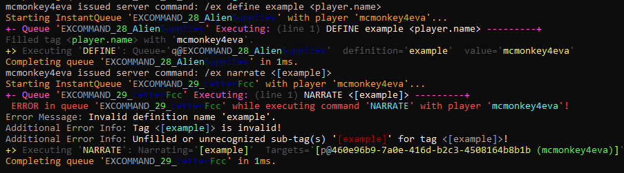
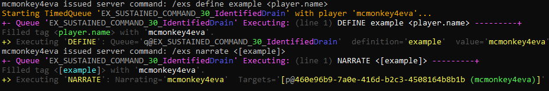
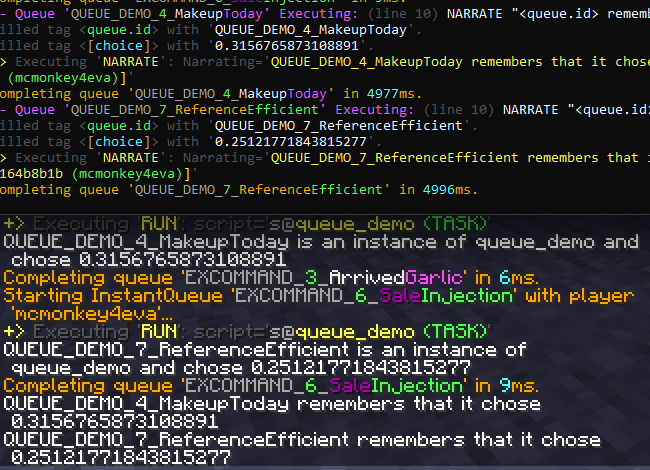

The Queue System
----------------

```eval_rst
.. contents:: Table of Contents
    :local:
```

### Preface

The primary purpose of this page is to introduce you to the concept of *the queue system*. This system is very important for the basic level of scripting, however it is on the inside somewhat complex and enables many advanced features. As such, many of the advanced parts will be mentioned or noted in parentheses throughout the page.

If you're following this guide for the first time, you don't need to understand every part of the queue system, you just need to understand the basic ideas of what queues are, but you should still read through all the information on this page to get a general sense of the breadth of the system's impact on Denizen.

### What Is A Queue?

In Denizen, the word '**script**' can refer to a few different things - a `.dsc` file, a container within it <span class="parens">(such as a `world` script container)</span>, or the sub-section of a script container that lists out commands to be run. For the purposes of this page, we'll be using the word 'script' to refer to that last meaning. A script might be just a single `narrate` command, or a long list of commands to be ran one after another, potentially even with `wait`s to delay between commands, `run`s to fire off other scripts, etc.

When you run a script, that starts a **queue**. A queue can be thought of as a currently-running instance of a script. Exactly what this means may not be obvious at first, but the effect it has on how Denizen works is significant.

Queues are separate, temporary, unique instances, that run and wait separately, and store separate sets of temporary data <span class="parens">(definitions, etc)</span>.

To help understand queues, let's work through some examples. We'll give a few different examples, so if you don't grasp it at first, continue reading, and you might understand it after the next example.

#### Phrasing Note

Often when talking about things attached to specific queues, the word "script" will still be used - we'll say for example that a script has a definition, even though in reality the queue has the definition, and the script just has the raw command that will later be ran in a queue to set a definition. It's often easier to just say the script did it, and only worry about the script vs. queue distinction when it needs to be exactly specified to avoid confusion.

### Ex-Sustained

Let's start by using the `/ex` command and the `/exs` command to get an idea of what a 'queue' is.

In your game, type the following two commands:
First: `/ex define example <player.name>`
Then: `/ex narrate <[example]>`

You'll see that this outputs an error and fails to fill. You defined the def `example` in the first command, and then tried to narrate it in the second, but it didn't work.



Why didn't that work? Because each usage of the `/ex` command is its own separate *queue*. The definition made in the first command is stored in the first command's queue, and is not accessible to the second command's queue.

Now, let's try using `/exs` - where `/ex` means "execute", `/exs` means "execute-sustained", as in it sustains a single queue.

First type: `/exs define example <player.name>`
Then: `/exs narrate <[example]>`

This time, you'll see your name narrated back as intended. Because both commands ran in the same sustained queue, the second command actually knows about the first command's definition.



### Sample Script

Let's use an actual prewritten script to understand the distinction between a 'script' and a 'queue'.

```dscript_green
queue_demo:
    type: task
    script:
    - define choice <util.random_decimal>
    - narrate "<queue.id> is an instance of <script.name> and chose <[choice]>"
    - wait 5s
    - narrate "<queue.id> remembers that it chose <[choice]>"
```

Load this script in, and then in-game enter the command `/ex run queue_demo` twice rapidly.

You should see output like this:



In the above screenshot, you can see that two queues started, one labeled "`QUEUE_DEMO_4_MakeupToday`" and one labeled "`QUEUE_DEMO_7_ReferenceEfficient`". These IDs are generated from a combination of the script name, a numeric ID <span class="parens">(a number that counts up by 1 each time a new queue is started)</span>, and two words from a random word generator. In the console debug log, you can see that the queue IDs also have random colors assigned to the random words <span class="parens">("`MakeupToday`" has white then magenta, "`ReferenceEfficient`" has orange then green)</span>, to help quickly distinguish between queues in debug logs.
<span class="parens">(Note: you can customize the queue id format in your `Denizen/config.yml` if you wish.)</span>

The queue labeled "`MakeupToday`" chose a random number of "`0.315`...", while "`ReferenceEfficient`" chose "`0.251`...".

Both queues started from the same `task` script, `queue_demo`, but are independent of each other. They ran at slightly separate times <span class="parens">(depending on how fast you repeated the run command)</span>, they each chose a separate random number and stored it in their own separate copy of the `choice` definition, both waited 5 seconds from when they uniquely started, and then gave the final narrate each at their own time, each showing their own separate ID and separate random number choice.

You can also see that each usage of `/ex` had its own queue, which exclusively executed the `run` command then finished, separately from the queue created for the running task script.

### Queues Are Separate

Each queue is separate from every other queue. This means they run/start/stop separately, and they track data separately.

#### Starting Separately

As we demonstrated earlier, you can `/ex run ...` a script multiple times and have the same script start a new queue multiple times, even while the previous times were still going. Those prior queues have no relation to the new queue.

#### Running Separately

In our above sample script, we saw that the queues each waited separately. If it wasn't obvious right away, try running `/ex run queue_demo`, then wait a couple seconds, then run it a second time. You should see the first queue start, then a pause, then the second queue start, then a pause, then the first queue finishes, then another pause equivalent to how long you waited between starting, then the second queue finishes. Each queue kept track of its `wait` time separately.

#### Stopping Separately

Each queue can stop separately. As seen above, the first queue stopped and was done, but the second queue kept going.

In a script you can at any time use the `stop` command to stop a queue - it will only stop the queue that has reached that command, other queues of the same script will not stop until they also reach that `stop` command.

#### Separate Data

Each queue has its own separate set of data attached to it. The most straightforward example of this is definitions - as you saw in the sample script above, the `choice` definition was attached uniquely to each queue.

This also means the *attached player and NPC* are unique to the queue - the same script can run multiple times for multiple different players, and each player will have their own queue.

This also includes *context data*, such as in a `world` script, the same event can run many times with different context data in each queue.

This also includes [the `save` argument](https://meta.denizenscript.com/Docs/Languages/the%20save%20argument).

### Queues Are Temporary

Queues only exist as long as they are running. The moment a queue is finished, it is gone forever <span class="parens">(though you can still in some advanced use cases grab determination values or other information from a stored reference to the `QueueTag` instance)</span>.

Queues necessarily cannot continue to exist after a server restart - when the server shuts down, all queues are lost. This means you can't have a queue `wait` to run more commands after a server restart - what you can do instead, however, is use the [`RunLater` command](https://meta.denizenscript.com/Docs/Commands/runlater) to schedule a script to be activated in the future, even after restarts.

### Queues Are Unique

Each queue is inherently unique. Accordingly, each queue has a unique ID - this means that no other queue can have the same ID at the same time. Note that this refers to the generated words, but does not contain the generated colors <span class="parens">(the colors are exclusively for debugging clarity)</span>.

After a queue is gone, A queue with the same ID cannot generate again until the server restarts. <span class="parens">(Warning: if you disable the numeric ID portion in your config, it is possible, albeit rare, for a queue to generate the same ID as one that has already stopped earlier in the server run, but not while a queue is still running with that ID.)</span>

After a server restart, queue IDs that are the same as previous ones may generate <span class="parens">(if you have the random-words part of the queue ID generator enabled, duplicate IDs will be very rare even after a restart)</span>. This is another reason that queue references should not be stored long-term.

### Queues Only Sometimes Overlap

If a queue never uses the `wait` command or any other source of delay, the queue can complete instantly. "Instantly" doesn't mean that no real time passes, but does mean that no in-game time passes. In other words, nothing else on the server runs, either in Denizen or in minecraft, until the queue is done. The whole server waits for the commands in the queue to execute.

If, however, you give the queue a source of delay <span class="parens">(a `wait` command, a `~` waitable, etc.)</span>, then the queue will instead instantly run commands until it reaches the delay, then pause the queue and allow the rest of the server to run. This includes any other queues that are themselves waiting to run more commands. Once the specified delay is done, the queue will resume, and instantly run the waiting commands until either it finishes or it reaches another command that causes a delay.

#### Technical Note 1: Queues vs Threads

If you have experience in other programming languages, you're probably thinking that queues sound similar to threads. This is true, they are similar, however they are not the same. The most important distinction is that while a queue is running non-delayed commands, no other queue can run. This is in contrast to multithreading, where multiple threads can run simultaneously, and have to be cautious about interacting with data that other threads might also be interacting with.

Queues can reliably read/modify any data without worry about conflict. The only exception is if you read some data, then `wait`, then perform actions based on that earlier data - the source might have changed during the `wait`. For example, if you read that a block's material is a door, then `wait`, then `switch` the door open, it's possible a player broke the door down during the wait, and thus the switch command will now produce an error.

#### Technical Note 2: InstantQueue vs TimedQueue

You might sometimes see `Forcing queue (NAME) into a timed queue...` in your debug log. This is because, internally, most queues are "instant" queues by default, and can become "timed" queues if they need to wait, such as when the `wait` command is used. The separation between queue times largely only exists for internal/technical reasons - so you don't really need to worry about this, just know that that type of debug output is normal and just the internal system doing its job.

### Queues Aren't Always From A Script

While we usually speak about queues in terms of a single script that they were created from, there are exceptions.

The first exception is of course the `/ex` and `/exs` commands, where they are created from a command typed directly into your in-game chat window.

The second exception is when the `inject` command is used, which will be explained further on the [Run Options page](/guides/basics/run-options).

As a related side note: any command that runs in Denizen is always inside a queue, however tags can sometimes be parsed outside of any queue.

### Is That Queue Running?

As a more advanced example of what you can do with the queue system, here's a sample script that runs another queue and keeps track of whether it's still running or not.

```dscript_green
start_a_queue:
    type: task
    script:
    - run wild_queue save:myqueue
    - while <entry[myqueue].created_queue.is_valid>:
        - narrate "Queue has <entry[myqueue].created_queue.determination.size> determinations thus far"
        - wait 1s
    - narrate "The queue finished and determined: <entry[myqueue].created_queue.determination.formatted>"

wild_queue:
    type: task
    script:
    - while true:
        - determine passively <util.random_boolean>
        - if <util.random_chance[20]>:
            - stop
        - wait 0.5s
```

Use `/ex run start_a_queue` to try this script sample.

This demonstrates running a separate queue, then tracking whether it's still running, and what determinations it has made. The "`wild_queue`" example just runs for a random length of time determining random values as it goes.

Note that the first narrate can sometimes be immediately "the queue finished...", and when not it's always "Queue has 1 ..."

This is because the `run` command *instantly* runs the new queue - so the queue of the `start_a_queue` task pauses and waits for `wild_queue` to either finish to itself pause - then, once `wild_queue` has paused, control of the server immediately returns to the `start_a_queue` script's queue, which proceeds to run the `while` command, and the first `narrate`, and then reaches its own `wait` command, at which point the server is finally allowed to process other things, including vanilla minecraft game logic.

If `wild_queue` passes the first `random_chance` and stops, then the sequence of events is: `start_a_queue` runs `wild_queue`, `wild_queue` starts a loop, makes one determination, then stops, then `start_a_queue` tries the `while` command but doesn't loop, then runs its final `narrate`, then stops - then and only then, the rest of the game is allowed to continue running.

### Denizen Is Fast

As a final note, some sections of the above page discusses the concept of the server pausing and waiting for queues to finish. This might give the impression that your game might freeze or lag, however the important thing to understand is that we are speaking about processor-level timescales - computers are very fast, the average modern processes runs literal billions of things per second. The time the server sits waiting for a queue is usually a few nanoseconds, or sometimes a few milliseconds. Almost everything processed on the server will normally cause the server to wait until it's done - this is just how computers usually work, they go through things in order <span class="parens">(excluding when multithreading is used, which doesn't apply to minecraft servers, which are largely single-threaded)</span>.

### Related Technical Docs

If you want to read a lot more about queues, here are a few technical guides you might consider...

Note: most users, especially those learning from the Denizen for the first time, should just continue on to the next guides page. These references might be of interest to later come back to after you've learned Denizen as far as this guide teaches.

- [The ex and exs commands](https://meta.denizenscript.com/Docs/Languages/ex%20command)
- [QueueTag object type](https://meta.denizenscript.com/Docs/ObjectTypes/queuetag)
- [QueueTag tag list](https://meta.denizenscript.com/Docs/Tags/queuetag)
- [ScriptTag.queues tag](https://meta.denizenscript.com/Docs/Tags/ScriptTag.queues)
- [util.queues tag](https://meta.denizenscript.com/Docs/Tags/util.queues)
- [RunLater command](https://meta.denizenscript.com/Docs/Commands/runlater)
- [The Player and NPC arguments language doc](https://meta.denizenscript.com/Docs/Languages/the%20player%20and%20npc%20arguments)
- [the save argument language doc](https://meta.denizenscript.com/Docs/Languages/the%20save%20argument)
- [waitable commands language doc](https://meta.denizenscript.com/Docs/Languages/waitable)
