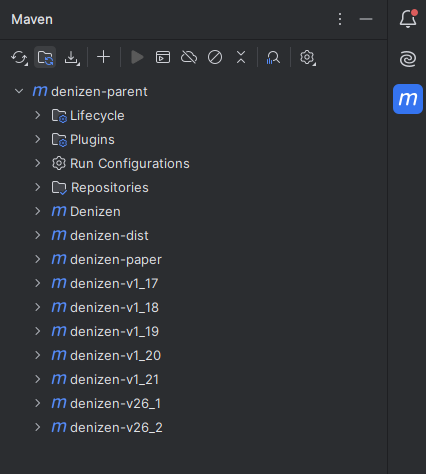

Building Denizen and Testing Changes
---------------------------------

```eval_rst
.. contents:: Table of Contents
    :local:
```

### Building Denizen

After you've made changes to Denizen's code, you'll need to test them thoroughly to ensure that they function as expected in all use-cases. To do this, you'll need to build the plugin, with your changes, into a custom .jar file.
The easiest way to do this is to use IntelliJ's Maven plugin's GUI. In IntelliJ, on the right side, you should see an `M` symbol. Click that and it'll open a menu that looks like this:



Right click on `denizen-parent` and select "Run Maven Build". This will take a few moments, especially the first time you do it. Wait until the console tells you that the build is sucessful, and then navigate to your repository. In the root directory, you'll find /target, and the` .jar` will be inside. This is your plugin and you can put it into your [test server](/guides/first-steps/local-test-server) and try it! Make sure you get the jar from the target directory in the root. 

### Testing Changes

How you test changes varies greatly depending on the nature of the feature, but you'll want to make sure that it works when used correctly and gracefully errors when used incorrectly on each version that it supports. Unless you've set otherwise, this means that you need to test it on each minecraft version that Denizen supports.
You should try to think a little outside-the-box when testing for failures, as you may be surprised just how incorrectly users manage to use your feature. For example, if you're adding a tag, command, or mechanism, try giving no input, input of the completely wrong object type, empty input, misordered input, or so on. If your change uses a location, try it on locations that are unloaded, do not exist at all (such as in a made-up world name), with noted locations. It's not possible or expected to catch every possible mistake, and Denizen will often handle user-created problems for you before your code ever runs, but do your best!
