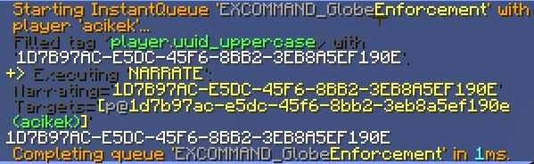

Adding New Properties And Tools
-------------------------------

```eval_rst
.. contents:: Table of Contents
    :local:
```

You should already be familiar with how to use tags and mechanisms within scripts. This page will walk you through creating your own custom tags, mechanisms, and properties in Java.

### Registering Tags

Tags that don't belong to properties are registered in the class definition of the object type, specifically in the `registerTags` static method. Take a look at the `PlayerTag` class located in the `objects` package.

Every tag type has a **tag processor**, which is defined as a static member of the type's class as `tagProcessor`. To register a tag, you'll need to call `registerTag` on this object. This method takes three parameters: the return type's class, the name of the tag, and a lambda expression that takes two parameters of its own.

```java
tagProcessor.registerTag(ElementTag.class, "tag_name", (attribute, object) -> {
    return new ElementTag("Hello, world!");
});
```

Let's explain that lambda in more detail. The `attribute` parameter is an instance of the `Attribute` class which is a general utility object that contains all information about the tag being processed and a variety of helper methods and tools to use while processing the tag. For example, you can access the parameter with `attribute.getParam()`. When things go wrong, you'll call `attribute.echoError("...")` and return null.

The `object` parameter is just the instance of the current class. This means that in the `PlayerTag` class, `object` would be a `PlayerTag`.

Using this information, let's make a tag called `uuid_uppercase` which returns the player's UUID and capitalizes every letter. This doesn't have a genuine use; it's just for demonstration and practice purposes. If it did have a use, then the author of this guide page would have already contributed it.

We want to a return a single string, so our return type will be ElementTag. Additionally, we can use the `getUUID()` method on `object` to get the player's UUID. `UUID` is a Java utility class that has a `toString()` method, so we can use that alongside `toUpperCase()` to get what we want.

The `ElementTag` class has many constructors, including one that can take a single `String`, so we'll use that.

```java
tagProcessor.registerTag(ElementTag.class, "uuid_uppercase", (attribute, object) -> {
    return new ElementTag(object.getUUID().toString().toUpperCase());
});
```

Put this into the `registerTags` method, build Denizen, and put the jar into your `plugins` folder. Now, if you start the server and run `/ex narrate <player.uuid_uppercase>` in-game, it'll display your UUID in uppercase.



### Taking Tag Input

Let's mess with the player's UUID a bit more. We'll be editing our `uuid_uppercase` tag to take a boolean input that represents whether the UUID should be repeated once with a space in between.

We can use the `attribute` parameter to check if the tag has input with `hasParam()`. If so, we can get the input as an element with `getParamElement()`. The `ElementTag` class has a variety of methods for returning different primitive values depending on its internal value; we can get the boolean input by calling `asBoolean()`.

The above logic can be turned into one if statement like so:

```java
if (attribute.hasParam() && attribute.getParamElement().asBoolean()) {
    // ...
}
```

We can then move our UUID string to a variable and modify it if the condition passes <span class="parens">(concatenation is fine)</span>. After that, we just return it as an element like before.

```java
tagProcessor.registerTag(ElementTag.class, "uuid_uppercase", (attribute, object) -> {
    String uuid = object.getUUID().toString().toUpperCase();
    if (attribute.hasParam() && attribute.getParamElement().asBoolean()) {
        uuid = uuid + " " + uuid;
    }
    return new ElementTag(uuid);
});
```

With this setup, the tag input is optional; you don't even need to use `[]`. If you test it and input `true`, however, it should return two uppercase UUIDs separated by a space.

### Documenting Tags: Meta Entries

We have a complete and functional tag, but there's one more thing we're missing: documentation! If you've ever wondered how the [meta documentation site](https://meta.denizenscript.com/) works, it actually looks through all the Denizen code and finds custom comments to parse. We call this **meta documentation** because it is documentation that exists next to, but not as a direct part of, the feature it's documenting. For tags, it look like this:

```text
// <--[tag]
// @attribute <ObjectTag.tag_name>
// @returns ObjectTag
// @mechanism ObjectTag.mech_name
// @description
// This is the description of the tag.
// -->
```

Note that "attribute" is just another term for tag. Keep in mind that this needs to display exactly how the tag should be used, so if the tag takes input, you'll need to account for it. The `@mechanism` key is optional; if present, it means that the supplied mechanism is the direct counterpart to the tag.

The `@returns` key is the tag type of the returned value. In our case, it's just `ElementTag`, since we're returning a piece of text. However, you'll need to be more specific at times; ElementTags can contain booleans, integers, and decimals. For those cases, we denote the specific type in parentheses: `ElementTag(Boolean)`, `ElementTag(Number)`, and `ElementTag(Decimal)` respectively. This specification also applies to ListTags: for example, if you had a list of locations, you'd denote the type as `ListTag(LocationTag)`.

Meta entries are stuck directly above the tag code. Here's what it would look like on our tag:

```java
// <--[tag]
// @attribute <PlayerTag.uuid_uppercase[(<repeat>)]>
// @returns ElementTag
// @description
// Returns the UUID of the player in uppercase.
// Optionally specify whether the UUID should be repeated once.
// -->
tagProcessor.registerTag(ElementTag.class, "uuid_uppercase", (attribute, object) -> {
    String uuid = object.getUUID().toString().toUpperCase();
    if (attribute.hasParam() && attribute.getParamElement().asBoolean()) {
        uuid = uuid + " " + uuid;
    }
    return new ElementTag(uuid);
});
```

Note that while meta-documentation is, as far as your IDE cares, just a text comment, it is in fact a very strict format that must be followed with care. This is because multiple services automatically parse and make use of this metadata. For example, if you forgot the `()` around the `<repeat>` in the above example, [the script editor](/guides/first-steps/script-editor) would display an error on any script that tried to use the tag without the parameter.

### Creating Mechanisms

**NOTE**: This section is subject to change in the future when mechanisms are updated to use a registration system akin to the tag registration system.

Unlike modern tags, mechanisms undergo a series of checks to "match" the mechanism. This is done in the class definition's `adjust` method, which takes a `mechanism` parameter. Mechanisms have a variety of methods to match and check input, which we'll see shortly.

To match a mechanism, use the `matches(String)` method and provide the mechanism name. To require a specific input type, you can make use of the methods starting with `require`, such as `requireBoolean()` and `requireObject(Object)`. Wrap these methods in an if statement to start a mechanism block.

```java
if (mechanism.matches("some_mechanism") && mechanism.requireBoolean()) {
    // do stuff
}
```

Let's make a mechanism for an ItemTag called `wrap_brackets` that takes an integer as input. It'll wrap its display name in brackets with the specified amount of spaces in between. We can make use of the `requireInteger()` method for the input.

The `ItemTag` class has an `Item` instance variable named `item`. Since `adjust` isn't a static method, we can use instance variables directly inside of mechanism code. The display name, lore, enchantments, etc. all fall under "item meta," which we can check exists with `hasItemMeta()` and get with `getItemMeta()`. In the case there isn't any existing item meta, we'll throw an error. 

Generally, you should try to check for reasonably possible invalid inputs and give a clean error to explain the user. This is not strictly necessary, but it is encouraged to help ensure that Denizen remains friendly to new scripters, as unchecked errors may be hard to track down and fix for the inexperienced.

There is an `echoError("...")` method for both `attribute` in tags and `mechanism` in mechanisms. That doesn't stop the code, however, so you'll need to return in both cases. Since you need to return something in a tag, you'll return `null`, as that is understood by the tag system to indicate the tag was invalid.

```java
if (mechanism.matches("wrap_brackets") && mechanism.requireInteger()) {
    if (getItemMeta() == null || !getItemMeta().hasDisplayName()) {
        mechanism.echoError("This item doesn't have a display name!");
        return;
    }
}
```

Now that we're free of errors, we can use the `getValue()` method, which returns the input as an ElementTag. Building off of the [Taking Tag Input](#taking-tag-input) section, we can use `asInt()` for the amount of brackets. After that, we can use some basic `StringBuilder` logic to repeat spaces.

```java
if (mechanism.matches("wrap_brackets") && mechanism.requireInteger()) {
    // ...
    int amount = mechanism.getValue().asInt();
    StringBuilder spaces = new StringBuilder(amount);
    for (int i = 0; i < amount; i++) {
        spaces.append(" ");
    }
}
```

It's time we talk about **NMS** <span class="parens">(short for `net.minecraft.server`, the core Minecraft server package)</span>. "NMS" code in Denizen is generally used any time the Spigot API does not support a feature, or code must be written differently depending on the Minecraft version. In the case of item display names, the Spigot API has a method for display names that improperly handles advanced text features <span class="parens">(for example, alternate fonts)</span> and as such a special NMS assisted implementation is used instead in Denizen.

Denizen provides NMS tooling through the class `NMSHandler` and its attached sub-classes. The specific class we want to access is `ItemHelper`, which can be accessed via `NMSHandler.getItemHelper()`. We can then use `getDisplayName(ItemTag)` and `setDisplayName(ItemTag, String)` to achieve what we want.

Going back to the item mechanism - it's a simple call to those two methods, and some string concatenation. Here's our final implementation:

```java
if (mechanism.matches("wrap_brackets") && mechanism.requireInteger()) {
    if (getItemMeta() == null || !getItemMeta().hasDisplayName()) {
        mechanism.echoError("This item doesn't have a display name!");
        return;
    }
    int amount = mechanism.getValue().asInt();
    StringBuilder spaces = new StringBuilder(amount);
    for (int i = 0; i < amount; i++) {
        spaces.append(" ");
    }
    String newName = "[" + spaces + NMSHandler.getItemHelper().getDisplayName(item) + spaces + "]";
    NMSHandler.getItemHelper().setDisplayName(this, newName);
}
```

Remember that you'll need to use the [`inventory`](https://meta.denizenscript.com/Docs/Commands/inventory) command to adjust an item in your inventory. The item will also need to have its `display` property set beforehand <span class="parens">(that's what the error check is for)</span>.

Mechanisms also have meta entries! Try to fill out one on your own based on this template:

```text
// <--[mechanism]
// @object ObjectTag
// @name mech_name
// @input ObjectTag
// @description
// This is the description of the mechanism.
// @tags
// <ObjectTag.tag_name>
// -->
```

### Properties?

Many objects in Denizen can be described by some core type, combined with a set of specific details about that object. Each specific detail that is necessary to accurately define the identity of an object is called a **Property**.

For example, `MaterialTag`, when used to identify block types, has a core type - the Material enum value - and various specific datapoints about the block data. For example, [`MaterialTag.half`](https://meta.denizenscript.com/Docs/Tags/materialtag.half) is the "half" value of a material like a bed - the head half, or the foot half. The head-half of a bed is a different precise block-type than the foot-half of a bed. This shows up in Denizen like `red_bed[half=head]`. When this material is read by Denizen, it creates an instance of `MaterialTag` with the material type `red_bed`, and the adjusts the `half` mechanism with a value of `head` to produce the final valid object. When `identify()` is called on the instance, it reads through all properties and includes them in the output.

Each Property in Denizen is defined in its own class that implements the `Property` interface. A valid property must necessarily have a name, a mechanism, and a value getter that corresponds to the mechanism. Properties should almost always have one or more tags to read the relevant data directly as well.

Tags are registered in the static `registerTags` method, and mechanisms are applied in the `adjust` method. You might recognize that this is exactly how it works in the tag type classes!

Here are the methods a property needs to implement:

- `getPropertyString` - the current value of the property as a String, formatted to be input directly back into the mechanism. For simple properties such as boolean values, this can return `"true"` or `"false"`. However, with more complex tag outputs, you can use the relevant object type's `identify()` method. This can return `null` in cases where a property's value is a default or 'unset' state. It can also return `null` for extension properties <span class="parens">(further explanation below)</span>.
- `getPropertyId` - the property's name. This must be the same as the mechanism name. For example, `half` in `MaterialTag.half`.
- `describes` - this is a static class called through reflection by the property engine and by `getFrom`. It takes an ObjectTag and determines if it can be used for the property. This must both check the tag type and validate that the object's specific sub-type can be described by the property. For example, `leaf_size` is only relevant to `bamboo` blocks, so `MaterialLeafSize` checks if the material provided is bamboo.
- `getFrom` - this is a static class called through reflection by the property engine. It must return an instance of the property if valid to, or `null` if not. This method's body in practice is almost always just copy/pasted from reference implementations.

Currently, when creating mechanisms, you need to add the mechanism name to the `handledMechs` array. There used to be the equivalent for tags, but that was deprecated in favor of the registry system. If your mechanism isn't recognized, chances are you probably forgot to put it in the array.

For a property to be recognized, it itself needs to be registered. The `properties` package holds all the packages for the different types of properties as well as the `PropertyRegistry` class. To register a property, use `PropertyParser.registerProperty()` and pass in the property class and the tag type it applies to. Make sure to place this call in alphabetical order with the other properties of the same type.

Take a look at the existing property classes for examples!

#### Extension Properties

An additional usage of the property system that comes up is as an extension to existing object types. Notably, the Spigot implementation of Denizen has a few extensions of core types such as `BukkitElementProperties`. Also, Depenizen heavily utilizes extension properties to add external-plugin-relevant features to Spigot object types like PlayerTag.

At a technical level, an extension property:
- implements `Property` like any normal property would
- usually does not have any checks in the `describes` method other than object type
- always returns null from `getPropertyString`
- has a generic name (usually the class name) as the return from `getPropertyId`
- does not necessarily have any mechanism(s)
- exists in a separate project from the one that defines the relevant object
