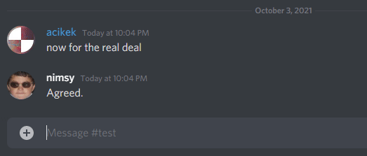
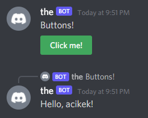

Denizen and Discord: dDiscordBot
--------------------------------

```eval_rst
.. contents:: Table of Contents
    :local:
```

### Introduction

dDiscordBot is an **addon plugin** for Denizen that provides commands, script events, and tags for interacting with the Discord API. Basically, you can create a functioning Discord bot directly within Denizen!

### What Can It Do?

There are many libraries for various different programming languages for the Discord API. You might be familiar with some, such as [Discord.Net](https://github.com/discord-net/Discord.Net), or [JDA](https://github.com/DV8FromTheWorld/JDA) <span class="parens">(both of these libraries are used by Denizen's own projects)</span>. These libraries aim to cover **all aspects** of the Discord API.

Denizen is for Minecraft servers. Accordingly, dDiscordBot provides utilities that would be useful for a Minecraft server to interact with Discord. Nevertheless, some of the things you can do are:

- Send, receive, and reply to messages
  - Attach files, embeds, and buttons
- Manage and reply to slash commands
- Manage roles

...and much more.

### What Can It Be Used For?

Many Minecraft servers have Discord communities. They provide a social space outside of the game itself. Discord users might want to interact with the online Minecraft players, and vice versa. 

The main uses might be an account linker, which verifies a Discord user with their player on the server, and a chat bridge between Discord and Minecraft. You might also relay announcements, host cross-platform events, or let Discord users query data from the server.

### Creating a Bot

There are enough tutorials out there for creating a bot account, such as [this one](https://discordpy.readthedocs.io/en/stable/discord.html).

Make sure to enable the `Server Members Intent` on the bot page.

When generating a link to have bot join a server, use the 'OAuth2' page of the developers tab and checkmark the `bot` box. You probably also want to checkmark `applications.commands` if you want to use slash commands.

Alternately, just use the join link: `https://discord.com/oauth2/authorize?scope=bot%20applications.commands&permissions=0&client_id=1234` and replace the `1234` at the end with your bot's application ID.

In most cases, you do not want to assign bot permissions on the 'OAuth2' page, as this can make a mess in your server role settings page.

### Sticking It Onto Your Server

When we say dDiscordBot is an addon plugin, that means it's not in the main Denizen jar - it has its own jar, which you have to download and put in your plugins folder. [You can download it here.](https://ci.citizensnpcs.co/job/dDiscordBot/)

If you're installing dDiscordBot for the first time, you have to restart your server to load it in. Once you've restarted, your server has access to a variety of Discord related commands, tags, and events.

### Logging In

Once you have a bot created on Discord's applications page, that bot added to your Discord group, and dDiscordBot installed onto your Minecraft server, the next step is to login to that Discord bot instance from your minecraft server.

To log your server in as your bot, use the [`discordconnect` command](https://meta.denizenscript.com/Docs/Commands/discordconnect).

For security reasons, you'll need to use a separate tokenfile placed outside of the `scripts` folder. A common location for this is in `Denizen/data`. The token file is just a simple text file, that contains only the bot token <span class="parens">(from the Discord applications page you created above)</span> and nothing else.

The `discordconnect` command takes an `id` argument. This can be anything you want, just choose a label that's memorable and fitting <span class="parens">(such as `mybot`, `ticketbot`, or `relay`)</span>, and is just used to uniquely identify a single bot in the case you have multiple bots in use at once on your server. Almost all Discord commands require this argument, and you just have to make sure to use the same label you chose every time.

Note that while you can connect or disconnect at any time, you only *need* to connect once - usually done right after the server starts with the [`server start` event](https://meta.denizenscript.com/Docs/Events/server%20start). Additionally, make sure to [~wait for](https://meta.denizenscript.com/Docs/Languages/waitable) this command, as you should with all other Discord commands.

```dscript_green
connect_to_discord:
    type: world
    events:
        after server start:
        - ~discordconnect id:mybot tokenfile:data/tokenfile.txt
```

### Sending a Message

Now that you've logged in, you can send your first message. The [`discordmessage` command](https://meta.denizenscript.com/Docs/Commands/discordmessage) has a `channel` argument, which is the Discord channel you want the bot to send the message in. The bot must have permissions to view and send messages in that channel, of course. You can use the proper [channel object](https://meta.denizenscript.com/Docs/ObjectTypes/DiscordChannelTag) anywhere you have the reference, or just use channel's internal Discord ID; if you don't know how to view IDs on Discord, [look here](https://support.discord.com/hc/en-us/articles/206346498-Where-can-I-find-my-User-Server-Message-ID-).

Note that if you're going to use a channel or server's ID a lot, you should put it in a data script/flag it somewhere. You can do this in-game for example by typing the command `/ex flag server discord_botspam:<discord[mybot].group[Denizen].channel[bot-spam]>` and filling in the appropriate names - of course, be sure to check the debug output to ensure it filled properly. You can try `/ex narrate <server.flag[discord_botspam].name>` to make sure it has the channel stored properly.

Here's how sending a message to a channel would link in a simple task script:

```dscript_green
send_a_message:
    type: task
    script:
    - ~discordmessage id:mybot channel:<server.flag[discord_botspam]> "Hello, world!"
```

#### Fancier Messages: Embeds

If you've ever interacted with a bot on Discord <span class="parens">(hopefully you have if you're at the point of making your own!)</span> you know they often don't reply in plaintext, but instead through specially formatted boxes - these are called "embeds".


In Denizen, this is handled via [DiscordEmbedTag objects](https://meta.denizenscript.com/Docs/ObjectTypes/DiscordEmbedTag). This is sent with the same `discordmessage` command, with the embed object replacing the message text.

`DiscordEmbedTag` is basically just a wrapper around a MapTag of data. At the most basic, you can construct it via the [`discord_embed` tag](https://meta.denizenscript.com/Docs/Tags/discord_embed) and fill it with data via [`DiscordEmbedTag.with[key].as[value]`](https://meta.denizenscript.com/Docs/Tags/discordembedtag.with.as) or [`DiscordEmbedTag.with_map`](https://meta.denizenscript.com/Docs/Tags/discordembedtag.with_map).

There is a long list of keys supported by `DiscordEmbedTag`, so refer to the object's tag documentation for details. Titles and descriptions are used the most often.

A very simple embed can be made completely inline using `with_map` and map syntax. More complicated input, especially when using tags, is probably better input using the `with[...].as[...]` tag variant to prevent mis-parsing, or a [`definemap` command](https://meta.denizenscript.com/Docs/Commands/definemap).

Simple inline usage example:

```dscript_green
send_an_embed:
    type: task
    script:
    - define embed "<discord_embed.with_map[title=Example Bot;description=Wow! This bot sure is a bot;timestamp=<util.time_now>;color=#00FFFF]>"
    - ~discordmessage id:mybot channel:<server.flag[discord_botspam]> <[embed]>
```

Note as well that you can use the `<n>` tag to produce newlines in any message or embed.

### Automatic Messaging

Let's make this automated! Using the [`discord message received` event](https://meta.denizenscript.com/Docs/Events/discord%20message%20received), you can detect when a Discord user sends a message and run commands based off the message content. You can also respond in the same channel they sent the message in! For example, if you wanted to respond to the user if their message includes "ping", you'd do:

```dscript_green
ping_pong:
    type: world
    events:
        after discord message received:
        - if <context.new_message.text.contains_text[ping]>:
            - ~discordmessage id:mybot reply:<context.new_message> Pong!
            # or: - ~discordmessage id:mybot channel:<context.new_message.channel> Pong!
```


#### Applied: A Chat Bridge

Now you've got the basic tools to make a chat bridge. A basic chat bridge functions as two simple parts:

- When a minecraft user chats, Send a message to a Discord channel
- When a Discord user sends a message in the channel, broadcast it to the online Minecraft players

Let's tackle the first part. You can use the [`player chats` event](https://meta.denizenscript.com/Docs/Events/player%20chats) for this one. Then all you have to do is use the `discordmessage` command like in the first example. You should also include the Minecraft player's name in the message, otherwise the Discord users won't know who it's from.

Note that Discord text formatting uses [Markdown](https://support.discord.com/hc/en-us/articles/210298617-Markdown-Text-101-Chat-Formatting-Bold-Italic-Underline-) - Denizen's Minecraft chat formatting tags like `<bold>` won't work here.

```dscript_green
chat_bridge:
    type: world
    events:
        after player chats:
        - define message "**<player.name>**: <context.message>"
        - ~discordmessage id:mybot channel:<server.flag[discord_chatrelay]> <[message]>
```

Great! Now for the next step. You can use the `discord message received` event like in the earlier example, but we only want to relay the message if it's in a certain channel. Luckily, this event comes equipped with a `channel` switch, which is exactly what we need. This time, because the message will be displayed in Minecraft, we should use Denizen Minecraft chat formatting tags instead of Discord Markdown.

Note that the received [`DiscordMessageTag` object](https://meta.denizenscript.com/Docs/ObjectTypes/DiscordMessageTag) doesn't only represent the message content: you can get the author, channel, id, and much more.

```dscript_blue
chat_bridge:
    type: world
    events:
        # Note that this '12345' should be replaced by the raw channel ID you have copied.
        # Unfortunately, tags like server.flag don't currently work in event label lines.
        after discord message received channel:12345:
        # ex: [Discord] <acikek> Hello!
        - announce "[<blue>Discord<&r>] <&lt><context.new_message.author.name><&gt> <context.new_message.text>"
```

### Slash Commands

Slash commands are Discord's new way for interacting with a bot upon request. They're builtin to the client, which means you can see the help for a command without external resources. They also show up in a list when you start a message with `/` - go ahead and try it!


With dDiscordBot, you can create your own slash commands. They belong to a feature set known as Interactions, along with buttons and selection menus.

**You only have to create a slash command once.** Creating a slash command of the same name updates the existing one.

When a user uses a slash command, you need to respond within just 5 seconds. However, that doesn't necessarily mean you have to send a message; instead, if you need more time, you can *defer* - or acknowledge - the request, which you can reply to later.

You can read further about slash command limitations [here](https://gist.github.com/MinnDevelopment/b883b078fdb69d0e568249cc8bf37fe9).

#### Applied: A Last-login Command

Let's make a slash command for a player's last login time. If the player is online, we should say that instead. First, you have to create the command. You can do so with the [`discordcommand` command](https://meta.denizenscript.com/Docs/Commands/discordcommand) and the `create` argument. We want to take input from the user for the player name; this is called an option, and it needs to be attached to the command upon creation.

When creating a slash command, you can specify a server for it to be available to with the `group` argument. This is very useful for testing, even if you want it to be globally available in the future. **Registering a global command can take up to an hour!**

The `options` argument is a map of maps, where the values follow a certain format. You can view the map format on the [meta page](https://meta.denizenscript.com/Docs/Commands/discordcommand). It's recommended to use the `definemap` command for this. 

The `name` argument is required, and the `description` argument is optional, but it's useful for users. Let's throw everything into a task script:

```dscript_blue
create_lastlogin:
    type: task
    script:
    - definemap options:
        1:
            type: string
            name: player
            description: The Minecraft player's name
            required: true

    - ~discordcommand id:mybot create name:lastlogin "description:Displays a player's last login time." "group:<discord[mybot].group[My server]>" options:<[options]>
```

Once the command is created, you can use the [`discord slash command` event](https://meta.denizenscript.com/Docs/Events/discord%20slash%20command) to listen for uses. Be sure to use the `name` switch for the name of the command.

Using slash commands, buttons, and selection menus is called an interaction, and these are the things we have to acknowledge, as mentioned previously. You can handle this with the [`discordinteraction` command](https://meta.denizenscript.com/Docs/Commands/discordinteraction), which has a required `interaction` argument. Note that this command **doesn't** need the `id` argument. All three corresponding events have a `<context.interaction>` tag, which includes the bot reference inherently.

It's good practice to defer the response even if the interaction isn't going to take long to respond to. Use the `defer` instruction to acknowledge, and the `reply` instruction to reply with a message. For now, just test out the usage with a Hello World:

```dscript_green
lastlogin:
    type: world
    events:
        on discord slash command name:lastlogin:
        - ~discordinteraction defer interaction:<context.interaction>
        - ~discordinteraction reply interaction:<context.interaction> "Hello, world!"
```


This command relies on dealing with the passed-in option. Since we set the `player` option to `required`, a standard Discord client will prevent the user from using slash command without supplying that string.

The `<context.options>` tag for the `discord slash command` event returns a MapTag of option names and their supplied values.

We can get the player name value they input via `<context.options.get[name]>`, and put that into `<server.match_offline_player[...]>` to retrieve the actual player object corresponding to the name.

As we teach on the [Common Mistakes Page: Don't Trust Players](/guides/troubleshooting/common-mistakes#don-t-trust-players), never trust input from a user. Even for this simple interaction, the Discord user might: input the name of a player that doesn't exist, input something that isn't a player name at all or is formatted like an unrelated object, input an empty value, or glitch something to bypass the required options list and thus have no player input at all. So, make sure to verify every last piece of input with care, and handle the error cases with a simple refusal message.

Next, you'll want to check if the player is online or offline, which you can do with the [`PlayerTag.is_online` tag](https://meta.denizenscript.com/Docs/Tags/playertag.is_online). If they are, you can just say so. If not, you can use the [`PlayerTag.last_played_time` tag](https://meta.denizenscript.com/Docs/Tags/playertag.last_played_time) and format the returned [`TimeTag`](https://meta.denizenscript.com/Docs/ObjectTypes/timetag). We can use the [`TimeTag.format_discord` tag](https://meta.denizenscript.com/Docs/Tags/timetag.format_discord) to display that time cleanly using Discord's automatic formatting - you can alternately use [`TimeTag.format[...]`](https://meta.denizenscript.com/Docs/Tags/timetag.format) to build a custom format.

Make sure to include the player's name in the message! `<server.match_offline_player[...]>` returns the *best match* for the input, meaning the result player won't always be the one the user was thinking if they input a name incorrectly.

Here's the final script:

```dscript_green
lastlogin:
    type: world
    events:
        on discord slash command name:lastlogin:
        - ~discordinteraction defer interaction:<context.interaction>

        # Note that empty input to match_offline_player is guaranteed to return null.
        - define player <server.match_offline_player[<context.options.get[player].if_null[<empty>]>].if_null[null]>

        - if <[player]> == null:
            - ~discordinteraction reply interaction:<context.interaction> "That name is invalid, or that player has never joined!"
            - stop

        - if <[player].is_online>:
            - ~discordinteraction reply interaction:<context.interaction> "**<[player].name>** is online!"
        - else:
            - define message "**<[player].name>** was last seen: <[player].last_played_time.format_discord>"
            - ~discordinteraction reply interaction:<context.interaction> <[message]>
```



<span class="parens">(The format used in this gif was `<[player].last_played_time.format[LLLL dd, yyyy 'at' hh:mm a]>` instead of the format_discord tag)</span>

### Clicky Thingies: Components

The rest of the interactions feature set includes buttons and selection menus, which are in their own category: *components*. Components can be attached to both interaction replies and basic messages (via the `rows` argument), and when used, return an interaction.

You can construct a [`DiscordButtonTag`](https://meta.denizenscript.com/Docs/ObjectTypes/DiscordButtonTag) with [`<discord_button>`](https://meta.denizenscript.com/Docs/tags/discord_button). You can then attach properties using the `with` style tags just like `DiscordEmbedTag` used. [`DiscordSelectionTag`](https://meta.denizenscript.com/Docs/ObjectTypes/DiscordSelectionTag) also works this way.

You can view the supported properties for a button [here](https://meta.denizenscript.com/Docs/Tags/discordbuttontag.with.as) and for a selection menu [here](https://meta.denizenscript.com/Docs/Tags/discordselectiontag.with.as).

The `rows` argument is a list of lists. The main lists represent the separate rows, while the lists inside represent the components on each row (similarly to columns on a grid). You can use `definemap` to represent the layered list more simply. For a single button, you can just input it directly without any list wrapping. This argument is found on both `discordinteraction` and `discordmessage`. Additionally, you can mix and match components in rows as you please. However, a message is still required!

#### Buttons

For example, sending a message with a single button would look like:

```dscript_green
buttons:
    type: task
    script:
    - define click_me "<discord_button.with[id].as[click_me].with[label].as[Click me!].with[style].as[success]>"
    - ~discordmessage id:mybot channel:<server.flag[discord_botspam]> rows:<[click_me]> Buttons!
```

An example with several buttons:

```dscript_green
buttons:
    type: task
    script:
    - definemap buttons:
        1:
            1: <discord_button.with[id].as[first].with[label].as[Click me!].with[style].as[primary]>
            2: <discord_button.with[id].as[second].with[label].as[No, click me!].with[style].as[secondary]>
        2:
            1: <discord_button.with[id].as[secondrow_first].with[label].as[This row's better!].with[style].as[danger]>
            2: <discord_button.with[id].as[https://denizenscript.com].with[label].as[This column's best!].with[style].as[link]>
    - ~discordmessage id:mybot channel:<server.flag[discord_botspam]> rows:<[buttons]> Buttons!
```

The ID should be unique to the button: it's how you'll identify one button over another. You'll see this with the `discord button clicked` event, which has an `id` switch much like the slash command event's `name` switch. The exception is when your button just needs to be a link - in that case, set the ID to the URL to open when the user clicks the button.

An example reply to a button press (for the single-button example):

```dscript_green
click_me:
    type: world
    events:
        on discord button clicked id:click_me:
        - ~discordinteraction defer interaction:<context.interaction>
        - ~discordinteraction reply interaction:<context.interaction> "Hello, <context.interaction.user.name>!"
```



#### Selection Menus

Selection menus function like a mixture of buttons and command options.

The options input is a map-list of maps, where each inner map can have keys `label`, `value`, `description`, and `emoji`.

The emoji is optional, and if you want to include it, the easiest way is to post the emoji on Discord with a `\` in front of it, like `\:smile:`, to get the raw form of the emoji, and then use that in the script.

The way selection menus work is easiest to see with an example script:

```dscript_green
selection_menu:
    type: task
    script:
    # Similar to command options
    - definemap options:
        1:
            label: Good
            value: mood_good
            description: I'm doing well.
            emoji: 🙂
        2:
            label: Better
            value: mood_better
            description: I'm doing wonderfully!
            emoji: 😃
        3:
            label: Best
            value: mood_best
            description: I'm on top of the world!
            emoji: 🤩

    - define menu <discord_selection.with[id].as[mood_menu].with[options].as[<[options]>]>
    - ~discordmessage id:mybot channel:<server.flag[discord_botspam]> rows:<[menu]> "How are you today?"

mood_menu:
    type: world
    events:
        on discord selection used id:mood_menu:
        - ~discordinteraction defer interaction:<context.interaction>

        - choose <context.option.get[value]>:
            - case mood_good:
                - define message "I'm glad."
            - case mood_better:
                - define message "Wow, that's great!"
            - case mood_best:
                - define message "Downright incredible!"

        - ~discordinteraction reply interaction:<context.interaction> <[message]>
```


### Some Things To Try

This guide page covers two small projects, plus the basics of message components. For more ideas, you might want to look back at the [What Can It Be Used For?](#what-can-it-be-used-for?) section. If you're looking for a challenge, you could try:

- Mixing components in messages
- Replying to interactions privately (hint: docs!)
- Making a "player info" command

Be imaginative! Discord is yet another platform, full of unique concepts and possibilities, for you to be creative with.

### Common Issues: When Something Went Wrong

If something has gone wrong while testing your bot, here are some common issues you might run into and how to fix them.

- First of all, if you're having any issues, make extra sure you enabled the `Server Members Intent` on the Discord bot page. A lot of things will break if that's turned off.
- Make sure your bot has permissions to do what you're trying to make it do! The bot needs to be able to view the channel you're using, read messages in that channel, and be able to send messages there. When first testing your bot, more permissions are better permissions. Once you're putting your bot into real use, limit the bot to only the permissions it needs.
- If you're unable to register slash commands (with a `50001: Missing Access` error in your console) you may have forgotten to enable the `applications.commands` scope when adding your bot to your server.
- As with all Denizen issues, monitor your console - the debug output contains a lot of helpful information to diagnose precisely what went wrong.
- If you're stuck or lost, ask for help on Discord. See also the general Denizen [solving problems you encounter page](/guides/first-steps/problem-solving)

### Related Technical Docs

If you want to read some more about dDiscordBot, here are a few technical guides you might consider...

- [dDiscordBot commands](https://meta.denizenscript.com/Docs/Commands/discor)
- [dDiscordBot tags](https://meta.denizenscript.com/Docs/Tags/discor)
- [dDiscordBot events](https://meta.denizenscript.com/Docs/Events/discord)
- [dDiscordBot GitHub page](https://github.com/DenizenScript/dDiscordBot)
- [Discord's internal reference docs](https://discord.com/developers/docs/reference)
