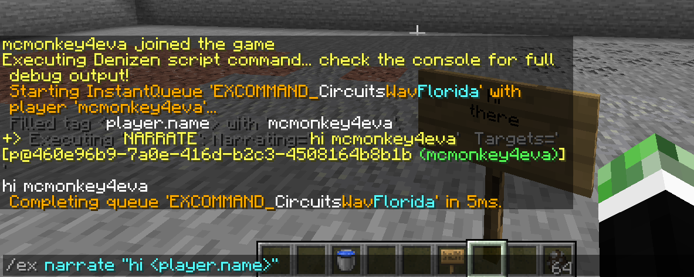

The Ex Command
--------------

```eval_rst
.. contents:: Table of Contents
    :local:
```

### So, You Want To Use Denizen

If you're reading this page, you're probably new to Denizen and are ready to learn the absolute basics. As you've read on previous pages, Denizen is a *scripting engine*. This means you're gonna write script files full of script code stuff, right? Well, sorta. You don't technically *need* to write scripts in a separate file. For the sake of easing you into the absolute basics of Denizen, we're going to showcase one of Denizen's biggest "selling point" features: you can just write Denizen commands in-game and they work, just like that!

### Denizen Commands vs Server Commands

Before we do that, there's an important distinction to understand: a "Denizen command" vs a "server command".

- A **server command** is a command you can type into the game-chat with a `/` in front of it. So, for example, `/gamemode creative` is a server command.
- A **Denizen command** is a command that goes into a script, that is processed by the Denizen scripting engine. So, for example, `- narrate "hi <player.name>"` is a Denizen command. Notice that it's indicated with a `-` in front (as is standard with Denizen commands) and can make use of tags (like `<player.name>`), which server commands of course cannot.

The important thing to remember is they aren't interchangable. You can't do `/narrate "hi <player.name>"` - it will tell you 'unknown command'. You also can't do `- gamemode creative`, that will give you a script error message.

### But You Said We Can Write Denizen Commands In-Game

Yes, I did! For that matter you can write server commands in a script. How? Well there's a Denizen command that executes a server command, and there's a server command that executes a Denizen command.

If you're writing commands in-game, and want to run a Denizen command, just use `/ex`. So, for example: `/ex narrate "hi <player.name>"`. This works because `/ex` is a server command that simply tells Denizen to process the rest of your input. This will look something like this:


Similarly, if you're writing commands in a script, and want to run a server command, you can use the `- execute` command, like `- execute as_op "gamemode creative"` <span class="parens">(you can also do as_player, as_server, or even as_npc)</span>. Note that for the most part usage of the `- execute` command should be avoided, as almost anything you can do by server command, you can do better through a Denizen command <span class="parens">(for the gamemode example, `- adjust <player> gamemode:creative`)</span>. The only exception is usually commands from other plugins that you want your script to integrate into.

As a special additional note: please remember that `/ex` and `- execute` simply transition from one mode to the other. There is almost never a valid reason to have both of them in use at the same time, as that's just going back-and-forth for no reason. When you think about it, the mere idea sounds completely crazy... but we have actually had users attempt things like `- execute as_server "ex narrate 'hi'"`. Of course, that's just an overcomplicated and silly way of writing `- narrate 'hi'`.

### Wait, Narrating? I Thought We Were Coding Not Writing A Play!

Don't worry, Denizen is indeed the 'code' type of script, not the 'play' type of script. `narrate` is the first basic Denizen command to learn: it outputs some text to the player's chat view. <span class="parens">(When you use it through `/ex`, you also see Denizen debug information, but in real usage in a script, just the intended line of text will show to players.)</span> This is a very common basic command, and of course is the go-to command for simple testing. This command will be used for things like NPC scripts <span class="parens">(anything the player needs to read but the NPC isn't saying to them - narrate will be used!)</span>, custom server commands <span class="parens">(the response when a player runs your custom server `/command` will be given by a narrate)</span> and so much more!

### So What Do I Do?

Well if you haven't caught on yet: open your in-game chat and type `/ex narrate "hi <player.name>"`. This will be a recurring theme throughout this guide: you'll find examples of things you can do and descriptions of what they do and how they work... you won't always be explicitly told to, but you should always go ahead and try them out (on your local test server!). As you get to writing actual script files, there will be examples specifically color-coded to indicate whether you can just copy them in. Please take a moment to open [This Guide: Sample Scripts](/guides/this-guide/sample-scripts) in a new tab to review the color coding system before you continue.

Note that rather than raw copy-pasting, as much as possible you should be retyping the scripts you're testing. This helps guarantee you've actually read every bit of the script, and gives you time to think and understand exactly what each bit is before running it - and, importantly, gives you light practice writing scripts. You will of course be much more ready to test something with `/ex` if you've typed a few `/ex` test commands already (compared to if you've only read about the idea and copypasted a sample).

#### All That Extra Output

That above example is just meant to output the message `hi (your name here)`, but as you can see in both your in-game chat and your server console, there's a bunch of extra lines. This is called *debug output*, which as the name implies is meant to help you figure out what went wrong if something does. You'll see a lot of this while you're working with Denizen, but don't worry: when you actually have finished user-ready scripts, you'll be able to hide all that output from any players and from your console. This will be explained more a few pages later.

### Back On Topic: What Can `/ex` Do?

Basically anything! You can run any Denizen command from `/ex`, and there's Denizen commands for just about everything. In fact it's so powerful that I must note: on public servers, don't give permission access to `/ex` to anyone you wouldn't give full operator access to. If you have any doubts about that level of restriction: note that any player with access to `/ex` could easily do `/ex adjust <player> is_op:true`.

### What's This Got To Do With Scripting?

Denizen commands are at the heart of every script. Scripts can be described as simple config files listing a bunch of Denizen commands <span class="parens">(and the configuration parts just there to indicate when exactly it is the commands should run)</span>.

`/ex` is a really handy way to test out individual commands in-game quickly. We'll be making a lot of use of it in the upcoming sections of this guide. It's one of several Denizen power-tools that make your life easy <span class="parens">(and make Java developers hate their choice to learn Java after seeing how much better it is on the Denizen side!)</span>.

### Related Technical Docs

If you want to read a lot more about the /ex command, here are a few technical guides you might consider...

Note: most users, especially those learning from the Denizen for the first time, should just continue on to the next guides page. These references might be of interest to later come back to after you've learned Denizen as far as this guide teaches.

- [Ex command language doc](https://one.denizenscript.com/denizen/lngs/ex%20command)
- [Narrate command doc](https://one.denizenscript.com/denizen/cmds/narrate)
