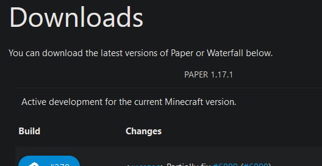
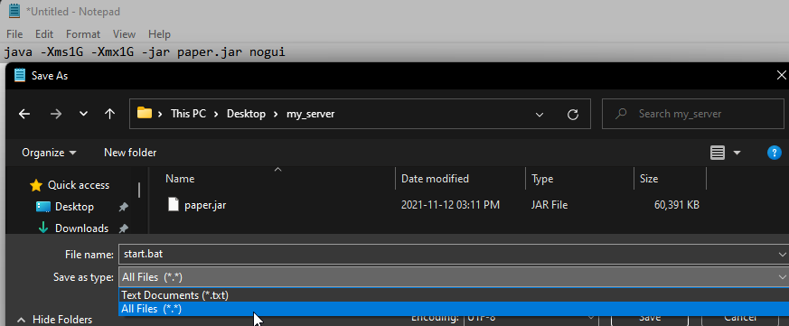
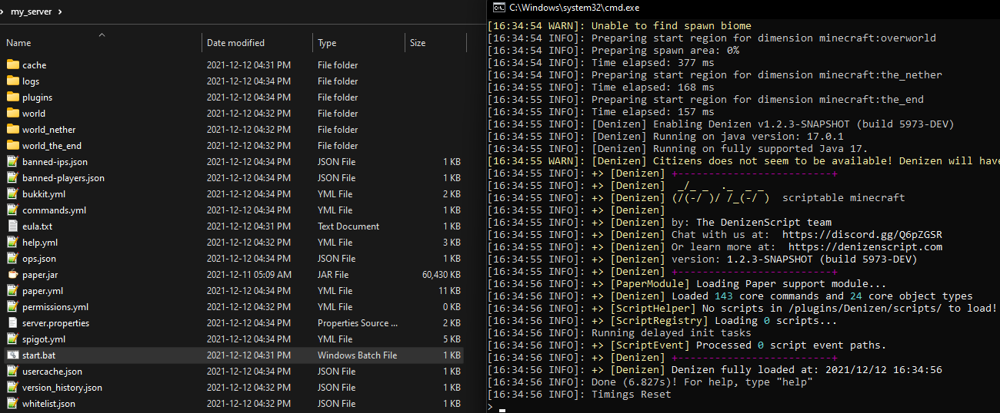

Setting Up A Local Test Server
------------------------------

```eval_rst
.. contents:: Table of Contents
    :local:
```

### You Need A Test Server

You're probably looking at this page thinking "I already have a server, why else would I be here?" ... Most people have *a server*, but most people **should** have *a production server, and a test server*. What's the difference?

- The **production server** is the one that players can join, which you probably don't want to crash or bug out unexpectedly.
- The **test server** is one that only you and maybe one friend will ever be on at any time, which is fine to crash or otherwise break.

When you're writing scripts, especially when you're new, it's quite possible to accidentally do something that crashes a server, or does something hilarious like making grass explode every time you break it... keep it to a test server, so you don't accidentally ruin any players' day with the experimentation.

### You Should Probably Have It Local

Some people already have a *remote* test server... that's actually more properly referred to as a 'staging server' - that is, a server where everything is set up like it would be a production server, but without players in the way. A test server is one you can delete, trash, empty, twist around, or whatever else on the slightest whim without anyone else being involved.

The easiest and best way to do this is to just run a server on your local computer (don't worry, it's really easy).

### How Do I Set Up A Local Server

It's pretty simple! Let's go through the steps...

**Fair warning** that this guide is focused on Windows PCs, as they are the most common (but will note differences for other OS's where applicable).

- **Step 1: Download a server jar.** Conventionally, this would be Spigot ... however, Spigot is a bit of a pain to get downloaded properly. You can read the [BuildTools Wiki Page](https://www.spigotmc.org/wiki/buildtools/) if you want to do that, but I recommend instead just using Paper, which is an easy click-to-download - [Download Paper here](https://papermc.io/downloads) - For reference, Paper is a fork of Spigot designed to run more efficiently, with the added benefit of being way easier to get started. 99% of the time, Paper and Spigot jars are effectively interchangeable without issue.



- **Step 2: Set up a server folder.** You can just make a folder anywhere, even on your desktop, just make sure there's nothing else in the folder already <span class="parens">(as the server will generate a bunch of files around itself)</span>. Put the server jar you downloaded into this folder.


- **Step 3: Make a launch script.** The simplest way to do this is to just open Notepad and create a file named `start.bat` (be sure to save as 'all files', not 'text documents'). In this file, put the following: `java -Xms500M -Xmx500M -jar paper.jar` ... you can configure the specifics - the '500M' twice is how much RAM you want to give to the server, and 'paper.jar' is the name of the server jar file. <span class="parens">(On Linux or Mac, create a `start.sh` file and edit it with whatever your favorite text editor is. The command to include remains the same.)</span>



- **Step 4: Launch the server once.** To do so, just double-click the start script file. If all goes well, a command line window will pop up for a minute, show a few messages, then disappear, and you'll have a new `eula.txt` file. Since Mojang is ruled by lawyers now, you have to open that file and change `false` to `true` to indicate that you accept the Minecraft EULA. Don't re-launch the server yet though.


- **Step 5: Add the plugins.** Create a `plugins` folder if you don't already have one, and download the latest jar file for Denizen, Citizens, etc. <span class="parens">(any plugins you want to include)</span> and place them into that folder. For your test server, you'll probably want to install the latest [Developmental Build of Denizen](https://ci.citizensnpcs.co/job/Denizen_Developmental/) - though for your production server, you'll generally want the latest [Release Build of Denizen](https://ci.citizensnpcs.co/job/Denizen/).


- **Step 6: Launch for the first real time.** Run the start script again... this will take a moment to load everything the first time, but will load faster in future uses. Plugin folders, world data, etc. will be automatically generated.



- **Step 7: Join the server.** Add a server in your Minecraft multiplayer menu, with the address set to just `localhost`. This is an automatic address that just means "the server on the same computer I'm playing on". You should be able to join it fine if nothing went wrong (and if anything did go wrong, you should have an error message somewhere to look into or report). You can use the command line window to op yourself or whatever else you need. Keep this window in view, as debug output sent to that window will come in handy later.
