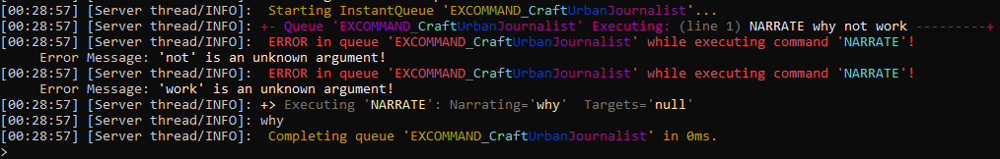
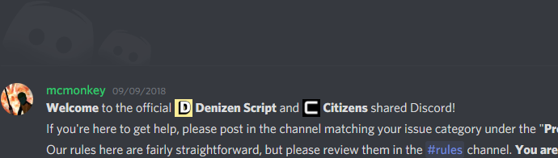

Solving Problems You Encounter
------------------------------

```eval_rst
.. contents:: Table of Contents
    :local:
```

### When Your Script Doesn't Work And You Don't Know Why

So, you wrote a script, loaded it in, and... nothing! It's either not working at all, or it's doing something other than what you intended. What do you do now?

### The Debug Console

One of the most important and beloved features of Denizen is *full automatic debugging*! Everything your scripts are doing go into the debug logs <span class="parens">(until you disable debug for that script with the `debug: false` key)</span>. This is the magic tool that will help you find the problem way faster than you ever could have without it.



### How Do I Read Debug?

The debug console will display every command that's run, in the order they ran in. It will show the command that was given, the way the arguments were interpreted, and sometimes the result of the command <span class="parens">(if applicable)</span>. Any tags that are parsed will also be displayed next to the commands that they came from. Sets of commands running together are identified by their queue <span class="parens">(which has a unique name and color pattern to visually distinguish it)</span>.

#### The Hard Way

In some cases, where things just aren't exactly as you expected, you might find yourself reading through the commands line by line, trying to find where things deviated from your expectations <span class="parens">(as an example of how reading that might go, you might find that a tag returned "zombie_pigman" when you thought it would return "pigzombie", and so some logic that depended on that now won't run, and everything falls apart after as a result)</span>.

#### Errors

In many cases, you will have the luck of the problem being caught by the system - at which point, you will have glaring red text saying **"ERROR!"** and explaining what was caught.

In some of those cases, the error message will tell you exactly what went wrong. For example, if you ever accidentally typed in tag documentation instead of a real tag, like `<PlayerTag.name>` where you probably needed `<player.name>`, the error message will be pretty clear: `'ObjectTag' notation is for documentation purposes, and not to be used literally.` `An actual object must be inserted instead.`

In other cases, the error message will identify the rough problem but not necessarily say exactly where you went wrong or what you need to do. For example, if you forgot quotes around a multi-word argument to a command, the error message will just be `(some word) is an unknown argument!` a few times in a row. The reason for this is that the script engine just can't guess what you *intended* to do, it can only say what's not going to work about the input you *did* give <span class="parens">(note however that the engine will often at least *try* to guess when it comes to common errors like the one given as an example - and in fact in modern Denizen versions that specific error message will ask if you maybe forgot some quotes)</span>. In these cases, it is up to you to be able to figure out what exactly you need to change. Generally speaking, it will almost always be something very close <span class="parens">(in terms of line numbers)</span> to whichever error message appeared **first** in the logs, and probably at a minimum closely related to what the error message is calling out. Note as well that whatever is debugged immediately *before* the error message is usually the thing that triggered the error, not what's *after*. But what if you just can't figure it out?

### A Jar Full of Eyeballs

Sometimes a problem is too confusing to figure out, other times you just need another set of eyes to look at your script to spot something obvious that you've merely glazed over.

In these cases, the best place to be is [the Discord](https://discord.gg/Q6pZGSR). The Discord has an open support channel (`#denizen`) where you can ask for help from other Denizen users. It also has several chat bots that can search documentation (check `!help`), and much more in the bot usage channel (`#bot-spam`).

[](https://discord.gg/Q6pZGSR)

When asking for help with a script, it's usually best to provide a link to your script through the [script sharing paste service](https://paste.denizenscript.com/), and a copy of your debug log - which you can record by typing `/denizen debug -r` in-game, then running the script, then typing `/denizen submit` - it will generate a link to a recorded copy of the debug logs for your script, that you can post alongside the script link for helpers to look through.

When you join the Discord, before you post anything, be sure to read the rules (in the `#rules`) channel to make sure you don't start off on the wrong foot. The discord is generally pretty chill and friendly, but the rules will be enforced <span class="parens">(lightly, that is - a simple accident isn't going to get you banned or anything, don't worry. Most caught rule breaks will just have a warning recorded... not much more will happen except to users that repeatedly break the same rules over and over)</span>.

Be prepared, however, for some potential tough-love support with fixing particularly messy scripts. If you post a script full of errors, you're likely to see a helper reply with a long angry-looking listing of every single problem and how to fix it. Don't read too much into the tone <span class="parens">(remember that text based conversations can often lose the intended tone, and tend to come across sounding more negative than was meant)</span> - we do long breakdowns because we want you to learn and achieve the best scripting you can. If we were actually angry or anything like that at you, we probably wouldn't be replying at all.

### Related Technical Docs

If you want to read a lot more about problem solving, here are a few technical guides you might consider...

Note: most users, especially those learning from the Denizen for the first time, should just continue on to the next guides page. These references might be of interest to later come back to after you've learned Denizen as far as this guide teaches.

- [Denizen debug command command language doc](https://meta.denizenscript.com/Docs/Languages/denizen%20debug%20command)
- [Denizen submit command language doc](https://meta.denizenscript.com/Docs/Languages/denizen%20submit%20command)
