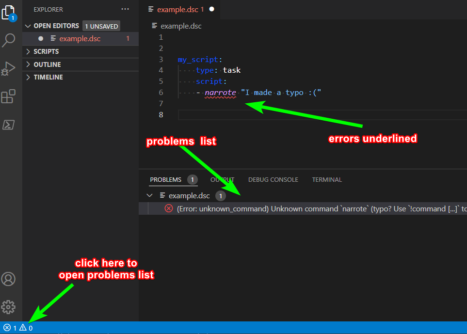
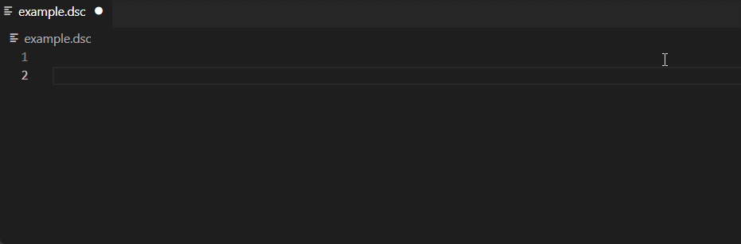
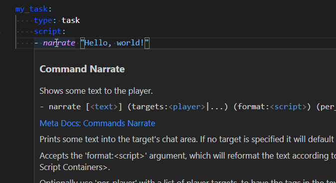
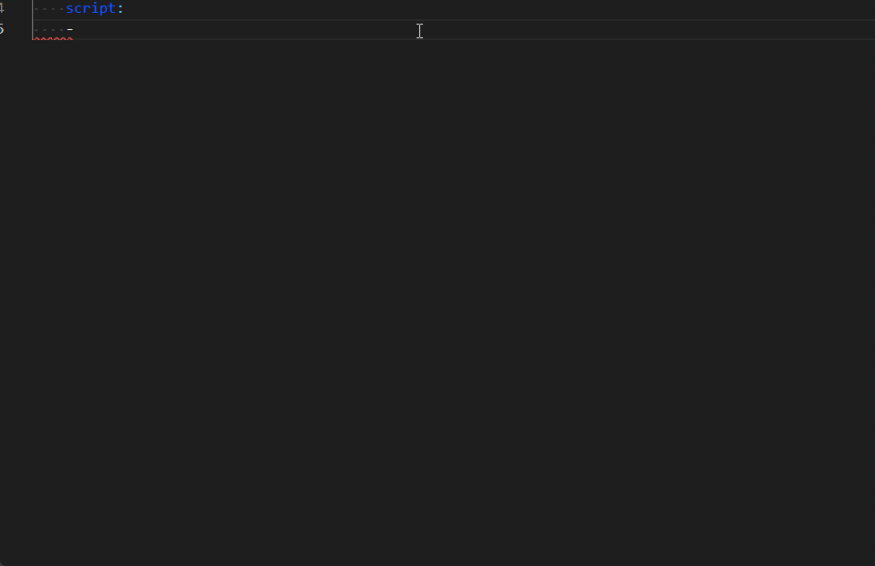
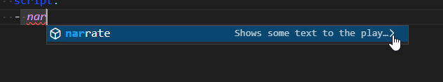
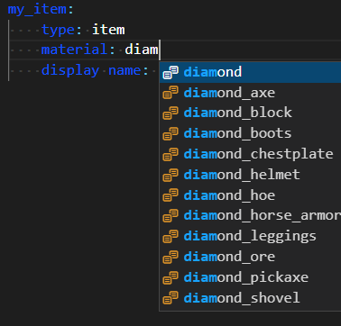

Setting Up Your Script Editor
-----------------------------

```eval_rst
.. contents:: Table of Contents
    :local:
```

### The Editor


The officially recommended way to edit Denizen scripts is using VS Code, with the Denizen extension!

### Installation

- First, download and install [VS Code](https://code.visualstudio.com/). Note that this is NOT "Visual Studio" despite half of its name being that. <span class="parens">(The naming is rather confusing, unfortunately. Microsoft's doing...)</span>
- Second, after VS Code is installed, you can install the [Denizen extension](https://marketplace.visualstudio.com/items?itemName=DenizenScript.denizenscript) by clicking the green "Install" button on the linked page.
- <span class="parens">(The extension will also automatically install [.NET 6.0](https://dotnet.microsoft.com/download/dotnet/6.0). Some users have reported needing to restart their PC for this install to fully complete.)</span>

### Usage

- Open your scripts folder with VS Code - that's `plugins/Denizen/scripts/` within your server directory <span class="parens">(the folder itself, not individual files - you can see the file tree on the left side of the editor)</span>.
- The Denizen extension will automatically be active on any files that have the `.dsc` file extension. <span class="parens">(note: historically, the `.yml` extension was used for scripts. This is no longer a recommended file extension, and `.yml` files will not have Denizen script highlighting. You must use `.dsc`).
- For the most part, just start editing your script files the same way you would edit any text file within VS Code.

### Guide Following

If you're following the guide for the first time, just get the editor installed per the instructions above and move on to the next page. The rest of this page is for users who want to learn more about the script editor's capabilities.

### Features

- While viewing a `.dsc` file, syntax will automatically be highlighted appropriately for Denizen scripts.

<br>

- As you write scripts, the extension will check for errors and highlight them when found. They will also be listed in VS Code's "problems" list.



<br>

- If you type the name of a container like `task` at the start of a line, you can use tab-complete to insert a snippet of the container.



<br>

- At any time you can hover your mouse over any command, tag, event, container type, ... to view a preview of meta-documentation for that value.



<br>

- While typing commands/tags/etc. you will be shown tab completion options for all the valid tags/commands/etc and their meta docs.



Note: if you only see the tab complete without full docs, click the little arrow on the right.



<br>

- In a few places, you will also be shown tab completion options for core data types like materials, entity types, etc.



<br>

- If you open VS Code's settings window and search `Denizen`, you will have a variety of options to enable/disable various features, change syntax highlighting colors, etc.
