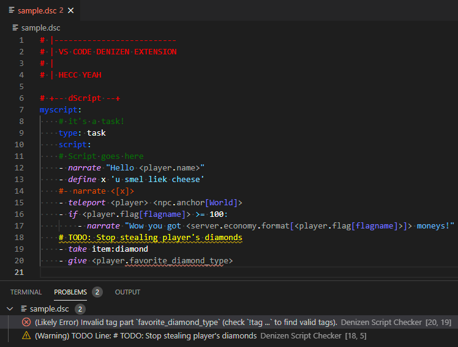

Setting Up Your Script Editor
-----------------------------

```eval_rst
.. contents:: Table of Contents
    :local:
```

### The Editor



The officially recommended way to edit Denizen scripts is using VS Code, with the Denizen extension!

### Installation

- First, download and install [VS Code](https://code.visualstudio.com/). Note that this is NOT "Visual Studio" despite half of its name being that. <span class="parens">(The naming is rather confusing, unfortunately. Microsoft's doing...)</span>
- Second, after VS Code is installed, you can install the [Denizen extension](https://marketplace.visualstudio.com/items?itemName=DenizenScript.denizenscript) by clicking the green "Install" button on the linked page.
- As an additional note: some features require [.NET Core 3.0+](https://dotnet.microsoft.com/download/dotnet-core/3.0) ... at time of writing, these features aren't yet implemented and thus you can ignore this requirement if you prefer (you will see an error message if you don't have it, but you can ignore that message).

### Usage

- Open your scripts folder with VS Code - that's `plugins/Denizen/scripts/` within your server directory <span class="parens">(the folder itself, not individual files - you can see the file tree on the left side of the editor)</span>.
- The Denizen extension will automatically be active on any files that have the `.dsc` file extension. <span class="parens">(note: historically, the `.yml` extension was used for scripts. This is no longer a recommended file extension, and `.yml` files will not have Denizen script highlighting. You must use `.dsc`).
- For the most part, just start editing your script files the same way you would edit any text file within VS Code.
