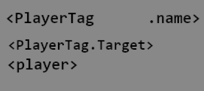

Your First Tags
---------------

```eval_rst
.. contents:: Table of Contents
    :local:
```

### What Is A Tag?

If you're following this guide in order <span class="parens">(and you should be!)</span>, you've already used a tag. In the [ex command guide](/guides/first-steps/ex-command), you tried `/ex narrate "hi <player.name>"`. That `<player.name>` part is a **tag** in Denizen. This is somewhat similar to what some plugins call a "placeholder", but with a lot more power to it. The "player.name" tag, as you can probably guess, is automatically replaced with your username.

Tags in Denizen are marked by `<>` around a description of what value should replace the tag. Tags can get you almost any information you need, whenever you need it.

### What Do Tags Look Like In Real Usage?

A simple tag usage might be `- teleport <npc> <player.location>` to teleport an NPC <span class="parens">(gotten via the `<npc>` tag)</span> to your own location <span class="parens">(gotten via the `<player.location>` tag)</span>.

Tag usages can get way more complex, like `- teleport <player.location.find.living_entities.within[<[range]>]> <player.cursor_on[<[distance]>]||<player.location.forward[<[distance]>]>>` ... don't worry if that doesn't make any sense, it's intentionally long and complicated, just to give you a taste of the amount of power tags have in the hands of an experienced user <span class="parens">(and that's just a start - the only limit is the scripter's imagination!)</span>. Basic scripts will almost never require tags this long.

### So, How Do I Make A Tag?

As you might have guessed looking at that longer sample above - tags aren't limited to just a list of prechosen tags we made available. Tags are *built* by the scripter out of multiple parts to fit their needs.

#### The Parts of A Tag

There are two basic 'types' of tag that are available as building blocks to scripters. These types are: **Base tags**, and **sub-tags**. Base tags exist on their own, and can only be used as the first part of a tag. Every completed tag has exactly one base tag in use. Sub-tags are tacked onto the end of an existing tag. A complete tag can have any number of sub-tags - zero <span class="parens">(just the base)</span>, one <span class="parens">(a very simple tag)</span>, five hundred <span class="parens">(an incredibly long tag)</span>, or any other number.

#### Combining The Parts

A base tag is something like `<player>` which returns a `PlayerTag` of the situationally relevant player. A sub-tag is something like `<PlayerTag.name>` which returns an `ElementTag` of the applicable player's name. When a sub-tag starts with "PlayerTag", this basically means "insert a player here"... since `<player>` returns a player, and `<PlayerTag.name>` needs a player as its first part, you can combine these to make `<player.name>` which returns the name of the situationally relevant player. In the case of the `/ex` command, `<player.name>` returns *your* name.

#### Longer Chains

The tag `<PlayerTag.target>` returns whichever entity the player is looking at. If you use this while looking at another player, this will return a `PlayerTag` of that player. So, we can use the rule of "insert anything that returns a valid PlayerTag anywhere it needs a PlayerTag" to insert `<player>` into the tag to form `<player.target>`. Because we're theoretically looking at another player for this example, we can repeat that rule by inserting this new tag at the start of `<PlayerTag.name>`. This results in `<player.target.name>`, a functionally complete tag that returns the name of the player that you're looking at!



### A PlayerTag Is A Player In A Tag

That choice of wording isn't exactly hard to decipher. A PlayerTag is a player, as represented by a tag, who would have guessed?! Similarly, an NPCTag is an NPC in a tag, an EntityTag is any entity in a tag, an ItemTag is any item in a tag, ... we could go on for a while here, there's a lot of types of things you could use in a tag.

One word we used earlier might be a bit less clear: "ElementTag". An ElementTag is the most basic type of value: anything! An ElementTag can be a number, some text, binary data, or even a player.

#### Wait, But You Just Said Players Are PlayerTags

Yes, players are PlayerTags. And also ElementTags. And also EntityTags.

In Denizen, object types can have sub-types. The notable example is that PlayerTag and NPCTag both have the sub-type of EntityTag. What this means, is that anywhere an `EntityTag` is needed <span class="parens">(for example, the tag `<EntityTag.health>`)</span>, a PlayerTag or NPCTag can be inserted and it will work exactly as expected <span class="parens">(so, `<player.health>` will return the player's health value)</span>.

ElementTag, as was said, is the most basic type of value. Every single object type in Denizen has the sub-type of ElementTag. This means that anywhere an `ElementTag` is needed, *any* value at all can be inserted. A PlayerTag, an NPCTag, an ItemTag, or anything else, all are valid inputs to anything that takes an ElementTag as input.

### Wording Clarifications

There are some words used on this page that are specific to Denizen. For the most part, the context of their usage should be enough to give you the idea of what they mean... But, just in case, here's some explanations to make sure you understand the words used properly:

- **"Returns"**, when discussing tags, generally used in sentences like "The tag `<PlayerTag.name>` returns the player's name" means that tag, when used, gets replaced by the player's name. So `- narrate "hi <player.name>"` will narrate `"hi bob"`. "Returns" in any sentence can be swapped out for "gets replaced by", like "The tag `<PlayerTag.name>` gets replaced by the player's name".
- **"Object"** is general term refering to some value, usually in the context of discussing the different *types of objects*. A PlayerTag is one type of object, an NPCTag is another. When working on a script, any player is an object, and that object is of the PlayerTag object type. Each type is named "(something)Tag" to indicate that it is (something) for usage within a tag. This phrasing is still used even when not specifically discussing tags. The wider set of all objects in the context of scripting are sometimes called ObjectTags.
