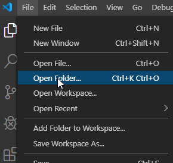
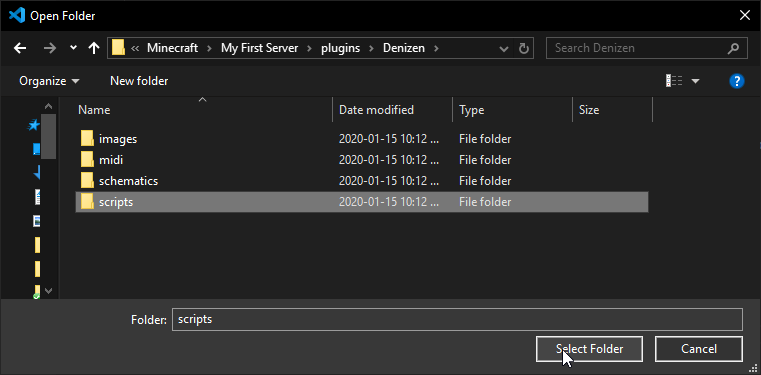
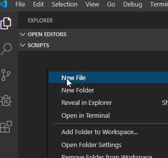
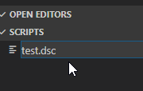
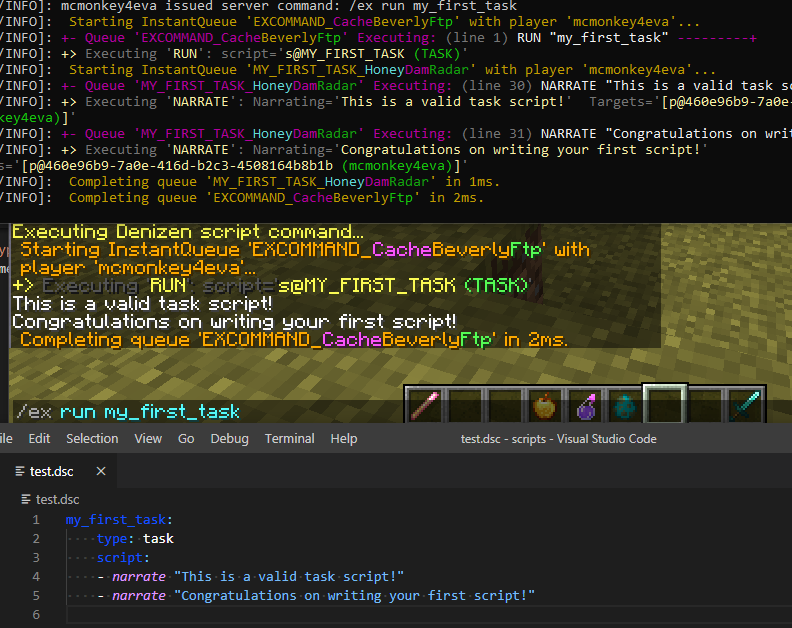

Your First Task Script
----------------------

```eval_rst
.. contents:: Table of Contents
    :local:
```

### Task Script Basics

A task script is a stand-alone script that can be run either via in-game command with the [/ex command](/guides/first-steps/ex-command), or by the `run` command in a script.

Task scripts will run all of the Denizen commands that they include. A task script can be simple, it can be complicated, and it can even run other task scripts. This is useful to create logic-based script chains, like dialogue options or random content.

### Task Script Syntax

Here's an example of a basic task script.

```dscript_green
example_task:
    type: task
    script:
    - narrate "This is a basic task script!"
```

This script will narrate the text: `This is a basic task script!` to the player attached to the script. If you use the `/ex` command to run this script - specifically, by running `/ex run example_task` in-game, *you* will be the attached player.

Note that this script sample is highlighted in green. That means it's good enough that you could copy/paste it and it will work. Farther down this page there's a script example highlighted in blue, meaning it's a good example but some part needs to be filled in. Later on you'll see examples in red, indicating that those examples are what to *not* do. For more information on this highlighting system, refer to [This Guide - Sample Scripts](/guides/this-guide/sample-scripts).

### Building Your First Task Script in VS Code

Previously, you've learned [how to set up VS Code](/guides/first-steps/script-editor), the editor that we recommend for writing Denizen scripts.

#### Creating the File

To create your first task script, start by opening your scripts folder in VS Code.




From there, right click the scripts folder in the explorer menu and click the "New File" option.



Type any file name you want, just make sure to end it with `.dsc` - the required extension for a Denizen script file.



Now you can begin writing your first task script!

#### Writing the Script

Let's start with the core of the script:

```dscript_blue
my_first_task:
    type: task
    script:
    - narrate (sometext)
```

This example should look familiar - it's very similar to the example above.

#### Script Names

The name of the script here is `my_first_task`. It's at the top of the indentation <span class="parens">(meaning that there are no spaces at the start of the line, whereas all the other lines have exactly 4 spaces at the start - those are indented farther in)</span>. Each top-level indentation entry is a separate script. Here is an example of two different scripts:

```dscript_green
my_first_task:
    type: task
    script:
    - narrate "This is is task number one!"

my_second_task:
    type: task
    script:
    - narrate "This is task number two!"
```

This example demonstrates what having two different scripts in the same file looks like. `my_first_task` and `my_second_task` are two different scripts, and each is a fully self-contained script.

Additionally, note that *script names* and *file names* are different. Both `my_first_task` and `my_second_task` could be contained within the same file named `my_first_scripts.dsc`. It's the script name <span class="parens">(that `my_first_task`)</span> that matters, the file name <span class="parens">(`my_first_scripts.dsc`)</span> is entirely for your own personal organization, and will not make any difference to Denizen.

#### Script Types

Below the script name - on the second level of indentation - you'll see the `type` key.

The `type` key is where you specify which `type` of Denizen script you're writing. In this case, we're writing a `task` script. You may have already seen `world` scripts, `item` scripts, `inventory` scripts, or any of the many other types that exist. For now, we will focus on `task` scripts. You'll learn about the different types as you read through these guides, and you can find explanations about all of them from the meta documentation on the [language explanation page](https://one.denizenscript.com/denizen/lngs/container).

Make sure you write `type: task` in your script on the second level of indentation <span class="parens">(press **enter** to start a new line, then press **tab** to indent once. This will add 4 spaces on the line, and every time you press enter after there will automatically be 4 spaces again, until you press backspace to remove the spaces)</span>, below the script name, like this:

```dscript_blue
my_first_task:
    type: task
```

#### Script Commands

Below the `type` key, you'll see the `script` key. For a task script, the `script` key is where you write the content of the script - the set of instructions that tell Denizen what to do. Other types of scripts use other keys, and you'll learn about them as you continue to work through this guide. The majority of actual work you do in Denizen will be under keys like this one.

Let's look at another example script:

```dscript_green
my_first_task:
    type: task
    script:
    - narrate "This is a valid task script!"
    - narrate "Congratulations on writing your first script!"
```

Notice how the text we want to narrate - `This is a valid task script!` - is enclosed in `""` quotes. Because the message we want to narrate has ` ` spaces in it, we enclose it in quotes to make sure that the command only has one argument. Denizen commands have arguments that are separated by ` ` spaces. For example, `run one two three` has arguments `one`, `two`, and `three`, but `run "one two three"` only has one argument, `one two three`.

### Completed Product

At this point, you should have a task script that's ready to run! Go on, give it a try - first, type `/ex reload` in-game to load the new script in, then use the `/ex run (YourTaskName)` command to run the task in-game. For example, the in-game command to run the above script would be `/ex run my_first_task`.

If you see the text that you wrote for the `narrate` command, you've successfully written your first task script. Congratulations!



### A Little Bit Further

To take what you learned here a little bit further, and bearing in mind that while we've been using the `run` command via `/ex`, it is a Denizen script command <span class="parens">(the `/ex` command is just an in-game tool to quickly run any script command)</span>, let's look at an example that does just a little bit more than the previous ones.

You can also use one task script to trigger another task script. That looks like this:

```dscript_green
my_first_task:
    type: task
    script:
    - narrate "This is a valid task script!"
    - narrate "Congratulations on writing your first script!"
    - run my_second_task

my_second_task:
    type: task
    script:
    - narrate "This is your second task script!"
```

This is just a basic example, and you'll be able to create more complicated and powerful scripts as you learn more about Denizen.
