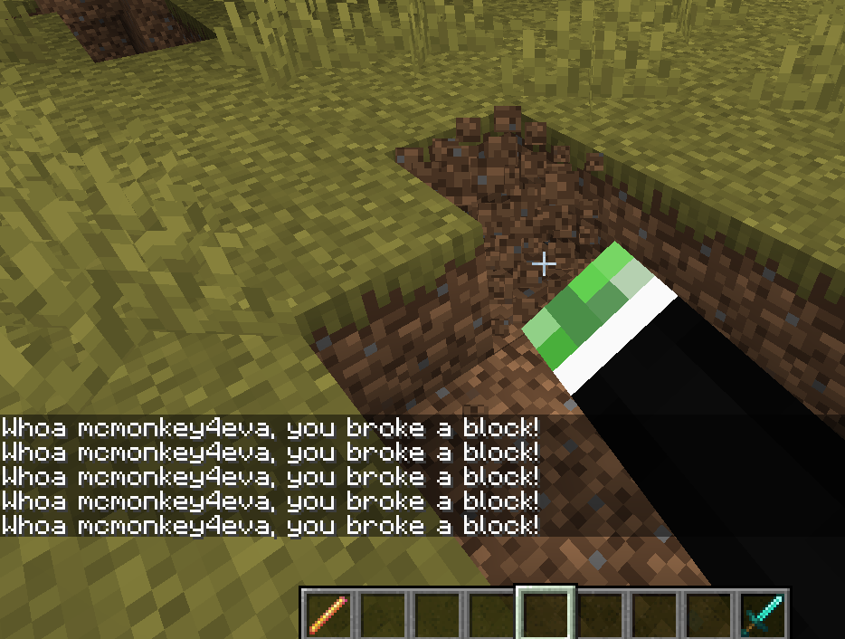
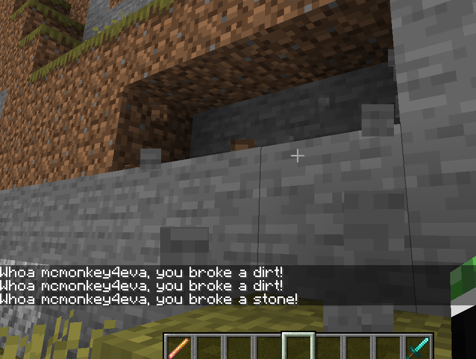

Your First World Script
-----------------------

```eval_rst
.. contents:: Table of Contents
    :local:
```

### It Runs On Its Own!

So, you've learned [how to use '/ex' to run a single Denizen command](/guides/first-steps/ex-command) and [how to make a 'task' script to run a series of commands together](/guides/first-steps/task-script). Those are pretty useful tools, but they require you sit there and type commands in to make it happen. Isn't the point of a script engine supposed to be that it automatically triggers when needed, to make custom stuff on your server? It would be ridiculous to just sit on a server typing `/ex` commands whenever a player needs something!

### Introducing: The World Script

Let's take a look at the primary way we make automatically triggered scripts: `world` script containers!

A world script contains `events`. An event is basically: a thing that happens in the world. For example, when a player breaks a block, there's an event for that. Most events are named pretty clearly and simply - for example, the previously mentioned event would be `on player breaks block`. Note that all events start with the word `on`, and what follows is usually English phrasing of the event based on that. Some more examples of event names: `on player places block`, `on entity dies`, `on creeper powered`, `on lightning strikes`, ...

### Let's See A Real World Script!

```dscript_green
my_world_script:
    type: world
    events:
        on player breaks block:
        - narrate "Whoa <player.name>, you broke a block!"
```

Go ahead and put that into a script file, use `/ex reload` to load it in, then break any block. You'll see the message appear in chat when you do so.



Some things to note in this example:
- The `type` for these scripts is now `world`.
- Instead of `script:` from before, we now have `events:`, which contains within it the actual event name.
- The player that broke the block is automatically the contextually linked player. So, the narrate shows to that player, and `<player.name>` will be that players name.

An event will run every time the thing happens in the world. Every single time any player breaks any block, that script will run. If 5 players all break a block at the same time, that script will run 5 times - once for each player, each time linking to the specific player that broke the block that the script is reacting to. If one player gets an efficiency 5 shovel and destroys 10 dirt blocks in under a second... yep, the event will run 10 times, with that one player linked each time.

### Okay, But What Block Did They Break?

So, you know that they broke a block when that script runs, but you're of course wondering how you know what type of block was broken <span class="parens">(after all, breaking a block of dirt and breaking a block of diamond ore probably shouldn't be handled the exact same way)</span>. There are two ways of doing this.

#### Context Tags

The first way to know what type of block was broken is `context` tags. Context tags are tags that, as the name implies, give the details about the context of when/where/why a script is running. In an event, context tags contain everything you need to know about the event that happened.

`<context.material>` is available in the `on player breaks block` event as a way to get a material. This returns a MaterialTag, and the tag `<MaterialTag.name>` gets the name of a material, so let's stick these tags together to form `<context.material.name>`.

Try putting that tag into the narrate line, like `- narrate "Whoa <player.name>, you broke a <context.material.name>!"`, and then reloading and breaking a few blocks. You should see the name of each block type you broke, as you break them.



Note that context tags are always base tags, and are never sub-tags <span class="parens">(though, of course, you can tack a sub-tag onto the end of a context tag whenever needed)</span>.

Note also that context tags, naturally, only exist within their relevant context. The `on entity dies` event doesn't have `<context.material>`, as that's not part of that event. Similarly, a task script or an `/ex` command won't have any contexts at all, as they're not part of any event.

#### More Specific Event Lines

Event names allow extra specification to be added, as either an input filling or an event switch.

The breaks block event is documented as: `on player breaks block` or `on player breaks <material>`. The second version here gives us a `<material>` input option. In this context, the `<>` means "fill in your specific value here". So, try changing your script's event line to be `on player breaks stone:`, then reload and try breaking a few different block types, including stone. You will see that the narrate only happens when you break stone. If you break dirt or anything else, nothing will happen.

Event switches are additional options on an event aside from just the basic name input. The breaks block event has a few switches available, including one documented as `with:<item> to only process the event when the player is breaking the block with a specified item`.

To put this to use, you can do, for example: `on player breaks stone with:diamond_pickaxe:` to make the script only run when the player specifically uses a diamond pickaxe while breaking the stone - if you try it with an iron pickaxe or anything else instead, the script simply won't run.

#### Event Lines Are Static

Note that event lines can never contain tags - they must always be valid plain text. In a [later section](/guides/basics/if-command) you will learn how to change whether the script runs based on more dynamic tag-based checks.

There is, however, a bit of limited dynamicness available. For example, consider the `with:diamond_pickaxe` switch we used above. What if we want *any* pickaxe to count? We can use `with:*_pickaxe` for this. The `*` symbol means "anything here". Similarly, if we want only diamond or iron, we can use `with:diamond_pickaxe|iron_pickaxe`. The `|` symbol means "either one of these counts". You can also apply this to the input portions of an event line. For example, if you want to react to players breaking wood logs, but don't want to have a different event for each and every type of log, you can simply use `on player breaks *_log:`.

### Okay But Stop Breaking My Blocks Please

So, you can make a script run when an event happens. You can also check the specific details of the event when it happens. But how do you *do anything* about the event? What, do we have to just `- narrate "*shakes fist* stop breaking my blocks!"`?

Enter the `determine` command. The determine command is how you *determine the outcome* of an event. When not put to use, the event simply happens however it normally would. When you use determine, you can change anything about the event <span class="parens">(within the reasonable limits of being an alteration to the event - if you want an unrelated change to the world to take place in response to the event, use the applicable command that produces that change)</span>.

The most commonly available determination, that almost all events support, is `- determine cancelled`. This *cancels* the event - that is, the event will either not take place at all, or immediately undo itself. In the case of the `breaks block` event, this will make it so the block never breaks <span class="parens">(players watching will see nothing happen, however, the player that attempted to break a block will see it flash broken and then pop right back in - this is a consequence of clientside prediction and is unfortunately unavoidable without a client mod)</span>.

So, let's try it! After the narrate line in our test script, add the determine. If you've applied all the suggested changes thus far, your script should now look like this:

```dscript_green
my_world_script:
    type: world
    events:
        on player breaks stone with:diamond_pickaxe:
        - narrate "Whoa <player.name>, you broke a <context.material.name>!"
        - determine cancelled
```

This script means if you break a stone with a diamond pickaxe, you will be stopped. If you break a different block, or don't use a diamond pick, things will work normally.


Note that a determine command is considered by default the end of a script. if you want to use a determine command but then continue running commands in the script <span class="parens">(for example, to apply multiple different determinations to change multiple parts of an event)</span>, you must use the `passively` argument, like `- determine passively cancelled`.

#### Making A Difference In This World

If you want to change an event, rather than simply cancelling it outright, most events have specific determination options available. The breaks block has the determination option `nothing` to make no items drop when the block is broken in survival mode, and the option of inputting an item or list of items to make the block instead drop those listed items when broken.

As an example of how you might use this, you can use the tag `<MaterialTag.item>` to get an item from any material, and combined with the `<context.material>` context tag available, get the resulting line: `- determine <context.material.item>`. You now have free silk touch powers! Every block now drops its exact raw form - so if you mine a diamond ore block for example, you'll receive the diamond ore block, instead of diamonds <span class="parens">(note that you will have to change the event line back to `block` instead of `stone`, or specify `diamond_ore` or anything like that)</span>.

### A Whole Big Bunch of Events

As an additional note to be aware of: any one world script can contain several events. That might look something like this:

```dscript_green
my_world_script:
    type: world
    events:
        on player breaks block:
        - narrate "Whoa <player.name>, you broke a <context.material.name>!"
        on player breaks stone with:diamond_pickaxe:
        - determine cancelled
        on player places stone:
        - narrate "Why are you putting that stone there? Better not break it with a diamond pickaxe!"
```

