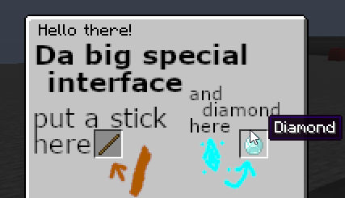

Resource Packs - Custom Items And Sounds
----------------------------------------

This page will answer some common questions from programmers interested in creating visually custom items and adding new sounds into a resource pack.
There are plenty of tutorials on creating your own resource pack, and less commonly how to implement custom model data and manage sounds within one.
This guide primarily, details how to correctly format your resource pack, and then implement it into Minecraft using Denizen scripts.

```eval_rst
.. contents:: Table of Contents
    :local:
```

### Inside The Root Directory

If you don't already have a resource pack: You can get to the `resourcepacks` directory by opening the Resource Packs menu in your Minecraft client and clicking on the "Open Pack Folder" button. Within there, you can create a new folder for your pack.

Directory: `.minecraft/resourcepacks/MyResourcePack/`

The main directory within your resource pack folder should contain both:
- The `Assets` Folder - This is where all your files are placed.
- `pack.mcmeta` - This is how Minecraft knows what format your Resource Pack is.
Optimally, you can also include `pack.png` - This is a `64x64` custom image for your pack!

#### Example File: `pack.mcmeta`

Inside the `pack.mcmeta` file, you will find this is formatted in a `json` format.
You need two named strings: `pack_format` and `description`.
Here is what it looks like inside:

```json
{
   "pack": {
      "pack_format": 9,
      "description": "My Fancy Resource Pack"
   }
}
```

##### pack.mcmeta File Key: `pack_format`

This is the indicator to Minecraft what version of Minecraft this pack was built for. This number can be a bit arbitrary, as it's updated whenever Minecraft updates pack format internals, sometimes even multiple times between a minecraft update.
- `7` indicates version `1.17`,
- `8` indicates version `1.18`,
- `9` indicates version `1.19`,
- `13` indicates version `1.19.4`,
- `32` indicates version `1.20.6`,
- `34` indicates version `1.21`,
- `42` indicates version `1.21.3`
- For more version options, refer to [This minecraft wiki page](https://minecraft.wiki/w/Pack_format/#List_of_resource_pack_formats)

##### pack.mcmeta File Key: `description`

This can be blank, or you can optimally fill this with something fancy.
Unicode characters must be written pre-escaped, like this: `\uCODE`; two examples being:
 `\u2588` for `█`, and `\u00A7` for `§`, the section sign symbol which parses [valid color tags](https://minecraft.gamepedia.com/Formatting_codes) you use to parse colors in minecraft chat.
If you want red text, your text will look something like `\u00A74Dark Red!`.
*Note: Color before formatting; Formatting codes persist after a color code, Not vise-versa!*

You can find special characters in your Character Map.
If you're on a Windows operating system, `Start` > `Windows Accessories`.
If you're in Linux using GNOME and Unity, `Gucharmap character map` is a part of `GNOME desktop`.
If you run a Gnome desktop - you can access it in any of these following ways:
- Menu on the top of the screen, `(language)` > `Character Map`.
- `Gucharmap` in terminal.
- `Applications` > `Accessories` > `Character Map`.

You can also google search for unicode characters.

### Inside The Assets Folder Directory

Directory: `.minecraft/resourcepacks/MyResourcePack/assets/`

This directory should be empty except for the one folder directory: `minecraft`. 
Toss it in and leave everything else out of here.

### Inside The Minecraft Folder Directory

Directory: `.minecraft/resourcepacks/MyResourcePack/assets/minecraft/`

Depending on what content you plan on changing, you can create any of the following folders:

- blockstates - This is where each block-state of materials are saved.
- font - This is where font data is saved.
- models - This is where the model data and files are saved.
- textures - This is where the texture image files are saved.
- sounds - This is where your sounds are saved.
- optifine - This is where your optifine data is saved. This guide does not cover this.

For Optifine support, it's recommended you join their discord and review their documentation at their [Github Source](https://github.com/sp614x/optifine/tree/master/OptiFineDoc/doc).

### Inside The Sounds folder Directory

Directory: `.minecraft/resourcepacks/MyResourcePack/assets/minecraft/sounds/`.
The sound format Minecraft uses is `.ogg`.
Free converting tools can be found online, one recommended option being [Audio-Online-Convert.com.](https://audio.online-convert.com/convert-to-ogg).
For organization's sake, if you're adding new sounds, it is recommended that you place them in a folder named `Custom`. Minecraft's default resource organizes it's sounds by [category](https://hub.spigotmc.org/javadocs/bukkit/org/bukkit/SoundCategory.html).
You can find Minecraft's default resource sound index here: `.minecraft/assets/indexes/1.21.json`; where `1.21` is the Minecraft version to use.
All of your sound files <span class="parens">('.ogg' files)</span> should be saved in this directory.

#### Example File: `sounds.json`

This file indexes where Minecraft should look for your sounds.
Below is an example of a setup for two custom sounds, `defense_levelup0` and `defense_levelup1`.

```json
{
  "entity.player.defense.level": {
    "sounds": [
      {
        "name": "custom/defense_levelup0"
      },
      {
        "name": "custom/defense_levelup1"
      }
    ],
    "subtitle": "Excited Trumpet Noises"
  }
}
```

The first key is the name for the sound; in this example, `entity.player.defense.level`.
The only data object within the command we need to specify are `sounds`.
Optionally, you can specify the subtitle that displays if subtitles are enabled in-game.
If you place multiple sounds within the `"sounds":[]` array, the sound will randomize between them based on their weight.
The file extension is `.ogg` - other formats are not compatible.

For each file, you will need the data: `"name":"FILEPATH/FILENAME"`, excluding the file's extension.
Optionally, you can manually adjust the following valid properties of the sound:

1) `volume` - The volume the sound will be played as. 
    - Default is `1.0`; Valid volume ranges from `0.0` to `1.0`; where `1.0` is the loudest it may be played at.
    - The Volume value accepts higher values using Denizen's PlaySound, however not by increasing the volume. It increases the audible distance the sound may be heard from. 
    - For example, volume 5 can be heard from five chunks away.
2) `pitch` - The pitch the sound plays at, altered from it's original `.ogg` form.
    - Default is `1.0`; Valid pitches range from `0.0` to `2.0`; where `1.0` is high-pitched and `0.0` will be low-pitched.
3) `weight` - The chance that this sound will be selected as opposed to randomly.
            - Higher integers are used more frequently.
4) `stream` - Determines if the sound should be streamed from it's file.
    - Default is false.
    - Recommended to set this value as `true` if the sound is longer than two seconds to avoid lag.
    - Use this sparingly; it's not optimal to specify everything true.
    - This is used with all music disks.
5) `preload` - Determines if the sound should be loaded when loading the pack, as opposed to when the player plays the sound.
    - Default is false.
    - Used for ambient noises.
6) `attenuation_distance` - Determines the reduction rate based on distance.
    - Default is `1.0`.
    - Used by portals, beacons, conduits.
7) `type` - determines if a pre-defined event fires this sound.
    - Default is `sound`, the other option available is `event`.
    - `sound` causes the value of `name` to be interpreted as the name of a file.
    - `event` causes the value of `name` to be interpreted as the name of an already defined event.
    - used for things like being under-water, in a cave, near a beacon, near a beehive.

#### Using Custom Sounds

Playing your sound is relative to the unique custom name you gave it.
In our example, we specified the name of the sound as `entity.player.defense.level`.
You can play this sound with the `playsound` command like this: `/ex playsound <player> entity.player.defense.level custom`.
In a script, this would look something like this:

```dscript_green
MyCustomSound:
    type: task
    script:
        - playsound <player> sound:entity.player.defense.level custom
```

### Inside The Blockstates Folder Directory

Directory: `.minecraft/resourcepacks/MyResourcePack/assets/minecraft/blockstates/`

To modify each individual block-state of an item, you must specify each individual blockstate.
Additional blockstates cannot be specified.
When specifying blockstate models, the relative folder directs to the `Models` directory, located at `/assets/minecraft/models/`.
Adjusting these is not covered in this guide.

### Inside The Models Folder Directory

Directory: `.minecraft/resourcepacks/MyResourcePack/assets/minecraft/models/`

To "Create" new items, you will need to modify existing items within Minecraft.
This can and was previously done with Durability, but optimally utilized with `custom_model_data` that was implemented in Minecraft 1.14.
The three object model types for model data are `Block States`,`Block Models`, and `Item Models`.
Block States and Block Model data are not covered in this guide.

#### Example File: `wooden_sword.json`

Existing files such as `wooden_sword` for example, should look like this:

```json
{
    "parent": "item/handheld",
    "textures": {
        "layer0": "item/wooden_sword"
    }
}
```

The above example is `wooden_sword.json`, which is located at `/assets/minecraft/models/item/wooden_sword.json`.
The `parent` key indicates the model data this file injects data for.
The data's value for parent specified are the `FILEPATH/FILENAME` from the `models` directory if specifying a model file,
and the `textures` directory if specifying a texture. 

In the above example, the `wooden_sword` utilizes the parent model located at: `/assets/minecraft/textures/item/handheld.json`.
In the above example, the `wooden_sword` utilizes the texture image located at: `/assets/minecraft/textures/item/wooden_sword.png`.

Note that removing `parent` keys if you are not specifying all display properties of an item will return unexpected results.
The `wooden_sword`, for example, utilizes the parent file `/assets/minecraft/textures/item/generated.json`;
which also utilizes a parent file at `/assets/minecraft/textures/builtin/generated.json`.
If these files do not exist altered in the pack, they utilize the respective existing file within Minecraft's default resource.
To add the `custom_model_data` predicate, we specify this in the `Overrides` key.
Here is an example of the override, and the `custom_model_data` specified.

```json
{
    "parent": "item/handheld",
    "textures": {
        "layer0": "item/wooden_sword"
    },
    "overrides": [
        { "predicate": { "custom_model_data": 1 }, "model": "item/custom/dserver_ubersword" }
    ]
}
```

*Note: Remember that objects and arrays are separated by commas.*
The above example extends the item `wooden_sword` to have an additional item model when the item in-game has the mechanism applied.
This file is located at: `/assets/minecraft/models/item/custom/dserver_ubersword.json`.
Valid `custom_model_data` entries are integers, <span class="parens">(including larger integers, as opposed to the durability predicate which is more limited)</span>.
An example of this file with multiple custom model data's specified looks like this:

```json
{
    "parent": "item/handheld",
    "textures": {
        "layer0": "item/wooden_sword"
    },
    "overrides": [
        { "predicate": { "custom_model_data": 1 }, "model": "item/custom/dserver_ubersword" },
        { "predicate": { "custom_model_data": 2 }, "model": "item/custom/dserver_prosword" },
        { "predicate": { "custom_model_data": 3 }, "model": "item/custom/dserver_greatsword" },
        { "predicate": { "custom_model_data": 4 }, "model": "item/custom/dserver_decentsword" }
    ]
}
```

#### Example File: `custom_item.json`

Your custom item's model data file is something you may or may not adjust yourself.
There are plenty of options for modeling software available, the most commonly recommended is [BlockBench](https://blockbench.net/), which is free and very capable, or  [Cubik Pro](https://cubik.studio/) which is non-free but some have claimed that it is powerful.
Note that the software you use must be able to export the model to a `.json` file format.
Cubik Pro specifically saves the model, and the respective image file, into it's correct locations and formats the model file correctly.
When you place your custom item's model data into the location you direct it to in the above example, the top of your model file should look something like this:

```json
{
	"textures": {
		"particle": "item/custom/handheld/dserver_ubersword",
		"texture": "item/custom/handheld/dserver_ubersword"
	},
```

Note that you do still need any other parts of the JSON file, such as the `"parent"` key.

In the above example the `particle` and `texture` keys both point to the image files we will be saving at the directory: `/assets/minecraft/textures/item/custom/handheld/dserver_ubersword.png`.

#### Using Custom Items

Giving yourself the item is simple. If it's a one-off time you need the thing or you're just generally testing, 
you can use the [`/ex` command](/guides/first-steps/ex-command) like this:
`/ex give wooden_sword[custom_model_data=1]`.
The item script simply looks something like this:

```dscript_green
UberSword:
    type: item
    material: wooden_sword
    mechanisms:
        custom_model_data: 1
```

The `custom_model_data` is in-line with any other mechanisms you choose to specify with the custom item.
You can give yourself the custom item just like any other item script, `/ex give dserver_ubersword` or in any script with the `give` or `inventory` command.

### Inside The Textures folder Directory

Directory: `.minecraft/resourcepacks/MyResourcePack/assets/minecraft/textures/`.
This is where your image files are saved.
These files should be in the relative filepath specified within the model file that it corresponds to.

### Making Custom Fonts

One of the many useful tools in a resource pack is custom fonts! This allows at the most basic of course to mess with the text font, but also allows you to make emojis, or even entire custom images! A font with an inventory-sized custom image, placed in an inventory title, allows you to have a custom inventory GUI screen!

#### How Do I Make A Custom Font?

Simple!

Step 1: In your resource pack, make sure you have a pack-specific folder. Many other features expect you to override the `minecraft` folder, but this one allows you to just make your own. So instead of `assets/minecraft/font`, you'll have `assets/examplepack/font` (but replace `examplepack` with the name of your pack... or any simple identifier you prefer).
Step 2: inside `assets/examplepack/font`, create a file named something like `examplefont.json` (but again, name it whatever you want to identify it - say `gui.json` or `particles.json` or something).
Step 3: inside that json file, add the following:
```json
{
  "providers": [
      {
          "type": "bitmap",
          "file": "examplepack:samplefolder/sampleimage.png",
          "ascent": 8,
          "height": 8,
          "chars": [
              "a"
          ]
      },
      {
          "type": "bitmap",
          "file": "examplepack:samplefolder/sampleimage2.png",
          "ascent": 8,
          "height": 8,
          "chars": [
              "b"
          ]
      }
  ]
}
```
Note the usage of `samplefolder` and `sampleimage` as again spots to fill in your own names.

Step 4: in `assets/examplepack/textures/samplefolder/`, add `sampleimage.png` as any valid image of any valid size (8x8, 32x32, 128x128, etc.)

These folder and file names can be anything, as long as they are: ASCII (a-z, 0-9), all lower case, and short/simple. Basically, don't tempt fate of bugs by using complicated or messy names.

It's important to make sure the names in the JSON file content are the same as the real file paths.

If you need images to test with, here's a pair of valid images you can use: [sampleimage.png](https://github.com/DenizenScript/Denizen-Beginners-Guide/raw/master/source/guides/non-denizen/images/denizen_pack_image.png), [sampleimage2.png](https://github.com/DenizenScript/Denizen-Beginners-Guide/raw/master/source/guides/non-denizen/images/denizen_pack_image2.png)

Step 5: Load up your pack in-game.

Step 6: In-game, try `/ex narrate <&font[examplepack:examplefont]>ab`

Notice how `examplepack` (the folder name) is used, and `examplefont` (the json file name) is used. Replace these with the names you chose yourself for the files.

Notice also that the text `ab` corresponds to the `"a"` and `"b"` lines in the JSON.

You should see your new images:


If you'd like to embed custom fonts within a normal line, you can also do `/ex narrate "Hi there <element[ab].font[examplepack:examplefont]> how's it going?"`, or you can just use `<&font[minecraft:default]>` to swap back to default font at any time.

#### Now How Do I Add More Images To The Font?

Just copy/paste the block starting a `{` and ending at `}`, and make sure to add a `,` in between each block (but not one after the last block), then edit the `chars` to a new letter or number you haven't used, and change the `file` to your new image file's path.

Some users prefer to have `chars` in the form of `\uF801` in the JSON and then use `<&chr[f801]>` in script, incrementing the number by 1 for each new value. This can sometimes be useful for organization, but is mostly just an artifact of the old standard of overriding the Minecraft default font instead of using a custom font.

#### How Do I Make Big or Small Images?

Changing the actual size of the `.png` file does nothing - to change the scale of the image, edit the `height` and `ascent` value in the JSON file.

The `height` is how big the image should be, and `ascent` is how much to move it up or down relative to the line of text it's in.

The default size of text is `8` for both height and ascent.

Note that text bigger than `8` will overlap other lines if used in chat.

#### How Do I Make A Custom Inventory GUI?

Here's an example pack for custom inventory GUIs:

You can add this json in as for example `assets/examplepack/font/gui.json`

```json
{
  "providers": [
      {
          "type": "bitmap",
          "file": "examplepack:gui/vanilla_inventory_reference.png",
          "ascent": 13,
          "height": 127,
          "chars": [
              "a"
          ]
      },
      {
          "type": "bitmap",
          "file": "examplepack:gui/custom_inventory.png",
          "ascent": 13,
          "height": 127,
          "chars": [
              "b"
          ]
      },
      {
          "type": "bitmap",
          "file": "examplepack:gui/space.png",
          "ascent": -32768,
          "height": -10,
          "chars": [
              "-"
          ]
      },
      {
          "type": "bitmap",
          "file": "examplepack:gui/space.png",
          "ascent": -32768,
          "height": -170,
          "chars": [
              "="
          ]
      }
  ]
}
```

In this pack, `-` uses "space" - a 1x1 empty image, with very specific ascent and height meant to adjust the image backwards into the spot it's meant to be at from an inventory title to apply over the full GUI, and `=` will move the text back to the normal spot. [Here's a space image you can use](https://github.com/DenizenScript/Denizen-Beginners-Guide/raw/master/source/guides/non-denizen/images/space.png).

Character `a`, `vanilla_inventory_reference`, is a picture of a vanilla inventory that can be used as a template. [You can download the reference here](https://github.com/DenizenScript/Denizen-Beginners-Guide/raw/master/source/guides/non-denizen/images/vanilla_inventory_reference.png). If you use a custom texture pack, you might prefer to use that pack's inventory image as a reference instead of the vanilla one.

Character `b`, `custom_inventory`, is an edit of the vanilla image to demonstrate usage. [You can download my test demo here if you want it](https://github.com/DenizenScript/Denizen-Beginners-Guide/raw/master/source/guides/non-denizen/images/custom_inventory.png).

Apply it to an inventory script like so:

```dscript_green
example_gui:
    type: inventory
    debug: false
    gui: true
    inventory: chest
    title: <&f><&font[examplepack:gui]>-b=<&font[minecraft:default]><&0>Hello there!
    slots:
    - [] [] [] [] [] [] [] [] []
    - [] [] [] [] [stick] [] [] [] []
    - [] [stone] [] [] [] [] [] [] []
    - [] [] [] [] [] [] [] [] []
    - [] [] [] [] [] [] [] [] []
    - [] [] [] [] [] [] [] [] []
```

Note the usage of `<&f>` to set the color to white (so it doesn't ruin the image by changing the color) `-` to move the position back, `b` to add the image, and `=` to move the position back to default, the `<&font[minecraft:default]>` to swap back to the default font, then `<&0>` to set color back to default black, and finally the normal inventory name.

Open that with `/ex inventory open d:example_gui` to see it in action.


In real usage, you don't have to match the inventory GUI's structure, you can completely block out spaces or anything else you'd like - the reference is mainly just helpful to keep track of where items will show up if added to the inventory.

You may prefer to set parts of the image to transparent to allow the background-highlight when selecting items to show up properly.

Here's an inventory GUI example that's a bit closer to a real world one: [(Click to download if you want it)](https://github.com/DenizenScript/Denizen-Beginners-Guide/raw/master/source/guides/non-denizen/images/awful_inv_demo.png)



*The above image serves as a reminder that even after you master coding, you can still benefit from hiring an artist to help with the resource pack rather than trying to do it all yourself.*

Hopefully this is enough to spark your imagination flying with the types of custom interfaces you could actually achieve! If not, [join the Discord](https://discord.gg/Q6pZGSR) and look in the `#showcase` channel, a bunch of really neat things have been showcased using custom inventory GUI images!

#### Fonts Conclusion

If you followed this font guide exactly without changing any of the names, your pack's file structure should match this:


### Tips, Tricks And Notes While You Create

A very handy trial-and-error debugging tricks for creating resource packs is that you can actively edit the pack and view your changes in-game.
One of the most common misconceptions of resource packs is that you need to have it saved as a `.zip`.
FALSE! You can save this directly in your resource packs folder, edit and just reload!
The default hotkey to reload your resource packs is `F3 + T`.

If you run across a flat purple and black square texture, this is the default Minecraft missing data replacement. 
- if your item is flat with the purple/black texture, your item's model file path is misconfigured or is missing.
- If your item has shape but no texture, your model file's image path is misconfigured or you're missing the image file.
- if your item is normal, your resource pack is not registering any changes made to the item.

There is an incredibly handy JSON formatter and Validator you can find [Here](https://jsonformatter.curiousconcept.com/) for checking your JSON data.
Minecraft will give no indicators excluding broken texture images and models if your files are wrongly formatted.

Custom textures, models and sounds can be placed within as many sub-folders as you would like. Remember to keep all file and folder names lowercase to avoid case-sensitivity issues.

Your default Resource Packs folder is located in your default minecraft directory, and looks something like this:
`C:/Users/[username]/AppData/Roaming/.minecraft/resourcepacks` (jump straight there via `%appdata%/.minecraft/resourcepacks`) on Windows, or `/home/[username]/.minecraft/resourcepacks` on Linux.
You can also just directly open the folder with the `Open Resource Pack Folder` button in the `Resource Packs...` section of your in-game menu.

The best template for modifying existing models and textures for Minecraft is the default resource,
which can be found in your Version Jar directly located in the directory: `/.minecraft/versions/`.
You can extract this to its respective file and locate the `Assets` folder within.
Note that if you copy the entire `assets` folder as a template, you may consider removing material you don't change,
as it's extra file storage you don't need to contribute to the resource pack.

### Related Technical Docs And Links

* [Playsound Command Meta](https://meta.denizenscript.com/Docs/Commands/playsound)
* [JSON Formatter and Validator](https://jsonformatter.curiousconcept.com/)
* [Online-Convert.com | Convert Audio to OGG Format](https://audio.online-convert.com/convert-to-ogg)
