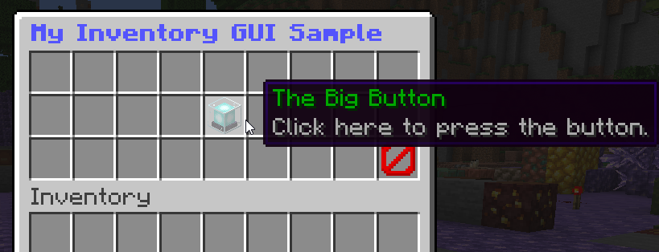

An Inventory GUI Menu
---------------------

This page will guide you through creating a basic Inventory GUI Menu in Denizen. It is expected that you've already gone through the [First Steps](/guides/first-steps/index) section and the [Basics](/guides/basics/index) section, as this page will use tools taught in those earlier sections.

In particular, this section will make use of: [the /ex command](/guides/first-steps/ex-command), [world scripts](/guides/first-steps/world-script), [meta documentation](/guides/basics/finding-tools), and [item scripts](/guides/basics/custom-items).

```eval_rst
.. contents:: Table of Contents
    :local:
```

### Introduction

Inventory GUIs are among the most common ways to implement simple menu systems on Minecraft servers. They generally consist of the Minecraft chest interface, with some items in it that can be clicked on to activate options.



An inventory GUI menu like this can be made in Denizen a few different ways, the easiest of which is to use the dedicated tool for the job: an [`inventory` script container](https://meta.denizenscript.com/Docs/Languages/inventory%20script%20containers).

### Initial Example

Here's what the basis of a valid inventory script looks like:

```dscript_blue
my_inventory_script:
    type: inventory
    inventory: chest
    title: <&9><bold>My Inventory GUI Sample
    gui: true
    slots:
    - [] [] [] [] [] [] [] [] []
    - [] [] [] [] [stone] [] [] [] []
    - [] [] [] [] [] [] [] [] []
```

This is largely just the `inventory` script container as documented in the meta, with a special note to make sure you set `gui: true`.

For `chest` based interfaces, slots are in rows of 9 items each. Note that each slot is contained by `[` and `]`, for example `[stone]` in the center slot of that example, and empty slots are simply `[]`. This could alternately be written as `[air]`.

#### How Do I Open That?

You can open your new inventory menu by using [`inventory` command](https://meta.denizenscript.com/Docs/Commands/inventory), with the sub-command `open`, and the `destination` parameter set to the inventory script.

In practice, using an `/ex` command, you'd write something like: `/ex inventory open d:my_inventory_script`.

When you try this command in-game, it should immediately pop open a chest view, with 3 rows of 9 slots each, where the exact center slot contains 1 single stone. You should be able to click the stone, however clicking it currently does nothing, and you also cannot move the stone item, nor put any of your own items into your inventory. This restriction is all thanks to the `gui: true` key on the inventory script.

### But I Want Menu Buttons, Not Stones!

Generally you want buttons in a menu, not just generic items... however, buttons are really just slightly more complicated items. As you should recall, the tool for the job of "more complicated items" is, of course, item scripts! Let's see a new example, using item scripts:

```dscript_green
my_inventory_script:
    type: inventory
    inventory: chest
    title: <&9><bold>My Inventory GUI Sample
    gui: true
    slots:
    - [] [] [] [] [] [] [] [] []
    - [] [] [] [] [big_button_item] [] [] [] []
    - [] [] [] [] [] [] [] [] [my_inv_gui_cancel_item]

big_button_item:
    type: item
    material: beacon
    display name: <&2>The Big Button
    lore:
    - <&7>Click here to press the button.

my_inv_gui_cancel_item:
    type: item
    material: barrier
    display name: <&c>Cancel
    lore:
    - <&7>Click here to not press the button.
```

When you use the `/ex` command to open this inventory script, you should now see an interface containing two unique buttons. However, they still do nothing.

### So How Do I Make The Buttons Do Things?

To make the buttons actually do something, you need the find important tool for this job: a `world` script, using the [player clicks &lt;item&gt; in &lt;inventory&gt;](https://meta.denizenscript.com/Docs/Events/player%20clicks%20in%20inventory) event.

This world event has two parameters to fill in: the item, and the inventory. You can probably guess how to fill these, right? Use the name of your inventory script <span class="parens">(in our example, `my_inventory_script`)</span> as the `<inventory>`, and use the name of your item script <span class="parens">(in our example, `big_button_item` and `my_inv_gui_cancel_item`)</span> as the `<item>`.

Let's see a valid world script for the above inventory script:

```dscript_green
my_inventory_gui_world:
    type: world
    events:
        after player clicks big_button_item in my_inventory_script:
        - narrate "<&[base]>Wow! You pressed the button!"
        after player clicks my_inv_gui_cancel_item in my_inventory_script:
        - inventory close
```

This world script example registers two events - one for each of the two 'button' items in the inventory. When you load this script in and open your inventory script, you'll be able to click the beacon item to get a narrated message, or the barrier item to close the inventory, using the `close` sub-command of the `inventory` command.

### That's It?

Yep, it's that simple! That's just about all you need to build your own inventory GUI menus. Take some time to experiment with the different options available - how does the menu look with different items or in different arrangements? What if you change the number of rows, or use alternate interface like `hopper`? What if you have multiple inventory scripts, where a button in the first inventory menu triggers an `inventory open` for the second inventory menu?

### Going Beyond

To really give your inventory menus some flair, you can take things a step further and make use of [Resource Packs](/guides/non-denizen/resource-packs) to make completely unique visual appearances for buttons, or even the entire menu itself. One common trick is to an image of an entire custom interface background attached to a custom font character, which can then be used as the title of the inventory, to override the inventory's default appearance with the custom image.

### Other Methods

In the introduction of this section, I mentioned there are many different ways to accomplish inventory GUI menus. Some examples of alternates include:
- Replacing the `gui: true` with a generic `on player clicks in my_inventory_script:` + `- determine cancelled`, alongside the same for the `drags` event. This is how we used to do it before the `gui` option was added.
- Replacing the `inventory` script container with a dynamically constructed generic inventory.
- Replacing the `item` scripts with in-line defined items, like `stone[display=<&c>Button;lore=<&7>Click me!]`
- Replacing the item inputs with dynamically generated items, for example a shop script that dynamically fills the inventory with the current stock.
- Using `note`s of inventories to pre-build a single global/shared inventory menu that can be modified in real-time.
- The list could go on. Perhaps even go outside the realms of inventories, using menus based on in-game chat, books, entities, or...

### Related Technical Docs

If you want to read some more about tools used for Inventory GUIs, here are a few technical guides you might consider...

- [Inventory script containers doc](https://meta.denizenscript.com/Docs/Languages/inventory%20script%20containers)
- [player clicks item in inventory event doc](https://meta.denizenscript.com/Docs/Events/player%20clicks%20in%20inventory)
- [Inventory command doc](https://meta.denizenscript.com/Docs/Commands/inventory)
