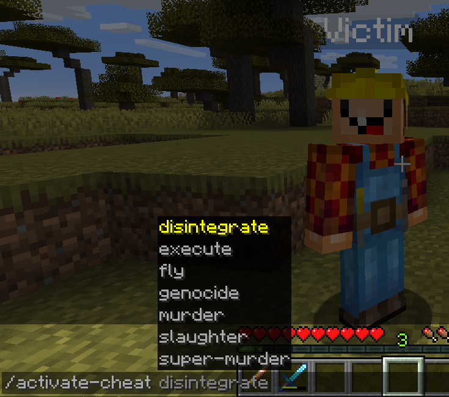
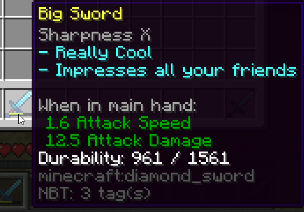
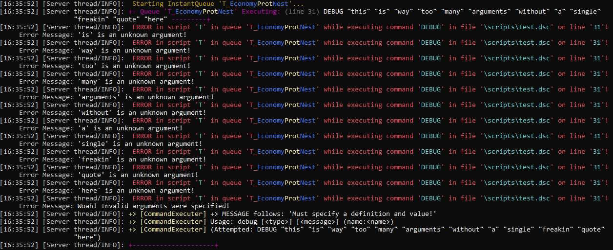
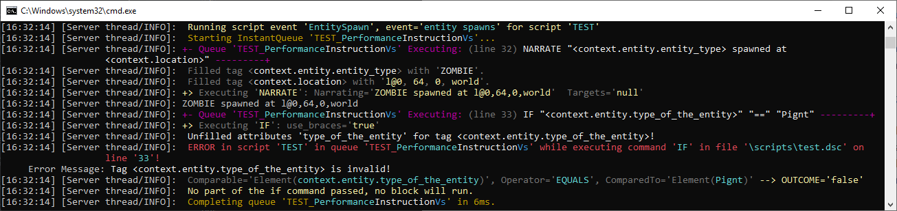

Common Mistakes
---------------

There are a few common mistakes and not-very-obvious expectations about how to handle things that we've seen while helping new Denizen users. To help you master Denizen more quickly, we've listed a few of these issues and what to do about them below.

```eval_rst
.. contents:: Table of Contents
    :local:
```

### Players Are Not Their Names

Historically in Minecraft, players were unique based on their name. This meant that "Steve" was theoretically always going to be "Steve". There was one true "Steve", nobody else could be "Steve" and "Steve" could never take on another name. This changed around the era of Minecraft 1.7, when UUIDs became the unique identifier of a player, and players were from there on allowed to change their names.

Never track a player's name internally. The `<player.name>` tag should exclusively be used for outputting a clean name in a `narrate` command or similar output meant to be read by players. As that's all a name is meant for: human reading. It is not meant for any internal tracking. It is not unique nor reliable.

\* Note that there is one exception to this: the `execute` command runs external plugin commands, which will likely expect either a name or UUID as input, not a Denizen object.

### So, A Player Is Their UUID?

A player is **not** just their UUID. A player isn't a name, a UUID, a location, or anything else. A player is a player.

Similarly, an NPC is **not** just their ID. An NPC is an NPC.

In fact, nothing is *just* that little piece of information that uniquely identifies it.

#### The Object System

An important part of the way Denizen functions is the **object system**.

An "object" in the world of software is a representation of something specific that can be tracked by a **lookup** identifier, that exists as more than just that lookup data. That's a bit confusing, so what does that mean in real usage? That means an "entity object" is a real full entity, with its AI and its health and its name and its specific place in the world and everything else that makes it what it is. The entity can be quickly looked up if you use the UUID, but the true entity itself is so much more than just a short set of numbers and letters. <span class="parens">(Note for the curious: in most software programming languages, the unique identifier of an object is its memory address)</span>.

In Denizen, whenever you look at an object in debug or with a `narrate` command <span class="parens">(or wherever else in text)</span>, the unique identifier is visible, with a prefix identifying what type of object it is (that's called **Object Notation**). This is **not** meant to be the object itself, but rather a lookup identifier so you or the system can read it and figure out what object was being referred to.

It's important when writing scripts to make sure you work with *the actual object* and not with some text that contains the lookup identifier.

A few examples of where this might come into play:
- A player object is placed into a line of text. Say for example `"Player:<player>"` is stored somewhere. When you read that text out, you may assume that `<[THAT_TEXT].after[:]>` is going to return the player object - but it won't. It will return plain text of the unique player identifier. You would have to convert it into a player object again, either use `<player[<[THAT_TEXT].after[:]>]>` or `<[THAT_TEXT].after[:].as_player>`.
- In some cases, reading directly from data storage <span class="parens">(YAML, Flags, SQL, etc.)</span> might return the plain text identifier of whatever object was inserted into it. When this happens, you again have to convert it back into the real object using the relevant conversion tags.
- Generally when user input is given (in for example a command script). A unique identifier or even a non-unique one may be used, and you will have to do more complex real-object-finding. As a particular example of this, when a command script has a player input option, generally you can trust that users aren't going to type out the exact perfect object identifier. The tag `server.match_player` is useful for converting the human-input player name into a real player object.

### Don't Trust Players



When you're writing scripts, you can generally assume that the system is going to process what you wrote as you wrote it. If you used a flag command to set a flag on a linked player, you can pretty safely trust that `player.flag` will then return the value of that flag.

Players, however, are not machines. They're human. Humans make mistakes - humans also sometimes like to cheat. When scripting user-input, you must prepare for and account for this.

Let's demonstrate the difference between a bad script that trusts players, and a good script that doesn't, using a "pay" command that you might have with an economy system.

```dscript_red
pay_command:
    type: command
    name: pay
    usage: /pay [player] [amount]
    description: Pays the specified player.
    script:
    - money take quantity:<context.args.get[2]>
    - money give players:<server.match_player[<context.args.get[1]>]> quantity:<context.args.get[2]>
    - narrate "<blue>You paid <gold><server.match_player[<context.args.get[1]>].name> <green>$<context.args.get[2]>"
```

That script is nice and simple. Only takes 3 lines, and does everything it needs to do... if the player using it uses it exactly as specified without any mistakes or intent to abuse the system.

Let's see what that script looks like if we validate all user input with care. Read the comments in the script to see what was being prevented.

```dscript_green
pay_command:
    type: command
    name: pay
    usage: /pay [player] [amount]
    description: Pays the specified player.
    # Users might be jailed or similar and have their permissions taken away,
    # so let's be sure to require a permission to use the command.
    permission: myscript.pay
    script:
    # Players might just type "/pay" without remembering the input arguments,
    # so if they do, just tell them what the input is and stop there.
    - if <context.args.size> < 2:
        - narrate "<red>/pay [player] [amount]"
        - stop
    # Use a fallback in case the player name given is invalid.
    - define target <server.match_player[<context.args.get[1]>]||null>
    # A user might mess up typing a player name.
    # If there's no matched player, just tell them and stop there.
    - if <[target]> == null:
        - narrate "<red>Unknown player '<yellow><context.args.get[1]><red>'."
        - stop
    - define amount <context.args.get[2]>
    # A user might mess up typing the number.
    # If they did mess up, tell them that and stop there.
    - if !<[amount].is_decimal>:
        - narrate "<red>Invalid amount input (not a number)."
        - stop
    # A user might try to cheat by paying a negative value
    # (so that they receive money instead of lose it).
    # So, validate that the number is positive.
    # Also exclude zero at the same time as there's no reason to pay $0.
    - if <[amount]> <= 0:
        - narrate "<red>Amount must be more than zero."
        - stop
    # A user might try to pay more than they have, either as a cheat or by accident.
    # Make sure they can afford it and stop if they can't.
    - if <player.money> < <[amount]>:
        - narrate "<red>You do not have <green>$<[amount]><red>."
        - stop
    - money take quantity:<[amount]>
    - money give players:<[target]> quantity:<[amount]>
    - narrate "<blue>You paid <gold><[target].name> <green>$<[amount]>"
```

That's an awful lot of things that needed checking! Unfortunately, good user-input scripts tend to get pretty long from all the input validation that's needed. Luckily, nobody should be able to break these longer scripts!

### Don't Compare Raw Objects

Raw object comparison is one that seems at first natural to do, and you don't realize the problems until they bite you much later on.

"Raw object comparison" refers to use an `if` command or similar to compare a raw Denizen object to something else (often plain text of the object identity).

This looks, for example, like this:
```dscript_red
- if <player.item_in_hand> == i@diamond_sword:
    - narrate "You have a diamond sword!"
```

At first glance, this looks mostly fine. If you test it in-game, it will probably even work. So what's the problem?!

#### Not Always Just A Sword



The first problem with this is that non-unique objects in Denizen <span class="parens">(those that are identified by their details, like an item is, as opposed to objects that identify by some ID, like entities do)</span>, often include secondary details in specific circumstances, even if they didn't in your early testing.

The if command in the example above will stop working the moment a player uses their sword a bit, as the durability value will change and now they'll have `i@diamond_sword[durability=1]`. This will also change if they enchant the sword, or rename it at an anvil, or...

#### Identifier Style Changes In Denizen

The second problem with this is that what's valid now might not be valid in the future. Denizen changes often, and the way objects identify change between versions. For example, `<player>` used to return `p@name`, but now returns `p@uuid`. Many other changes to identify format have happened over the years.

For the example given above, a sword that today is `i@diamond_sword`, might someday be `i@diamond_sword[durability=0]` or `item@diamond_sword` or `i@item[material=diamond_sword]` or `diamond_sword[future_minecraft_shininess_statistic=0]` or any number of other possibilities.

#### So What Do I Do?

Always compare objects based on reasonably-guaranteed-format tags. That is: tags that return a plaintext element of a clearly specified format, not an object.

Let's fix the earlier script:
```dscript_blue
- if <player.item_in_hand.material.name> == diamond_sword:
    - narrate "You have a diamond sword!"
```

The tag `.material.name` is guaranteed to always return *just* the material name, making this comparison safe from any item-detail-changes or future Denizen changes. The only risk is that the name of the material might change in a future Minecraft version <span class="parens">(this would be harder to avoid - luckily, this happens very rarely and usually you'll know it's coming when it does. If you really want to protect against it, you could do `== <item[diamond_sword].material.name>:` to rely on the autoconversion that would be added in Denizen when a rename happens, but you don't really need to)</span>.

For other object types, find the relevant unique comparison point. For materials, worlds, scripts, plugins, ... you can use `.name`.

For notable object types <span class="parens">(locations, cuboids, ellipsoids, ...)</span>, you should never compare them directly. Instead, note the object and check `.notable_name` - or use more specific syntaxes, like the `in:<area>` switch on events.

#### Note On Exact-Same Objects

When you want to compare exactly-the-same-object <span class="parens">(usually for unique objects like entities, or in list-handling tags, or similar)</span>, and you have a tag for both <span class="parens">(instead of typing one as plaintext)</span>, you can be relatively safe doing direct comparisons.

For example, you might add `- if <[target]> == <player>:` to [the `/pay` command example](#don-t-trust-players) to prevent players trying to pay themselves. This would be acceptable, as the two values do literally refer to exactly the same object in theory, and thus they will not have any different details, and any identifier changes will automatically apply to both, not only one.

### Don't Overuse Fallbacks

Fallbacks are an incredibly handy tool in Denizen. They're one of the primary tools you can use to handle uncertain situations edge-cases in your scripts. They are, like most things, best in moderation. Excessive use of fallbacks can cause more harm than good.

#### Errors Are Scary



The mindset that tends to lead to fallback overuse is one where errors are scary. An error is a problem, so you have to get rid of errors by any means necessary!

In reality, errors are just another tool that Denizen provides. The error message itself is not the problem, the error is merely there to tell you that there is a problem somewhere in your script. If you put a fallback on every tag, you'll end up hiding errors without fixing the actual problem. Your script won't show any scary red text in the console, but it also won't do what it's supposed to be doing!

#### When To Use Fallbacks

A fallback should only be placed onto a tag when you're *expecting* that tag to fail.

Consider for example the `server.match_player` tag, which is used to convert user-input names into a player object. You can quite reasonably expect that sometimes a player will input something that isn't a valid player name, and the tag will fail. That's a case where you should absolutely add a fallback like `||null`.

When you add a fallback, you often will also need to check for the fallback value, like for a definition defined as `<server.match_player[<input>]||null>`, you might do `- if <[target]> == null:` and inside that block handle the case of an invalid player input.

In other situations, the fallback can simply be a reasonable default value, like `<player.flag[coins]||0>`, which you won't need to specifically account for.

#### When To Not Use Fallbacks

Fallbacks should not be used when the tag doesn't have a very good reason it might fail.

For example, the tag `<player.name>` should probably not have a fallback in most scripts <span class="parens">(unless it's a reusable script that doesn't specifically require a player to work)</span>.

If a script that uses `<player.name>` runs, and there isn't a player available, it will show an error message. This is good! This lets you know that something went wrong, and the script was ran without a player, which means you can from there look into why there was no player, and fix whatever caused it.

### "Quotes Go Around The Whole Argument"

Many users tend to misunderstand where quotes go in Denizen commands.

Denizen syntax is structured such that a line starting with `-` indicates that that line is a command line. A command line is then made up of the command name and the command arguments. The command name goes first, then each argument is added, separated by spaces (and not by anything other than spaces). So, for example, `- commandname arg1 arg2 arg3` is a line containing a command with three arguments.

When you need to use a space within an argument, you must put quotes around whole the argument, to indicate that it is a single argument. For example, `- narrate "this is one big argument"` is a `narrate` command with only one argument.

As another example, `- flag player "my_flag:my value"`. This is a `flag` command with two arguments: `player`, and `"my_flag:my value"`. Notice that `my value` is not a separate argument from `my_flag`. The colon (`:`) symbol is not a symbol that separates arguments, it instead merely indicates a prefix to an argument (which is still part of that argument!).

It is **NEVER** correct to put quotes *inside* an argument. `- flag player my_flag:"my value"` is entirely invalid and considered an error.

Also, you should not put quotes around an argument that does not contain a space. For example, `- flag "player" "flag:value"` is full of redundant pointless quotes.

You should also never use quotes around a command name, or script key. In the following example, every single quote is bad and should be removed.

```dscript_red
"This is wrong":
    "type": "task"
    "script":
    - "flag" player flag:value
```

Here's how that should look:

```dscript_blue
This is right:
    type: task
    script:
    - flag player flag:value
```

### Watch Your Debug Console



When you're writing scripts, you should always have your server debug console open and ready. When you run a script, keep that console in your corner of your eye and look over it when applicable. If an error message appears in your console, that will both tell you that you need to fix something, and tell you *what* you need to fix far faster than trying to review your script to find what you might have screwed up.

When users come to the support Discord to ask for help with a problem, we usually ask for a debug recording. Far too often, they'll post a debug recording with a bright red visible error message that says exactly what went wrong. Had the user simply been watching their debug console and saw the error message, they could have resolved the issue quickly on their own, without having to ask for help.

Debug output also shows a lot of non-error information, which tends to be very useful when working on a script. Your custom-drops script is dropping too many items - why is that? The debug logs will show you a repeat loop going too long, or a quantity value being set different than you expected, or whatever else happened. You're not sure what that event context of an enum value might be when the event fires... the debug logs will show you what it is!

### Toggle Debug Settings With Care

First of all: **NEVER** disable the global debug output. Debug information is extremely important to have. A global disable will hide everything, even error messages! Instead, simply set `debug: false` on scripts you want to stop showing debug output.

Here's where you fit a `debug: false` onto a script:

```dscript_blue
No debug script:
    type: task
    debug: false
    script:
    - define a b
    - (commands here)
```

It should always be right after the `type:` line, at the same level of indentation.

When `debug: false` is set, the only debug information from that script that will show will be error messages. When it is not set, all debug information will show.

As a general rule of thumb:
- When you are editing a script / working on it, in any way, you should never have debug disabled.
- When you are FULLY DONE with a script, it works, it's tested, you're happy with it - THEN you can disable debug on it.

### Live Servers Are Not Test Servers

When helping people on our Discord, we sometimes hear things like "I can't restart the server right now, players are on" or "oh woops a player accidentally triggered the event".

If you have a LIVE server, with ACTUAL PLAYERS online, you should NOT be writing scripts on it. ALWAYS [set up a local test server](/guides/first-steps/local-test-server) for script writing, and move the scripts to the live server later, after the script fully works.

It's simply too easy to cause a lot of problems for a lot of people when you're editing a live server. Don't do it.

### If True Is True Equal To Truly True Is The Truth

The way the `if` command in Denizen works is it processes the arguments using logical comparison techniques, then runs the code inside if the result is `true`, and does not if the result is anything else.

So, if a script does `- if <sometag> == true:`, you're essentially saying `if ( true == true ) == true:` ... which is pretty silly, right?

**NEVER** input `== true` into an `if` command <span class="parens">(or `while` or anything like it)</span>. It is always redundant.

Also, do not input `== false`. Instead, to negate a check, use `!`. So for example, `- if !<some tag>:` or `- if <some tag> != somevalue:`.

### Text Isn't A Tag

Users who are new to Denizen often misread documentation like `<#>` in a command syntax as meaning that `<3>` is valid input.

This is not correct, as the [command syntax explanation](https://one.denizenscript.com/denizen/lngs/command%20syntax) writeup explains, in that context the `<>` means "insert a value here". The `<>` are not meant to be literally included.

So, if a command says its syntax is `- heal [<#>]`, correct input might look like `- heal 3`.

A key reason for this confusion stems from the fact that `<>` is often actually used in Denizen scripts to form a tag. The thing to remember is that tags are never literal - they are an instruction to the script engine to go find some other value. The tag `<player.money>` for example does not mean to insert the plain text "player.money" into a command, it means to find the amount of money the player has, and put that value in. So, `- heal <player.money>` in a script would process the tag's value and end up processing the command like `- heal 3` <span class="parens">(if the player happened to have $3 at the time)</span>.

If at any time you want to insert literal text: just insert literal text, will nothing more to it. `- heal 3` or `- narrate mytexthere` are perfectly valid ways to write arguments, with no need for any special symbols <span class="parens">(except when quotes are required to contain a space within an argument)</span>.

As an additional note, if you need literal text in the form of a tag <span class="parens">(to use some element sub-tag on it)</span>, you can use the `element` base tag, like: `<element[3].div[5]>` <span class="parens">(this takes the plain value "3", forms it into an ElementTag, then uses the `ElementTag.div` sub-tag to divide it by 5)</span>.
